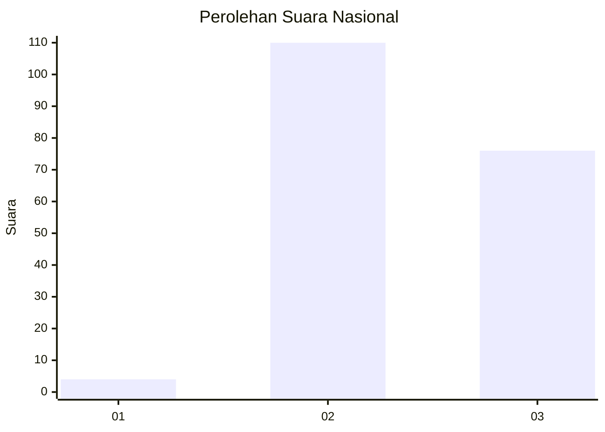
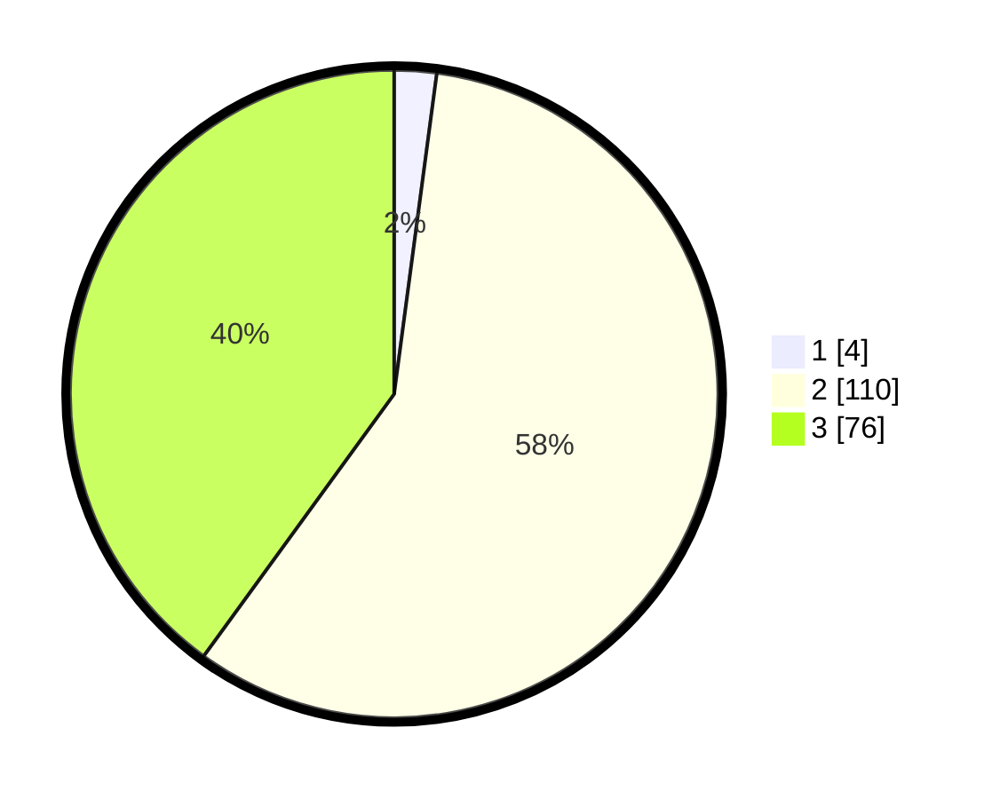

# Hasil

## Grafik

## Tabel

| No. | Nama Paslon    | Suara | Suara (raw) | Persentase |
|:--- |:-------------- | -----:| -----------:| ----------:|
| 1   | ANIES MUHAIMIN | 4     | [4][p-1]    | 2,11       |
| 2   | PRABOWO GIBRAN | 110   | [110][p-2]  | 57,89      |
| 3   | GANJAR MAHFUD  | 76    | [76][p-3]   | 40,00      |

[p-1]: https://github.com/gigit-pemilu/pemilu-2024/blob/main/pilpres/hitung-suara/sub/51-bali/sub/07-karangasem/sub/02-sidemen/sub/2005-telagatawang/sub/011-tps/sub/paslon-1.txt
[p-2]: https://github.com/gigit-pemilu/pemilu-2024/blob/main/pilpres/hitung-suara/sub/51-bali/sub/07-karangasem/sub/02-sidemen/sub/2005-telagatawang/sub/011-tps/sub/paslon-2.txt
[p-3]: https://github.com/gigit-pemilu/pemilu-2024/blob/main/pilpres/hitung-suara/sub/51-bali/sub/07-karangasem/sub/02-sidemen/sub/2005-telagatawang/sub/011-tps/sub/paslon-3.txt

## Foto C Plano

https://sirekap-obj-formc.kpu.go.id/e8e7/pemilu/ppwp/51/07/02/20/05/5107022005011-20240214-203019--a92eddd3-1bcf-48e9-9ce7-43e00512f518.jpg

https://sirekap-obj-formc.kpu.go.id/e8e7/pemilu/ppwp/51/07/02/20/05/5107022005011-20240214-202711--d2b1d42e-f588-42b6-bf17-25ad660f1c70.jpg

https://sirekap-obj-formc.kpu.go.id/e8e7/pemilu/ppwp/51/07/02/20/05/5107022005011-20240214-202417--2289314d-74dd-4add-ad06-73a0e1d35a06.jpg

## Metadata

| Key        | Value               |
| ---------- | ------------------- |
| Time Stamp | 2024-02-15 05:00:24 |

## DATA PEMILIH TETAP

Jumlah pemilih dalam DPT: **239**.
 * L: **102**.
 * P: **137**.

## DATA PENGGUNA HAK PILIH

Jumlah pengguna hak pilih dalam DPT: **190**.
 * L: **84**.
 * P: **106**.

Jumlah pengguna hak pilih dalam DPTb: **0**.
 * L: **0**.
 * P: **0**.

Jumlah pengguna hak pilih dalam DPK: **5**.
 * L: **1**.
 * P: **4**.

Jumlah pengguna hak pilih: **195**.
 * L: **85**.
 * P: **110**.

## JUMLAH SUARA SAH DAN TIDAK SAH

JUMLAH SELURUH SUARA SAH: **190**.

JUMLAH SUARA TIDAK SAH: **5**.

JUMLAH SELURUH SUARA SAH DAN SUARA TIDAK SAH: **195**.

