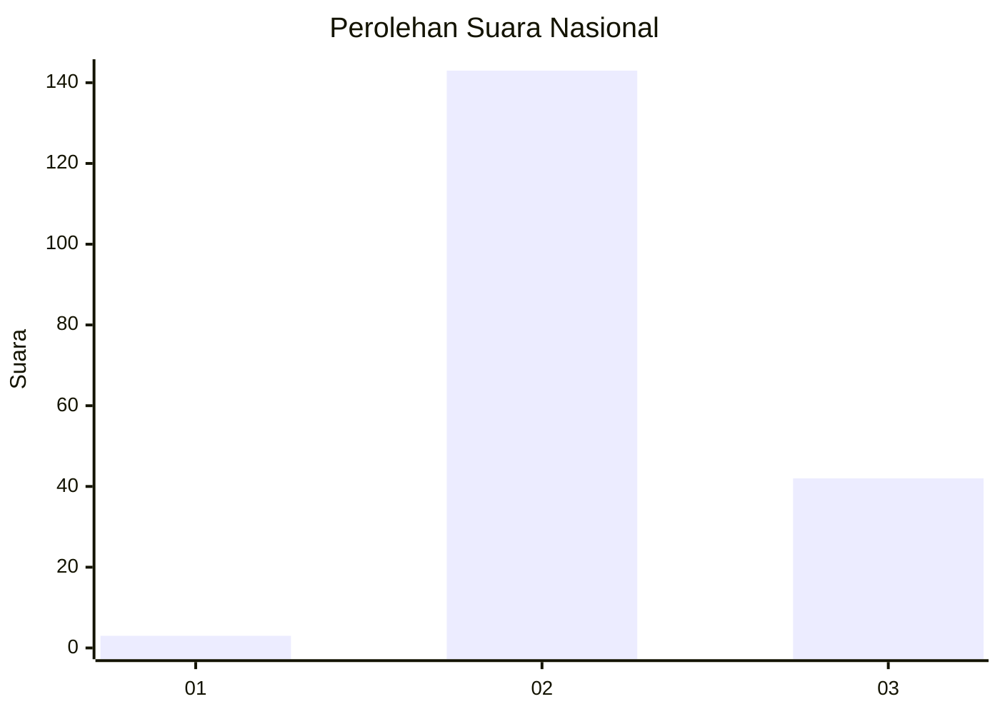
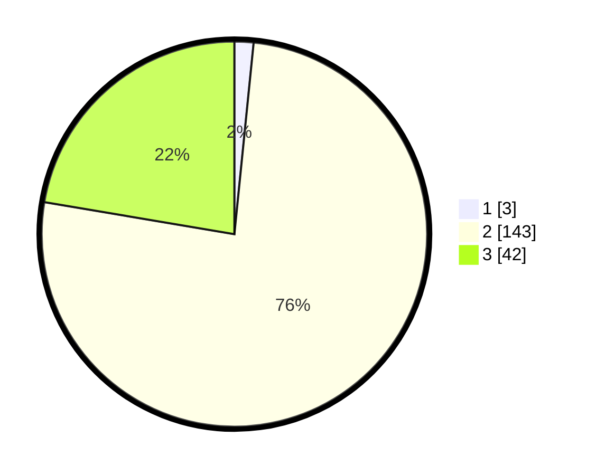

# Hasil

## Grafik

## Tabel

| No. | Nama Paslon    | Suara | Suara (raw) | Persentase |
|:--- |:-------------- | -----:| -----------:| ----------:|
| 1   | ANIES MUHAIMIN | 3     | [3][p-1]    | 1,60       |
| 2   | PRABOWO GIBRAN | 143   | [143][p-2]  | 76,06      |
| 3   | GANJAR MAHFUD  | 42    | [42][p-3]   | 22,34      |

[p-1]: https://github.com/gigit-pemilu/pemilu-2024/blob/main/pilpres/hitung-suara/sub/51-bali/sub/07-karangasem/sub/02-sidemen/sub/2006-sinduwati/sub/002-tps/sub/paslon-1.txt
[p-2]: https://github.com/gigit-pemilu/pemilu-2024/blob/main/pilpres/hitung-suara/sub/51-bali/sub/07-karangasem/sub/02-sidemen/sub/2006-sinduwati/sub/002-tps/sub/paslon-2.txt
[p-3]: https://github.com/gigit-pemilu/pemilu-2024/blob/main/pilpres/hitung-suara/sub/51-bali/sub/07-karangasem/sub/02-sidemen/sub/2006-sinduwati/sub/002-tps/sub/paslon-3.txt

## Foto C Plano

https://sirekap-obj-formc.kpu.go.id/37db/pemilu/ppwp/51/07/02/20/06/5107022006002-20240214-191359--a95744e3-56d8-4f4b-aa1f-79f3ef35eff1.jpg

https://sirekap-obj-formc.kpu.go.id/37db/pemilu/ppwp/51/07/02/20/06/5107022006002-20240214-191404--99c7e69c-d2ca-4a23-a802-9d3432cc1d03.jpg

https://sirekap-obj-formc.kpu.go.id/37db/pemilu/ppwp/51/07/02/20/06/5107022006002-20240214-191411--5b885ae1-dfba-422e-94df-9eca55ce9f7f.jpg

## Metadata

| Key        | Value               |
| ---------- | ------------------- |
| Time Stamp | 2024-02-15 04:00:24 |

## DATA PEMILIH TETAP

Jumlah pemilih dalam DPT: **247**.
 * L: **131**.
 * P: **116**.

## DATA PENGGUNA HAK PILIH

Jumlah pengguna hak pilih dalam DPT: **197**.
 * L: **107**.
 * P: **90**.

Jumlah pengguna hak pilih dalam DPTb: **0**.
 * L: **0**.
 * P: **0**.

Jumlah pengguna hak pilih dalam DPK: **0**.
 * L: **0**.
 * P: **0**.

Jumlah pengguna hak pilih: **197**.
 * L: **107**.
 * P: **90**.

## JUMLAH SUARA SAH DAN TIDAK SAH

JUMLAH SELURUH SUARA SAH: **188**.

JUMLAH SUARA TIDAK SAH: **9**.

JUMLAH SELURUH SUARA SAH DAN SUARA TIDAK SAH: **197**.

