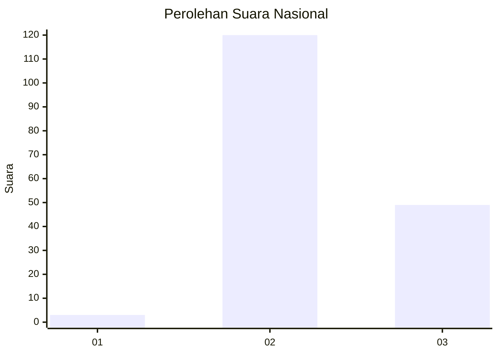
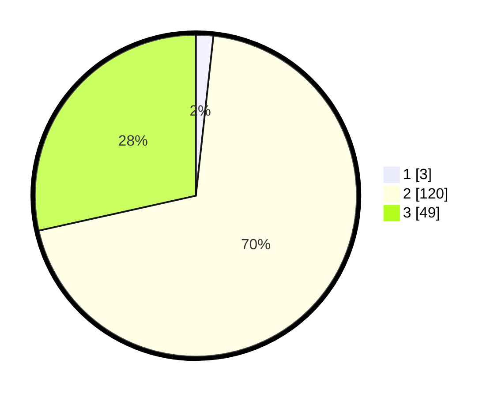

# Hasil

## Grafik

## Tabel

| No. | Nama Paslon    | Suara | Suara (raw) | Persentase |
|:--- |:-------------- | -----:| -----------:| ----------:|
| 1   | ANIES MUHAIMIN | 3     | [3][p-1]    | 1,74       |
| 2   | PRABOWO GIBRAN | 120   | [120][p-2]  | 69,77      |
| 3   | GANJAR MAHFUD  | 49    | [49][p-3]   | 28,49      |

[p-1]: https://github.com/gigit-pemilu/pemilu-2024/blob/main/pilpres/hitung-suara/sub/51-bali/sub/07-karangasem/sub/02-sidemen/sub/2006-sinduwati/sub/004-tps/sub/paslon-1.txt
[p-2]: https://github.com/gigit-pemilu/pemilu-2024/blob/main/pilpres/hitung-suara/sub/51-bali/sub/07-karangasem/sub/02-sidemen/sub/2006-sinduwati/sub/004-tps/sub/paslon-2.txt
[p-3]: https://github.com/gigit-pemilu/pemilu-2024/blob/main/pilpres/hitung-suara/sub/51-bali/sub/07-karangasem/sub/02-sidemen/sub/2006-sinduwati/sub/004-tps/sub/paslon-3.txt

## Foto C Plano

https://sirekap-obj-formc.kpu.go.id/260e/pemilu/ppwp/51/07/02/20/06/5107022006004-20240214-141607--73a6c737-c058-4536-9943-111d8e010fea.jpg

https://sirekap-obj-formc.kpu.go.id/260e/pemilu/ppwp/51/07/02/20/06/5107022006004-20240214-141912--b20252a3-0173-44a0-8183-35137ce00540.jpg

## Metadata

| Key        | Value               |
| ---------- | ------------------- |
| Time Stamp | 2024-02-24 22:31:28 |

