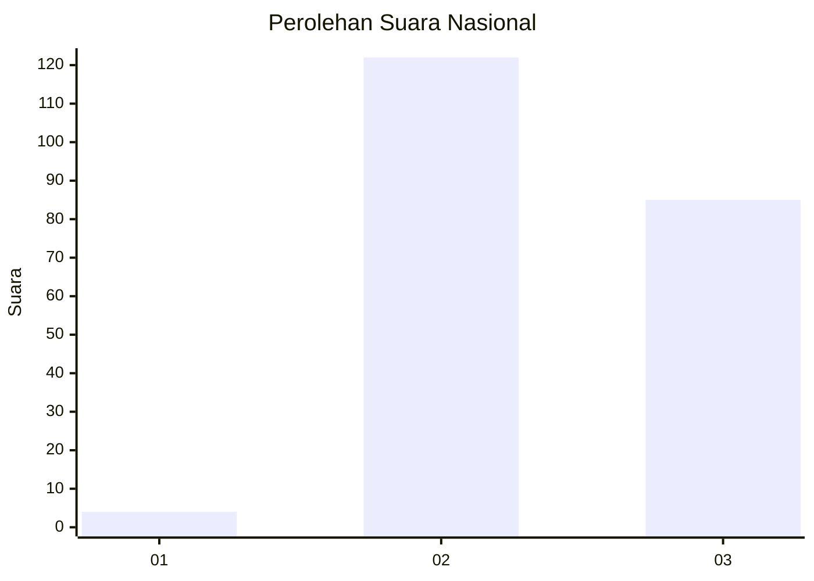
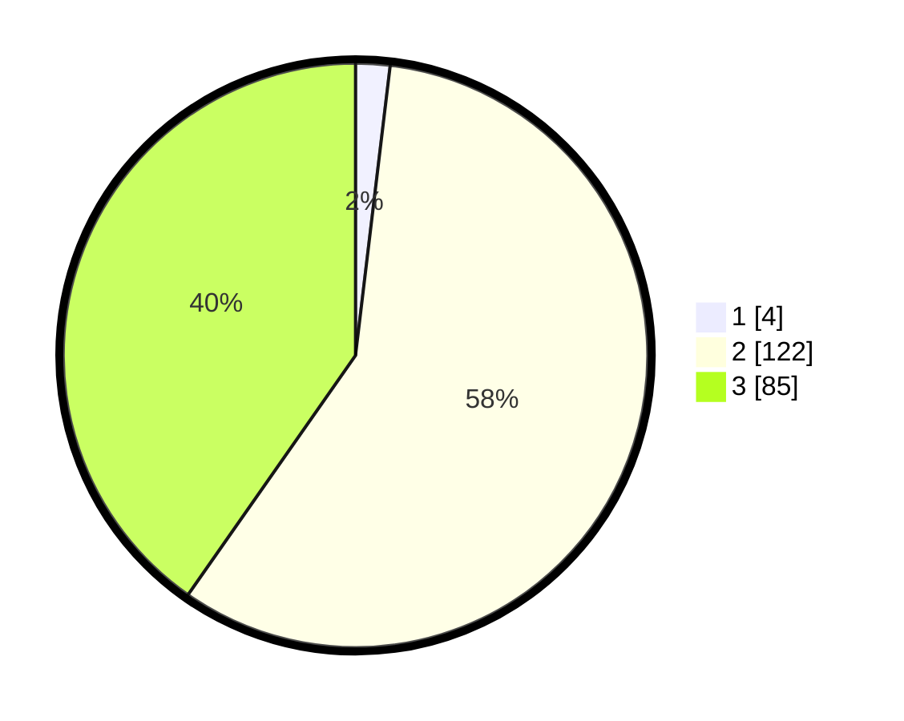

# Hasil

## Grafik

## Tabel

| No. | Nama Paslon    | Suara | Suara (raw) | Persentase |
|:--- |:-------------- | -----:| -----------:| ----------:|
| 1   | ANIES MUHAIMIN | 4     | [4][p-1]    | 1,90       |
| 2   | PRABOWO GIBRAN | 122   | [122][p-2]  | 57,82      |
| 3   | GANJAR MAHFUD  | 85    | [85][p-3]   | 40,28      |

[p-1]: https://github.com/gigit-pemilu/pemilu-2024/blob/main/pilpres/hitung-suara/sub/51-bali/sub/07-karangasem/sub/02-sidemen/sub/2006-sinduwati/sub/010-tps/sub/paslon-1.txt
[p-2]: https://github.com/gigit-pemilu/pemilu-2024/blob/main/pilpres/hitung-suara/sub/51-bali/sub/07-karangasem/sub/02-sidemen/sub/2006-sinduwati/sub/010-tps/sub/paslon-2.txt
[p-3]: https://github.com/gigit-pemilu/pemilu-2024/blob/main/pilpres/hitung-suara/sub/51-bali/sub/07-karangasem/sub/02-sidemen/sub/2006-sinduwati/sub/010-tps/sub/paslon-3.txt

## Foto C Plano

https://sirekap-obj-formc.kpu.go.id/5c7b/pemilu/ppwp/51/07/02/20/06/5107022006010-20240214-230353--b2cd00b6-27d2-470b-8a93-2f9e837509e3.jpg

https://sirekap-obj-formc.kpu.go.id/5c7b/pemilu/ppwp/51/07/02/20/06/5107022006010-20240214-230405--09f608cb-e93e-4413-a0e9-ea5c6be2ce04.jpg

https://sirekap-obj-formc.kpu.go.id/5c7b/pemilu/ppwp/51/07/02/20/06/5107022006010-20240214-230410--5e8999f6-10fc-4ac3-92a8-1d7a448ab0e4.jpg

## Metadata

| Key        | Value               |
| ---------- | ------------------- |
| Time Stamp | 2024-02-17 13:37:34 |

