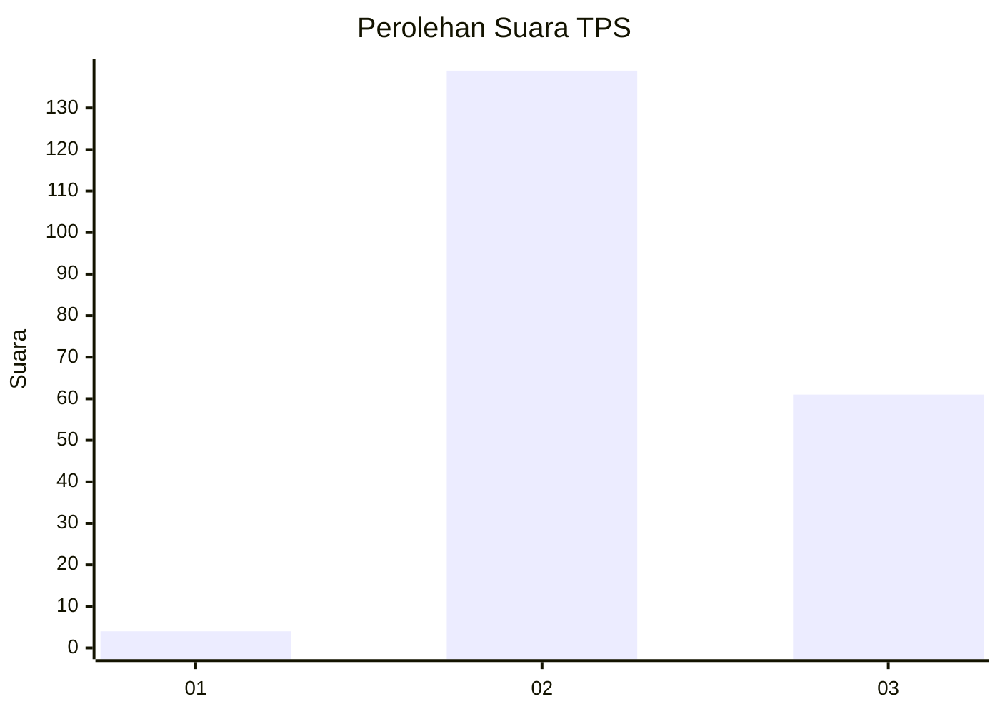

# Hasil

## Grafik

## Tabel

| No. | Nama Paslon    | Suara | Suara (raw) | Persentase |
|:--- |:-------------- | -----:| -----------:| ----------:|
| 1   | ANIES MUHAIMIN | 4     | [4][p-1]    | 1,96       |
| 2   | PRABOWO GIBRAN | 139   | [139][p-2]  | 68,14      |
| 3   | GANJAR MAHFUD  | 61    | [61][p-3]   | 29,90      |

[p-1]: https://github.com/gigit-pemilu/pemilu-2024-51-bali/blob/main/pilpres/hitung-suara/sub/51-bali/sub/07-karangasem/sub/02-sidemen/sub/2006-sinduwati/sub/011-tps/sub/paslon-1.txt
[p-2]: https://github.com/gigit-pemilu/pemilu-2024-51-bali/blob/main/pilpres/hitung-suara/sub/51-bali/sub/07-karangasem/sub/02-sidemen/sub/2006-sinduwati/sub/011-tps/sub/paslon-2.txt
[p-3]: https://github.com/gigit-pemilu/pemilu-2024-51-bali/blob/main/pilpres/hitung-suara/sub/51-bali/sub/07-karangasem/sub/02-sidemen/sub/2006-sinduwati/sub/011-tps/sub/paslon-3.txt

## Foto C Plano

https://sirekap-obj-formc.kpu.go.id/7e08/pemilu/ppwp/51/07/02/20/06/5107022006011-20240215-015113--633e1715-ee67-4f7c-9e4b-51c4810ce050.jpg

https://sirekap-obj-formc.kpu.go.id/7e08/pemilu/ppwp/51/07/02/20/06/5107022006011-20240215-015240--98eda7f8-e37b-40f7-95e4-8761b56c0d68.jpg

https://sirekap-obj-formc.kpu.go.id/7e08/pemilu/ppwp/51/07/02/20/06/5107022006011-20240215-015432--ea87d40b-cf68-40cd-b7d6-9204351a8e32.jpg

## Metadata

| Key        | Value               |
| ---------- | ------------------- |
| Time Stamp | 2024-02-19 06:16:00 |

