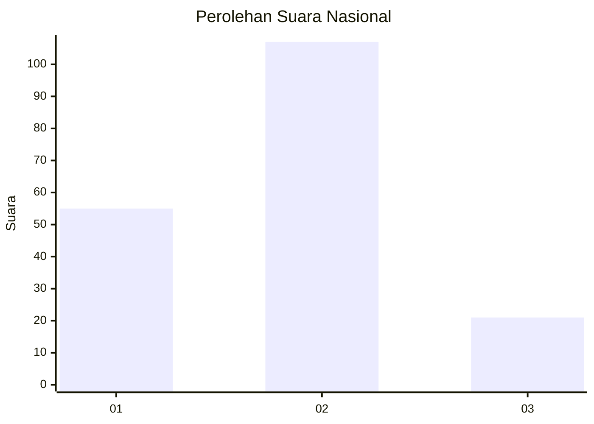
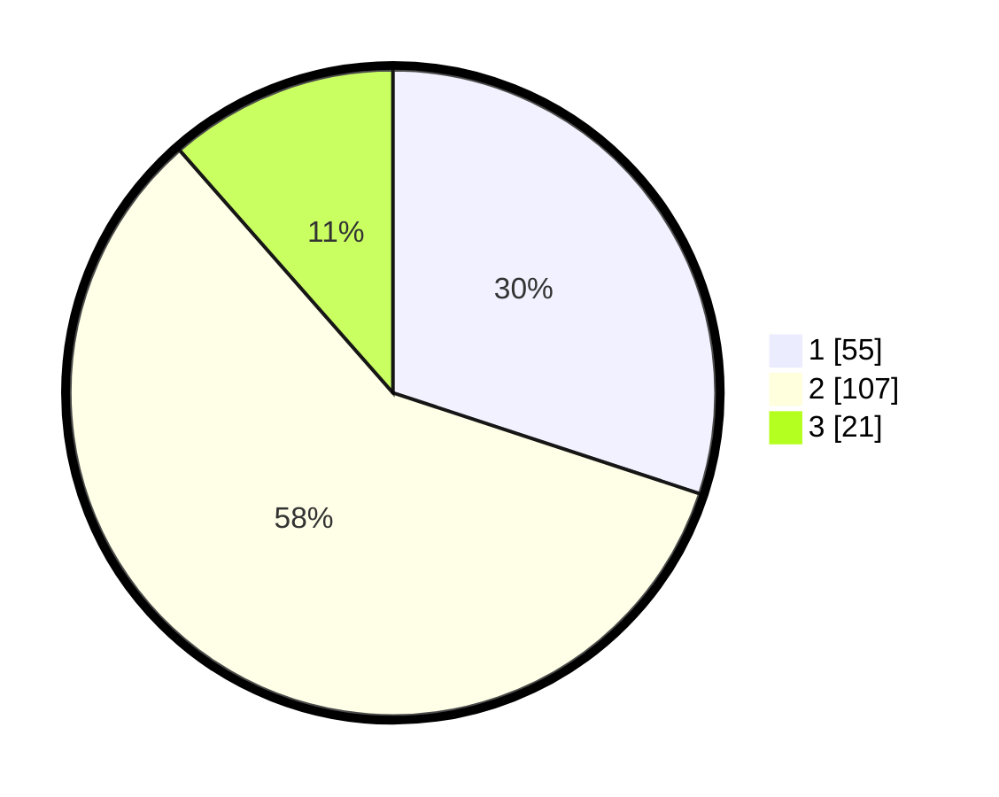

# Hasil

## Grafik

## Tabel

| No. | Nama Paslon    | Suara | Suara (raw) | Persentase |
|:--- |:-------------- | -----:| -----------:| ----------:|
| 1   | ANIES MUHAIMIN | 55    | [55][p-1]   | 30,05      |
| 2   | PRABOWO GIBRAN | 107   | [107][p-2]  | 58,47      |
| 3   | GANJAR MAHFUD  | 21    | [21][p-3]   | 11,48      |

[p-1]: https://github.com/gigit-pemilu/pemilu-2024/blob/main/pilpres/hitung-suara/sub/51-bali/sub/07-karangasem/sub/02-sidemen/sub/2006-sinduwati/sub/015-tps/sub/paslon-1.txt
[p-2]: https://github.com/gigit-pemilu/pemilu-2024/blob/main/pilpres/hitung-suara/sub/51-bali/sub/07-karangasem/sub/02-sidemen/sub/2006-sinduwati/sub/015-tps/sub/paslon-2.txt
[p-3]: https://github.com/gigit-pemilu/pemilu-2024/blob/main/pilpres/hitung-suara/sub/51-bali/sub/07-karangasem/sub/02-sidemen/sub/2006-sinduwati/sub/015-tps/sub/paslon-3.txt

## Foto C Plano

https://sirekap-obj-formc.kpu.go.id/0e43/pemilu/ppwp/51/07/02/20/06/5107022006015-20240214-235541--f88a0393-bf1f-43fc-8a0b-94db66f6276b.jpg

https://sirekap-obj-formc.kpu.go.id/0e43/pemilu/ppwp/51/07/02/20/06/5107022006015-20240214-235740--5a579cbf-3976-447c-9ddd-6d8a725f096e.jpg

https://sirekap-obj-formc.kpu.go.id/0e43/pemilu/ppwp/51/07/02/20/06/5107022006015-20240214-235937--f803bb6e-346a-469a-bfa0-753e55f69c7d.jpg

## Metadata

| Key        | Value               |
| ---------- | ------------------- |
| Time Stamp | 2024-02-16 11:00:29 |

