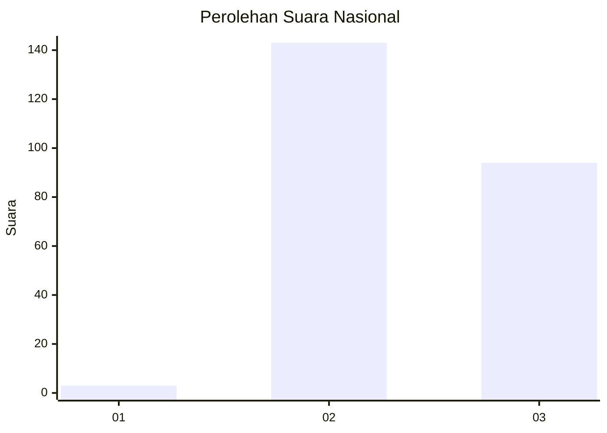
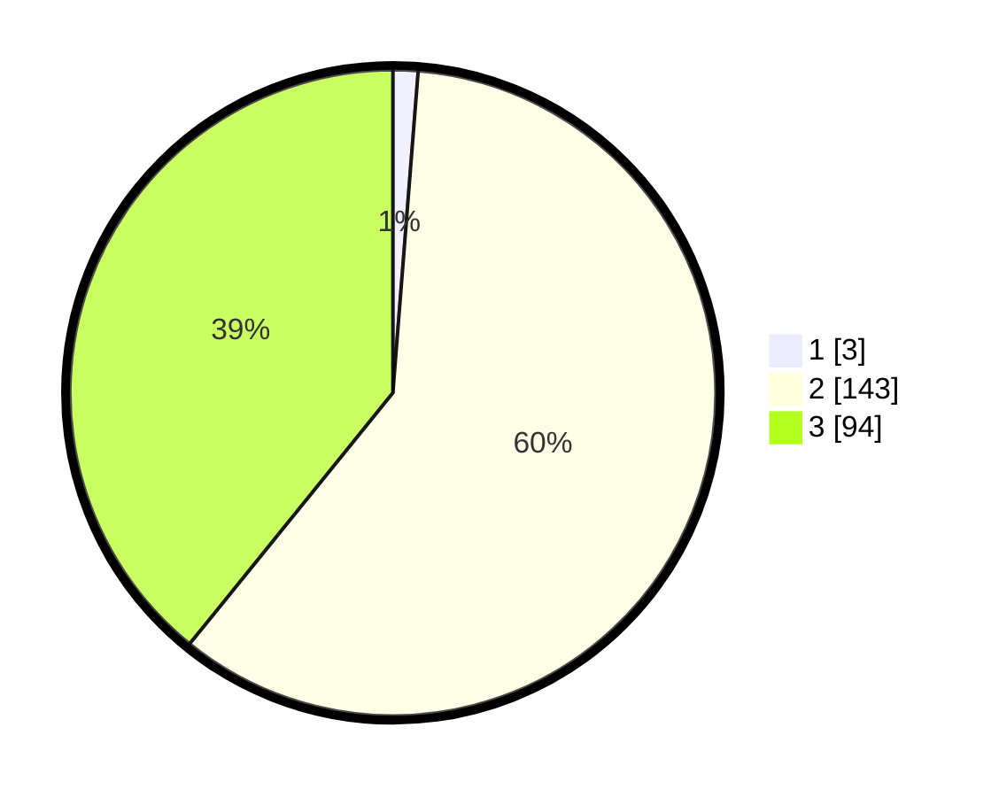

# Hasil

## Grafik

## Tabel

| No. | Nama Paslon    | Suara | Suara (raw) | Persentase |
|:--- |:-------------- | -----:| -----------:| ----------:|
| 1   | ANIES MUHAIMIN | 3     | [3][p-1]    | 1,25       |
| 2   | PRABOWO GIBRAN | 143   | [143][p-2]  | 59,58      |
| 3   | GANJAR MAHFUD  | 94    | [94][p-3]   | 39,17      |

[p-1]: https://github.com/gigit-pemilu/pemilu-2024/blob/main/pilpres/hitung-suara/sub/51-bali/sub/07-karangasem/sub/02-sidemen/sub/2007-tri-eka-buana/sub/002-tps/sub/paslon-1.txt
[p-2]: https://github.com/gigit-pemilu/pemilu-2024/blob/main/pilpres/hitung-suara/sub/51-bali/sub/07-karangasem/sub/02-sidemen/sub/2007-tri-eka-buana/sub/002-tps/sub/paslon-2.txt
[p-3]: https://github.com/gigit-pemilu/pemilu-2024/blob/main/pilpres/hitung-suara/sub/51-bali/sub/07-karangasem/sub/02-sidemen/sub/2007-tri-eka-buana/sub/002-tps/sub/paslon-3.txt

## Foto C Plano

https://sirekap-obj-formc.kpu.go.id/090b/pemilu/ppwp/51/07/02/20/07/5107022007002-20240214-214719--26467c0e-dacc-46c0-a347-407f288485de.jpg

https://sirekap-obj-formc.kpu.go.id/090b/pemilu/ppwp/51/07/02/20/07/5107022007002-20240214-214632--b11ad45c-ab68-43b6-a203-db16475fe513.jpg

https://sirekap-obj-formc.kpu.go.id/090b/pemilu/ppwp/51/07/02/20/07/5107022007002-20240214-191203--eb41d187-25f4-404d-894d-fd257c602f5f.jpg

## Metadata

| Key        | Value               |
| ---------- | ------------------- |
| Time Stamp | 2024-02-17 13:37:34 |

