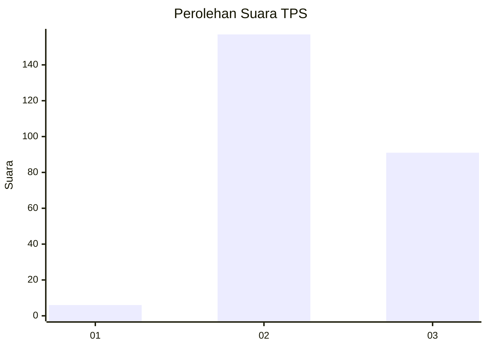
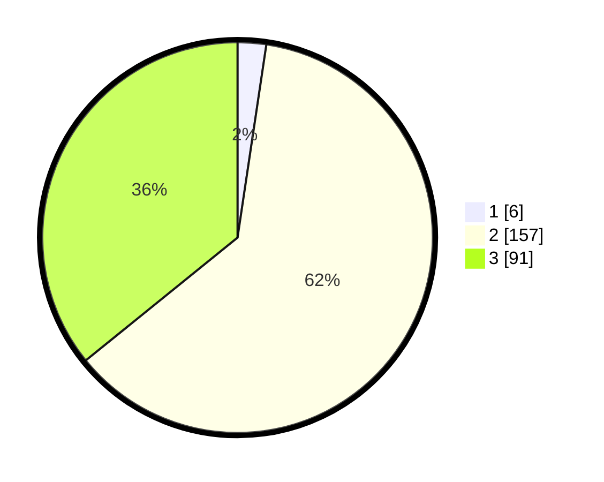

# Hasil

## Grafik

## Tabel

| No. | Nama Paslon    | Suara | Suara (raw) | Persentase |
|:--- |:-------------- | -----:| -----------:| ----------:|
| 1   | ANIES MUHAIMIN | 6     | [6][p-1]    | 2,36       |
| 2   | PRABOWO GIBRAN | 157   | [157][p-2]  | 61,81      |
| 3   | GANJAR MAHFUD  | 91    | [91][p-3]   | 35,83      |

[p-1]: https://github.com/gigit-pemilu/pemilu-2024-51-bali/blob/main/pilpres/hitung-suara/sub/51-bali/sub/07-karangasem/sub/02-sidemen/sub/2007-tri-eka-buana/sub/003-tps/sub/paslon-1.txt
[p-2]: https://github.com/gigit-pemilu/pemilu-2024-51-bali/blob/main/pilpres/hitung-suara/sub/51-bali/sub/07-karangasem/sub/02-sidemen/sub/2007-tri-eka-buana/sub/003-tps/sub/paslon-2.txt
[p-3]: https://github.com/gigit-pemilu/pemilu-2024-51-bali/blob/main/pilpres/hitung-suara/sub/51-bali/sub/07-karangasem/sub/02-sidemen/sub/2007-tri-eka-buana/sub/003-tps/sub/paslon-3.txt

## Foto C Plano

https://sirekap-obj-formc.kpu.go.id/735a/pemilu/ppwp/51/07/02/20/07/5107022007003-20240214-140933--fcc8d414-75f2-4356-a9bb-e6aea8f25808.jpg

https://sirekap-obj-formc.kpu.go.id/735a/pemilu/ppwp/51/07/02/20/07/5107022007003-20240214-141151--03607d1c-4ece-4221-bce1-d6865d000afb.jpg

https://sirekap-obj-formc.kpu.go.id/735a/pemilu/ppwp/51/07/02/20/07/5107022007003-20240216-103438--5eac2838-00f5-44c2-b776-0ea49bdfca13.jpg

## Metadata

| Key        | Value               |
| ---------- | ------------------- |
| Time Stamp | 2024-02-16 11:00:29 |

## DATA PEMILIH TETAP

Jumlah pemilih dalam DPT: **257**.
 * L: **124**.
 * P: **133**.

## DATA PENGGUNA HAK PILIH

Jumlah pengguna hak pilih dalam DPT: **255**.
 * L: **122**.
 * P: **133**.

Jumlah pengguna hak pilih dalam DPTb: **1**.
 * L: **0**.
 * P: **1**.

Jumlah pengguna hak pilih dalam DPK: **1**.
 * L: **0**.
 * P: **1**.

Jumlah pengguna hak pilih: **257**.
 * L: **122**.
 * P: **135**.

## JUMLAH SUARA SAH DAN TIDAK SAH

JUMLAH SELURUH SUARA SAH: **254**.

JUMLAH SUARA TIDAK SAH: **3**.

JUMLAH SELURUH SUARA SAH DAN SUARA TIDAK SAH: **257**.

