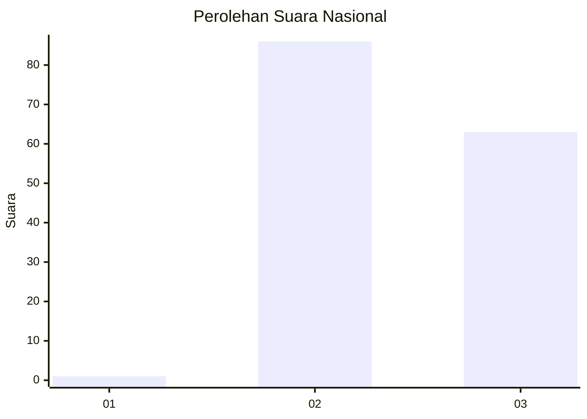
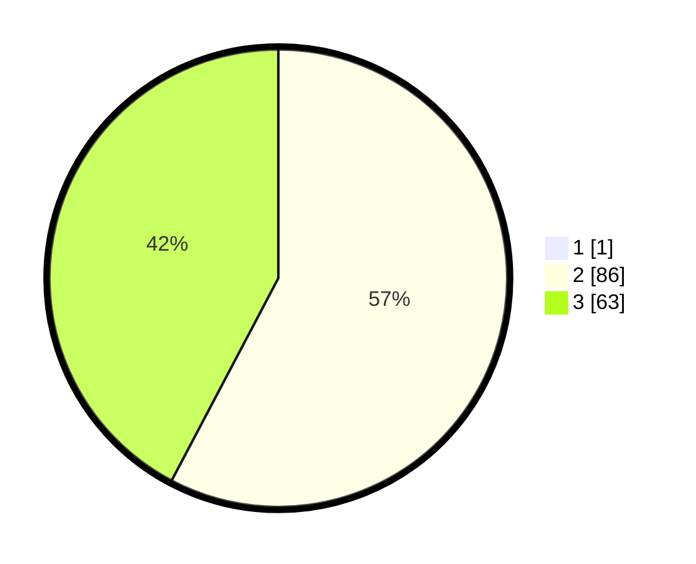

# Hasil

## Grafik

## Tabel

| No. | Nama Paslon    | Suara | Suara (raw) | Persentase |
|:--- |:-------------- | -----:| -----------:| ----------:|
| 1   | ANIES MUHAIMIN | 1     | [1][p-1]    | 0,67       |
| 2   | PRABOWO GIBRAN | 86    | [86][p-2]   | 57,33      |
| 3   | GANJAR MAHFUD  | 63    | [63][p-3]   | 42,00      |

[p-1]: https://github.com/gigit-pemilu/pemilu-2024/blob/main/pilpres/hitung-suara/sub/51-bali/sub/07-karangasem/sub/02-sidemen/sub/2008-kertha-buana/sub/001-tps/sub/paslon-1.txt
[p-2]: https://github.com/gigit-pemilu/pemilu-2024/blob/main/pilpres/hitung-suara/sub/51-bali/sub/07-karangasem/sub/02-sidemen/sub/2008-kertha-buana/sub/001-tps/sub/paslon-2.txt
[p-3]: https://github.com/gigit-pemilu/pemilu-2024/blob/main/pilpres/hitung-suara/sub/51-bali/sub/07-karangasem/sub/02-sidemen/sub/2008-kertha-buana/sub/001-tps/sub/paslon-3.txt

## Foto C Plano

https://sirekap-obj-formc.kpu.go.id/a986/pemilu/ppwp/51/07/02/20/08/5107022008001-20240214-201447--ac0882de-d589-4fb2-b21a-072d80d5081d.jpg

https://sirekap-obj-formc.kpu.go.id/a986/pemilu/ppwp/51/07/02/20/08/5107022008001-20240214-203744--bcb050a1-bd1e-40b7-a29e-354ed74a1139.jpg

https://sirekap-obj-formc.kpu.go.id/a986/pemilu/ppwp/51/07/02/20/08/5107022008001-20240214-203937--2d7a2e18-1ea9-45de-8fd6-a97701b00e14.jpg

## Metadata

| Key        | Value               |
| ---------- | ------------------- |
| Time Stamp | 2024-02-17 13:37:34 |

