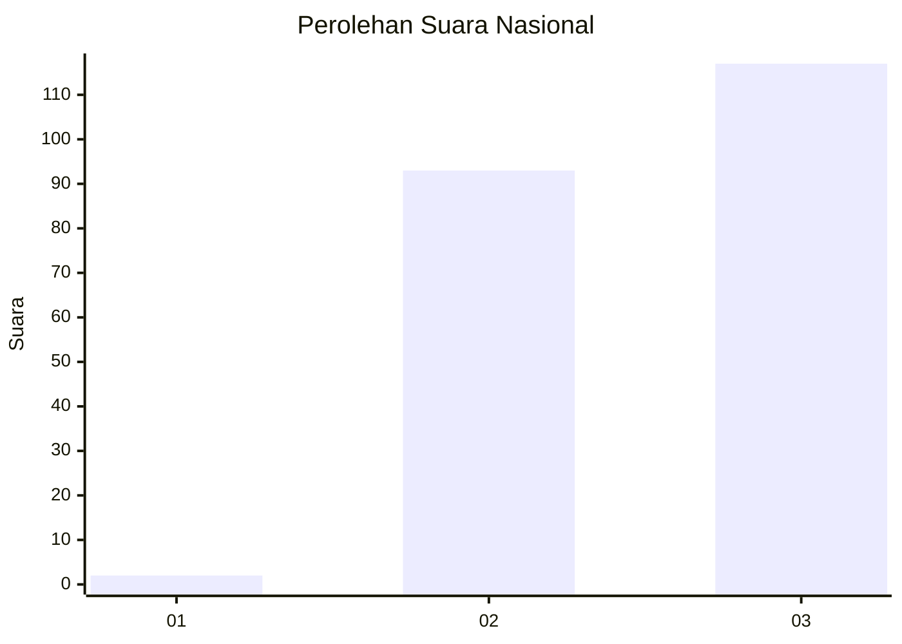
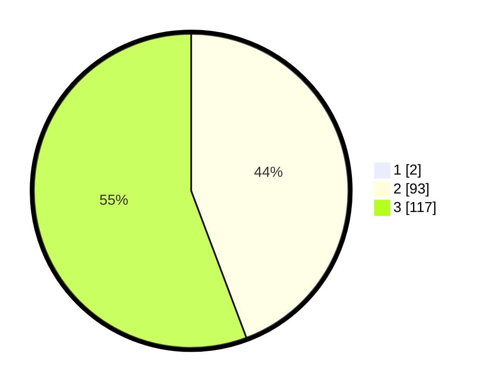

# Hasil

## Grafik

## Tabel

| No. | Nama Paslon    | Suara | Suara (raw) | Persentase |
|:--- |:-------------- | -----:| -----------:| ----------:|
| 1   | ANIES MUHAIMIN | 2     | [2][p-1]    | 0,94       |
| 2   | PRABOWO GIBRAN | 93    | [93][p-2]   | 43,87      |
| 3   | GANJAR MAHFUD  | 117   | [117][p-3]  | 55,19      |

[p-1]: https://github.com/gigit-pemilu/pemilu-2024/blob/main/pilpres/hitung-suara/sub/51-bali/sub/07-karangasem/sub/02-sidemen/sub/2008-kertha-buana/sub/005-tps/sub/paslon-1.txt
[p-2]: https://github.com/gigit-pemilu/pemilu-2024/blob/main/pilpres/hitung-suara/sub/51-bali/sub/07-karangasem/sub/02-sidemen/sub/2008-kertha-buana/sub/005-tps/sub/paslon-2.txt
[p-3]: https://github.com/gigit-pemilu/pemilu-2024/blob/main/pilpres/hitung-suara/sub/51-bali/sub/07-karangasem/sub/02-sidemen/sub/2008-kertha-buana/sub/005-tps/sub/paslon-3.txt

## Foto C Plano

https://sirekap-obj-formc.kpu.go.id/ecb7/pemilu/ppwp/51/07/02/20/08/5107022008005-20240214-160058--0091dc4b-e29c-4a59-9b90-d556e3290c02.jpg

https://sirekap-obj-formc.kpu.go.id/ecb7/pemilu/ppwp/51/07/02/20/08/5107022008005-20240214-155535--80c58a30-3fe9-4881-b798-26ed995685b1.jpg

https://sirekap-obj-formc.kpu.go.id/ecb7/pemilu/ppwp/51/07/02/20/08/5107022008005-20240214-160101--a33ad134-ecc6-4d91-8463-2aaedd5dddc6.jpg

## Metadata

| Key        | Value               |
| ---------- | ------------------- |
| Time Stamp | 2024-02-15 22:00:27 |

