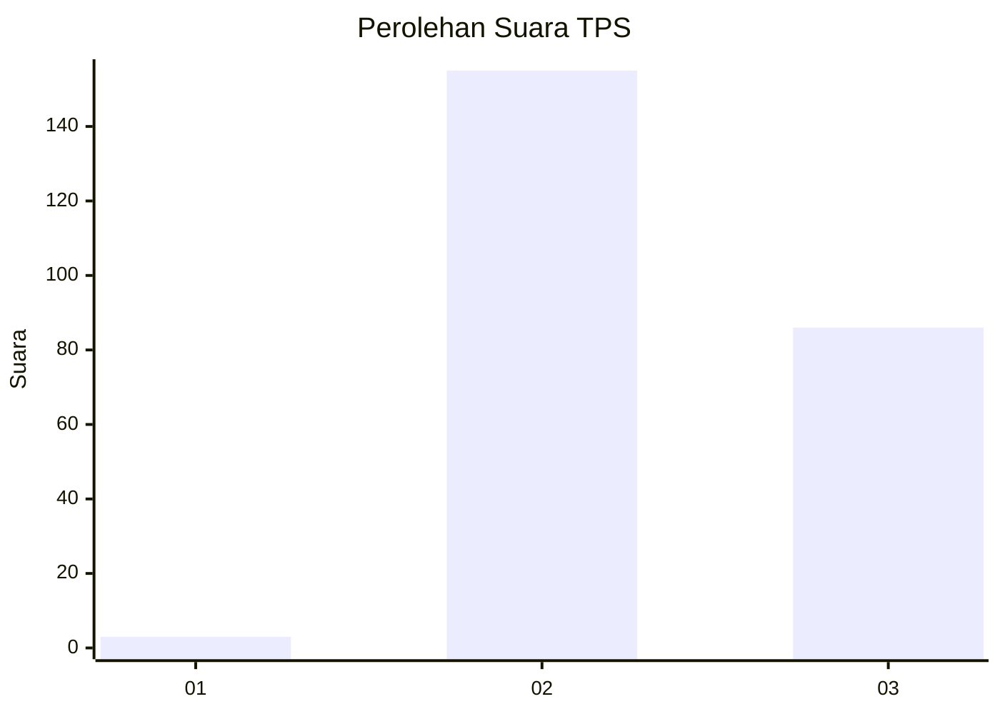
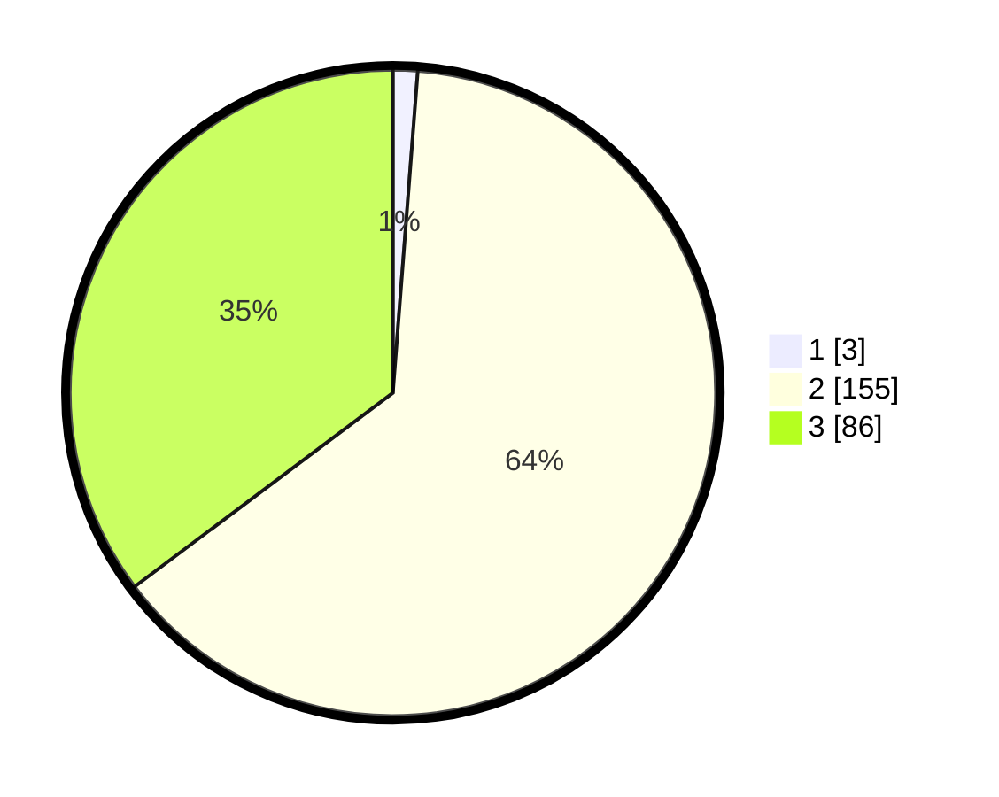

# Hasil

## Grafik

## Tabel

| No. | Nama Paslon    | Suara | Suara (raw) | Persentase |
|:--- |:-------------- | -----:| -----------:| ----------:|
| 1   | ANIES MUHAIMIN | 3     | [3][p-1]    | 1,23       |
| 2   | PRABOWO GIBRAN | 155   | [155][p-2]  | 63,52      |
| 3   | GANJAR MAHFUD  | 86    | [86][p-3]   | 35,25      |

[p-1]: https://github.com/gigit-pemilu/pemilu-2024-51-bali/blob/main/pilpres/hitung-suara/sub/51-bali/sub/07-karangasem/sub/02-sidemen/sub/2008-kertha-buana/sub/008-tps/sub/paslon-1.txt
[p-2]: https://github.com/gigit-pemilu/pemilu-2024-51-bali/blob/main/pilpres/hitung-suara/sub/51-bali/sub/07-karangasem/sub/02-sidemen/sub/2008-kertha-buana/sub/008-tps/sub/paslon-2.txt
[p-3]: https://github.com/gigit-pemilu/pemilu-2024-51-bali/blob/main/pilpres/hitung-suara/sub/51-bali/sub/07-karangasem/sub/02-sidemen/sub/2008-kertha-buana/sub/008-tps/sub/paslon-3.txt

## Foto C Plano

https://sirekap-obj-formc.kpu.go.id/1044/pemilu/ppwp/51/07/02/20/08/5107022008008-20240214-193156--c698f362-6c40-4aaf-a979-e9c650cac590.jpg

https://sirekap-obj-formc.kpu.go.id/1044/pemilu/ppwp/51/07/02/20/08/5107022008008-20240214-195531--56e60f30-b445-40a2-b086-3600dc4ef9c2.jpg

https://sirekap-obj-formc.kpu.go.id/1044/pemilu/ppwp/51/07/02/20/08/5107022008008-20240214-193218--7d702e4c-fa75-4a49-83f6-ac51edf91c9c.jpg

## Metadata

| Key        | Value               |
| ---------- | ------------------- |
| Time Stamp | 2024-02-17 13:37:34 |

