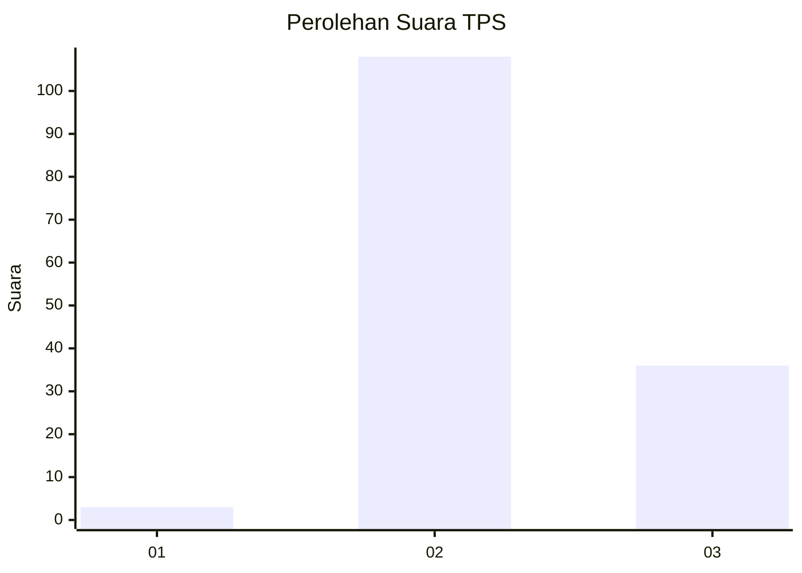
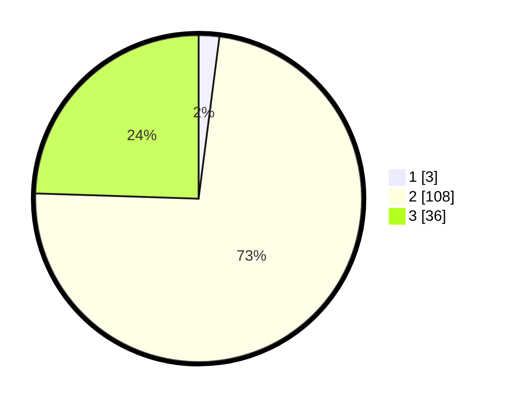

# Hasil

## Grafik

## Tabel

| No. | Nama Paslon    | Suara | Suara (raw) | Persentase |
|:--- |:-------------- | -----:| -----------:| ----------:|
| 1   | ANIES MUHAIMIN | 3     | [3][p-1]    | 2,04       |
| 2   | PRABOWO GIBRAN | 108   | [108][p-2]  | 73,47      |
| 3   | GANJAR MAHFUD  | 36    | [36][p-3]   | 24,49      |

[p-1]: https://github.com/gigit-pemilu/pemilu-2024-51-bali/blob/main/pilpres/hitung-suara/sub/51-bali/sub/07-karangasem/sub/02-sidemen/sub/2009-lokasari/sub/004-tps/sub/paslon-1.txt
[p-2]: https://github.com/gigit-pemilu/pemilu-2024-51-bali/blob/main/pilpres/hitung-suara/sub/51-bali/sub/07-karangasem/sub/02-sidemen/sub/2009-lokasari/sub/004-tps/sub/paslon-2.txt
[p-3]: https://github.com/gigit-pemilu/pemilu-2024-51-bali/blob/main/pilpres/hitung-suara/sub/51-bali/sub/07-karangasem/sub/02-sidemen/sub/2009-lokasari/sub/004-tps/sub/paslon-3.txt

## Foto C Plano

https://sirekap-obj-formc.kpu.go.id/d459/pemilu/ppwp/51/07/02/20/09/5107022009004-20240214-230728--43c770ab-68b5-4011-9bac-53f594d31351.jpg

https://sirekap-obj-formc.kpu.go.id/d459/pemilu/ppwp/51/07/02/20/09/5107022009004-20240214-225046--a041e0fe-b7f2-44d2-8918-24a303a2748d.jpg

https://sirekap-obj-formc.kpu.go.id/d459/pemilu/ppwp/51/07/02/20/09/5107022009004-20240214-223630--416ff918-6360-49f5-8ec1-2ce3cd9020e0.jpg

## Metadata

| Key        | Value               |
| ---------- | ------------------- |
| Time Stamp | 2024-02-17 13:37:34 |

