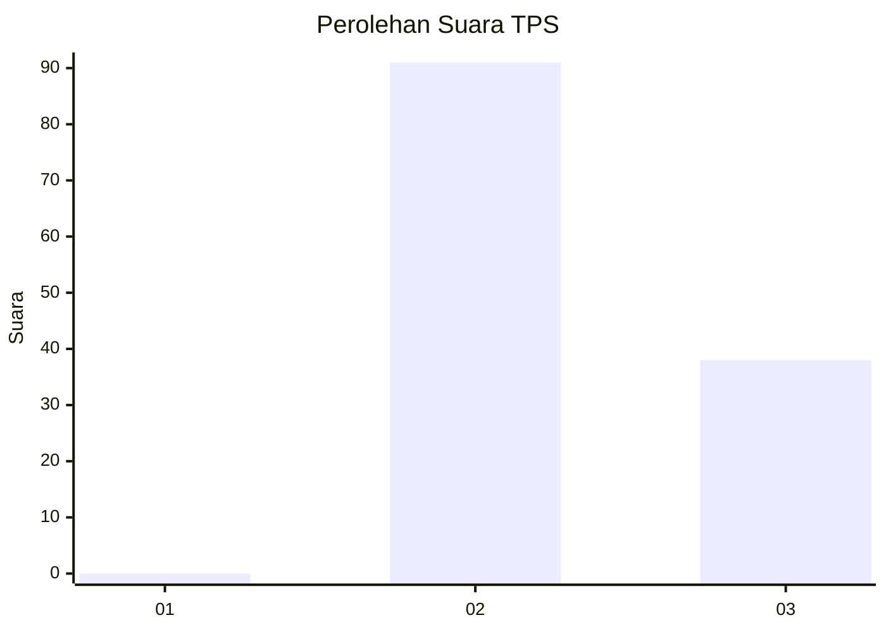
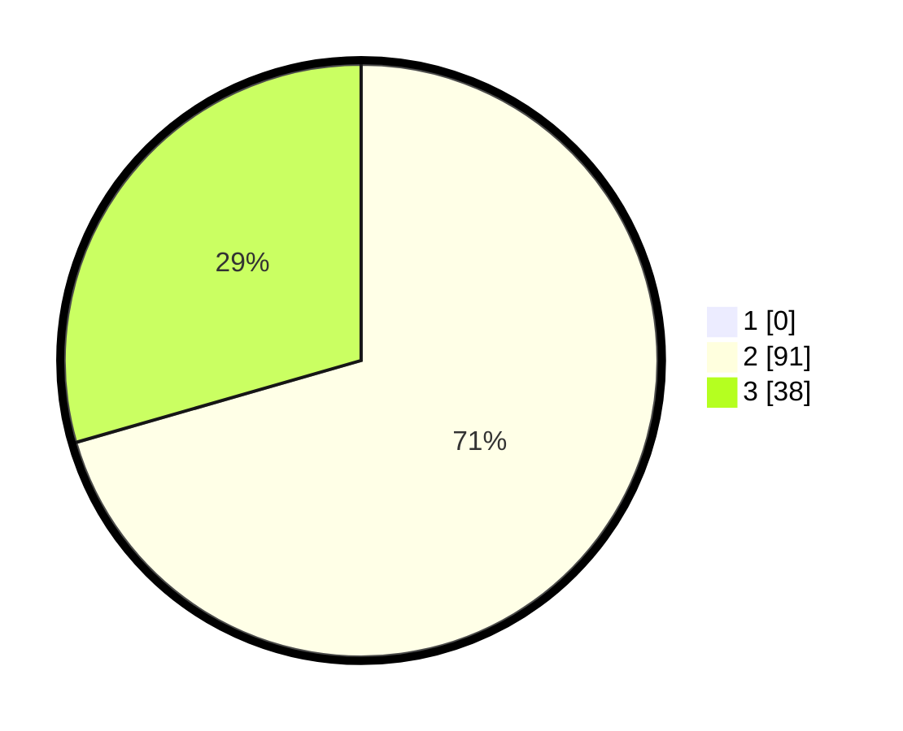

# Hasil

## Grafik

## Tabel

| No. | Nama Paslon    | Suara | Suara (raw) | Persentase |
|:--- |:-------------- | -----:| -----------:| ----------:|
| 1   | ANIES MUHAIMIN | 0     | [0][p-1]    | 0,00       |
| 2   | PRABOWO GIBRAN | 91    | [91][p-2]   | 70,54      |
| 3   | GANJAR MAHFUD  | 38    | [38][p-3]   | 29,46      |

[p-1]: https://github.com/gigit-pemilu/pemilu-2024-51-bali/blob/main/pilpres/hitung-suara/sub/51-bali/sub/07-karangasem/sub/02-sidemen/sub/2009-lokasari/sub/005-tps/sub/paslon-1.txt
[p-2]: https://github.com/gigit-pemilu/pemilu-2024-51-bali/blob/main/pilpres/hitung-suara/sub/51-bali/sub/07-karangasem/sub/02-sidemen/sub/2009-lokasari/sub/005-tps/sub/paslon-2.txt
[p-3]: https://github.com/gigit-pemilu/pemilu-2024-51-bali/blob/main/pilpres/hitung-suara/sub/51-bali/sub/07-karangasem/sub/02-sidemen/sub/2009-lokasari/sub/005-tps/sub/paslon-3.txt

## Foto C Plano

https://sirekap-obj-formc.kpu.go.id/b367/pemilu/ppwp/51/07/02/20/09/5107022009005-20240214-223052--721e87f6-4961-4591-bea2-f44c604e305e.jpg

https://sirekap-obj-formc.kpu.go.id/b367/pemilu/ppwp/51/07/02/20/09/5107022009005-20240214-222136--7ee2efe1-b22b-44ed-b650-edb7eefaf4a9.jpg

https://sirekap-obj-formc.kpu.go.id/b367/pemilu/ppwp/51/07/02/20/09/5107022009005-20240214-210810--2b4fc3bb-a2e1-4331-b251-2b8104e4c218.jpg

## Metadata

| Key        | Value               |
| ---------- | ------------------- |
| Time Stamp | 2024-02-17 13:37:34 |

