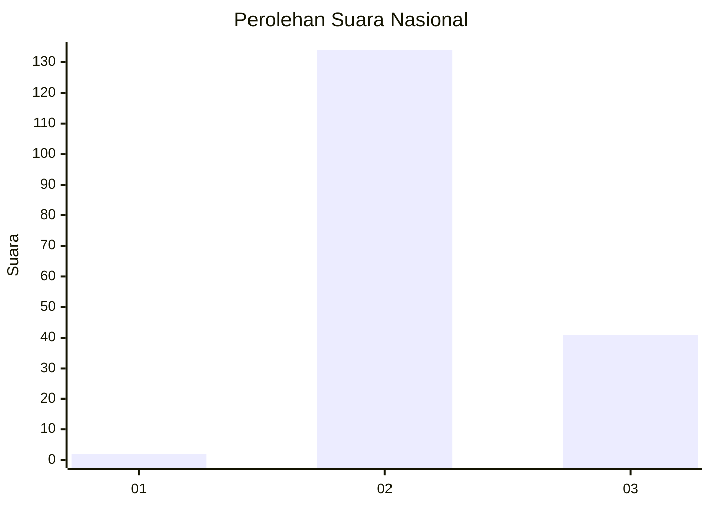
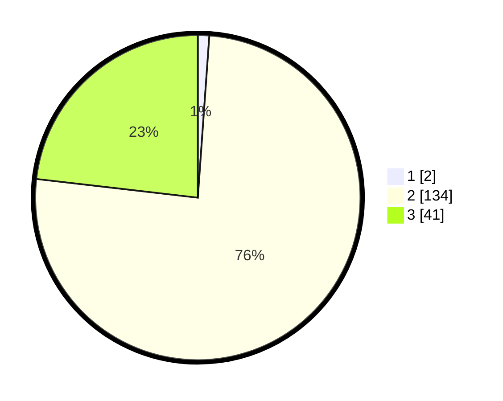

# Hasil

## Grafik

## Tabel

| No. | Nama Paslon    | Suara | Suara (raw) | Persentase |
|:--- |:-------------- | -----:| -----------:| ----------:|
| 1   | ANIES MUHAIMIN | 2     | [2][p-1]    | 1,13       |
| 2   | PRABOWO GIBRAN | 134   | [134][p-2]  | 75,71      |
| 3   | GANJAR MAHFUD  | 41    | [41][p-3]   | 23,16      |

[p-1]: https://github.com/gigit-pemilu/pemilu-2024/blob/main/pilpres/hitung-suara/sub/51-bali/sub/07-karangasem/sub/02-sidemen/sub/2010-wisma-kerta/sub/003-tps/sub/paslon-1.txt
[p-2]: https://github.com/gigit-pemilu/pemilu-2024/blob/main/pilpres/hitung-suara/sub/51-bali/sub/07-karangasem/sub/02-sidemen/sub/2010-wisma-kerta/sub/003-tps/sub/paslon-2.txt
[p-3]: https://github.com/gigit-pemilu/pemilu-2024/blob/main/pilpres/hitung-suara/sub/51-bali/sub/07-karangasem/sub/02-sidemen/sub/2010-wisma-kerta/sub/003-tps/sub/paslon-3.txt

## Foto C Plano

https://sirekap-obj-formc.kpu.go.id/3e1a/pemilu/ppwp/51/07/02/20/10/5107022010003-20240214-155357--9739314a-0b16-4999-9c35-5dcd2f33a932.jpg

https://sirekap-obj-formc.kpu.go.id/3e1a/pemilu/ppwp/51/07/02/20/10/5107022010003-20240214-155441--c58f153a-4384-4df7-be1b-b8aacc558aa2.jpg

https://sirekap-obj-formc.kpu.go.id/3e1a/pemilu/ppwp/51/07/02/20/10/5107022010003-20240214-155515--a2119fd6-23c6-4413-967b-24cef09f34dd.jpg

## Metadata

| Key        | Value               |
| ---------- | ------------------- |
| Time Stamp | 2024-02-14 21:46:01 |

## DATA PEMILIH TETAP

Jumlah pemilih dalam DPT: **263**.
 * L: **133**.
 * P: **130**.

## DATA PENGGUNA HAK PILIH

Jumlah pengguna hak pilih dalam DPT: **191**.
 * L: **99**.
 * P: **92**.

Jumlah pengguna hak pilih dalam DPTb: **2**.
 * L: **1**.
 * P: **1**.

Jumlah pengguna hak pilih dalam DPK: **0**.
 * L: **0**.
 * P: **0**.

Jumlah pengguna hak pilih: **193**.
 * L: **100**.
 * P: **93**.

## JUMLAH SUARA SAH DAN TIDAK SAH

JUMLAH SELURUH SUARA SAH: **177**.

JUMLAH SUARA TIDAK SAH: **16**.

JUMLAH SELURUH SUARA SAH DAN SUARA TIDAK SAH: **193**.

