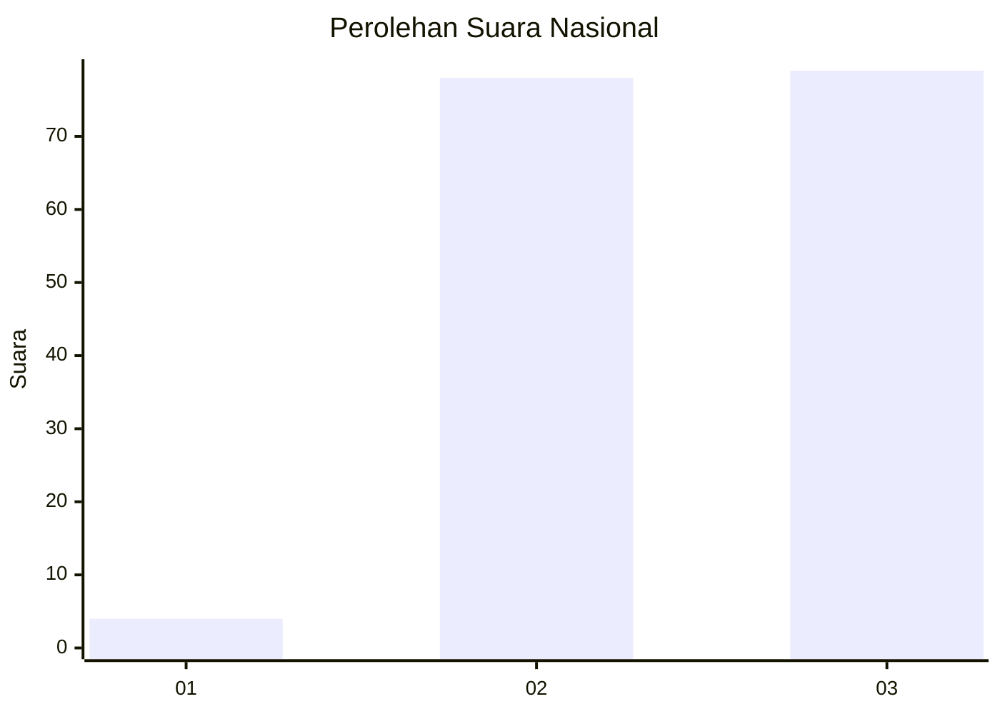
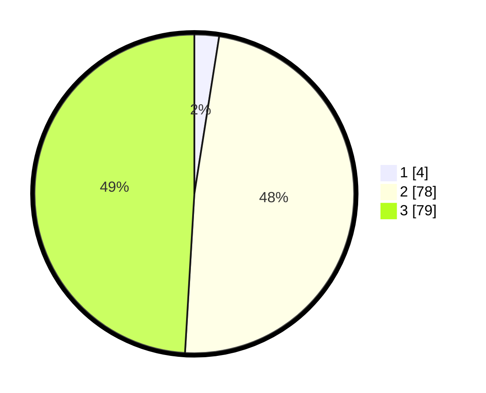

# Hasil

## Grafik

## Tabel

| No. | Nama Paslon    | Suara | Suara (raw) | Persentase |
|:--- |:-------------- | -----:| -----------:| ----------:|
| 1   | ANIES MUHAIMIN | 4     | [4][p-1]    | 2,48       |
| 2   | PRABOWO GIBRAN | 78    | [78][p-2]   | 48,45      |
| 3   | GANJAR MAHFUD  | 79    | [79][p-3]   | 49,07      |

[p-1]: https://github.com/gigit-pemilu/pemilu-2024/blob/main/pilpres/hitung-suara/sub/51-bali/sub/07-karangasem/sub/03-manggis/sub/2001-gegelang/sub/005-tps/sub/paslon-1.txt
[p-2]: https://github.com/gigit-pemilu/pemilu-2024/blob/main/pilpres/hitung-suara/sub/51-bali/sub/07-karangasem/sub/03-manggis/sub/2001-gegelang/sub/005-tps/sub/paslon-2.txt
[p-3]: https://github.com/gigit-pemilu/pemilu-2024/blob/main/pilpres/hitung-suara/sub/51-bali/sub/07-karangasem/sub/03-manggis/sub/2001-gegelang/sub/005-tps/sub/paslon-3.txt

## Foto C Plano

https://sirekap-obj-formc.kpu.go.id/6546/pemilu/ppwp/51/07/03/20/01/5107032001005-20240214-141555--b96ea80d-83f4-419a-a554-70051e9f5f1c.jpg

https://sirekap-obj-formc.kpu.go.id/6546/pemilu/ppwp/51/07/03/20/01/5107032001005-20240214-141722--982fe195-c567-4d3b-b330-d2a93adfdbde.jpg

https://sirekap-obj-formc.kpu.go.id/6546/pemilu/ppwp/51/07/03/20/01/5107032001005-20240214-141819--b6d589fb-058d-4cd9-995e-7dd3495d1def.jpg

## Metadata

| Key        | Value               |
| ---------- | ------------------- |
| Time Stamp | 2024-02-15 00:41:44 |

## DATA PEMILIH TETAP

Jumlah pemilih dalam DPT: **247**.
 * L: **128**.
 * P: **119**.

## DATA PENGGUNA HAK PILIH

Jumlah pengguna hak pilih dalam DPT: **166**.
 * L: **91**.
 * P: **75**.

Jumlah pengguna hak pilih dalam DPTb: **1**.
 * L: **0**.
 * P: **1**.

Jumlah pengguna hak pilih dalam DPK: **0**.
 * L: **0**.
 * P: **0**.

Jumlah pengguna hak pilih: **167**.
 * L: **91**.
 * P: **76**.

## JUMLAH SUARA SAH DAN TIDAK SAH

JUMLAH SELURUH SUARA SAH: **161**.

JUMLAH SUARA TIDAK SAH: **6**.

JUMLAH SELURUH SUARA SAH DAN SUARA TIDAK SAH: **167**.

