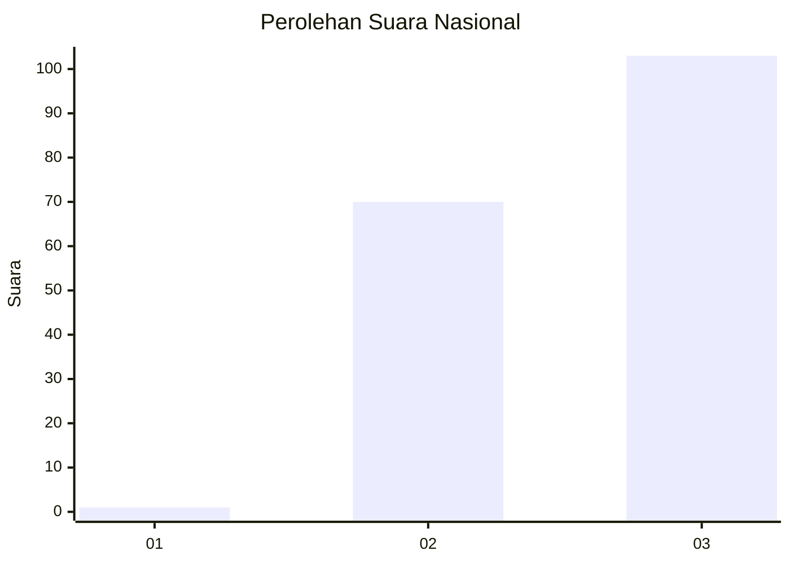
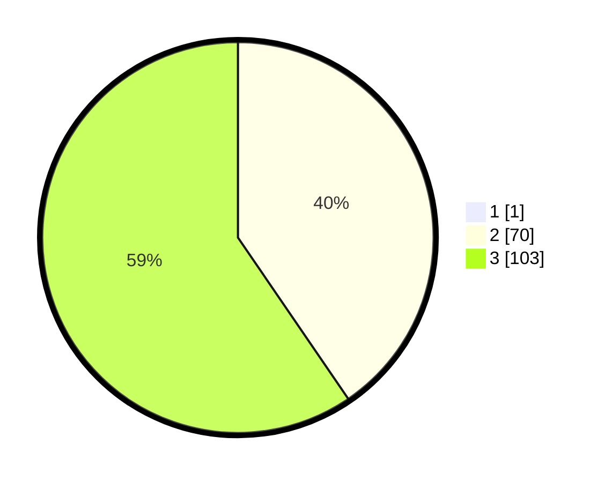

# Hasil

## Grafik

## Tabel

| No. | Nama Paslon    | Suara | Suara (raw) | Persentase |
|:--- |:-------------- | -----:| -----------:| ----------:|
| 1   | ANIES MUHAIMIN | 1     | [1][p-1]    | 0,57       |
| 2   | PRABOWO GIBRAN | 70    | [70][p-2]   | 40,23      |
| 3   | GANJAR MAHFUD  | 103   | [103][p-3]  | 59,20      |

[p-1]: https://github.com/gigit-pemilu/pemilu-2024/blob/main/pilpres/hitung-suara/sub/51-bali/sub/07-karangasem/sub/03-manggis/sub/2001-gegelang/sub/007-tps/sub/paslon-1.txt
[p-2]: https://github.com/gigit-pemilu/pemilu-2024/blob/main/pilpres/hitung-suara/sub/51-bali/sub/07-karangasem/sub/03-manggis/sub/2001-gegelang/sub/007-tps/sub/paslon-2.txt
[p-3]: https://github.com/gigit-pemilu/pemilu-2024/blob/main/pilpres/hitung-suara/sub/51-bali/sub/07-karangasem/sub/03-manggis/sub/2001-gegelang/sub/007-tps/sub/paslon-3.txt

## Foto C Plano

https://sirekap-obj-formc.kpu.go.id/a504/pemilu/ppwp/51/07/03/20/01/5107032001007-20240216-133107--9c1fcec6-fda3-4380-9c96-9b2619d1eea5.jpg

https://sirekap-obj-formc.kpu.go.id/a504/pemilu/ppwp/51/07/03/20/01/5107032001007-20240216-133108--2c1da1fe-3ba7-4707-b03e-f9d27976fd99.jpg

https://sirekap-obj-formc.kpu.go.id/a504/pemilu/ppwp/51/07/03/20/01/5107032001007-20240216-133107--f8fd81ba-c90a-4551-b3b9-34f4ee04c76e.jpg

## Metadata

| Key        | Value               |
| ---------- | ------------------- |
| Time Stamp | 2024-02-16 14:00:34 |

## DATA PEMILIH TETAP

Jumlah pemilih dalam DPT: **281**.
 * L: **138**.
 * P: **143**.

## DATA PENGGUNA HAK PILIH

Jumlah pengguna hak pilih dalam DPT: **183**.
 * L: **97**.
 * P: **86**.

Jumlah pengguna hak pilih dalam DPTb: **0**.
 * L: **0**.
 * P: **0**.

Jumlah pengguna hak pilih dalam DPK: **2**.
 * L: **0**.
 * P: **2**.

Jumlah pengguna hak pilih: **185**.
 * L: **97**.
 * P: **88**.

## JUMLAH SUARA SAH DAN TIDAK SAH

JUMLAH SELURUH SUARA SAH: **174**.

JUMLAH SUARA TIDAK SAH: **11**.

JUMLAH SELURUH SUARA SAH DAN SUARA TIDAK SAH: **185**.

