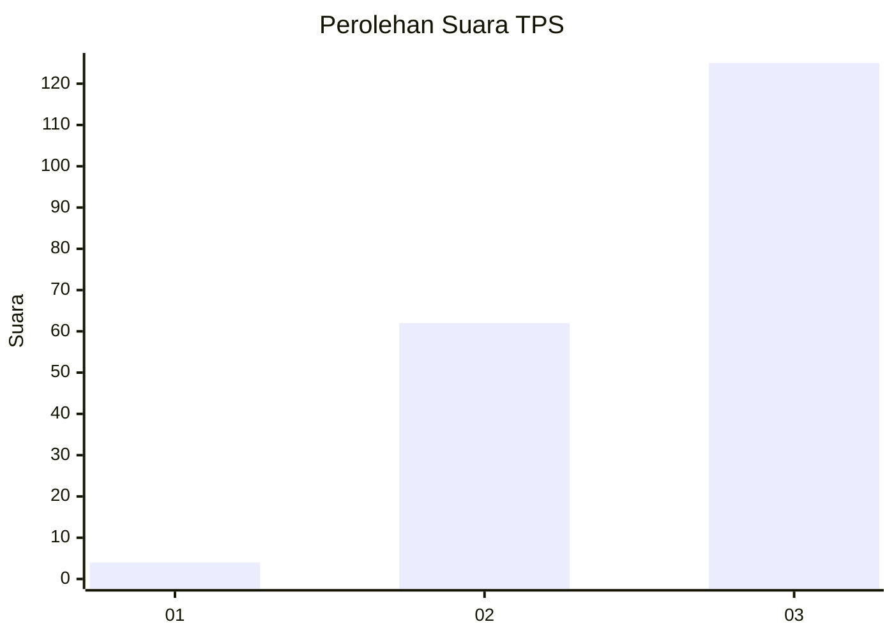
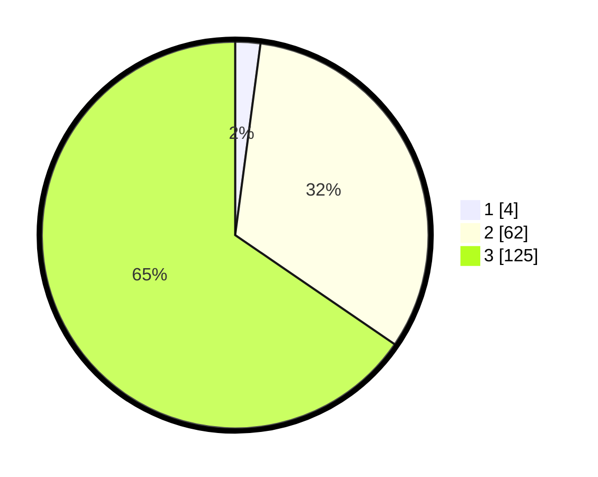

# Hasil

## Grafik

## Tabel

| No. | Nama Paslon    | Suara | Suara (raw) | Persentase |
|:--- |:-------------- | -----:| -----------:| ----------:|
| 1   | ANIES MUHAIMIN | 4     | [4][p-1]    | 2,09       |
| 2   | PRABOWO GIBRAN | 62    | [62][p-2]   | 32,46      |
| 3   | GANJAR MAHFUD  | 125   | [125][p-3]  | 65,45      |

[p-1]: https://github.com/gigit-pemilu/pemilu-2024-51-bali/blob/main/pilpres/hitung-suara/sub/51-bali/sub/07-karangasem/sub/03-manggis/sub/2001-gegelang/sub/008-tps/sub/paslon-1.txt
[p-2]: https://github.com/gigit-pemilu/pemilu-2024-51-bali/blob/main/pilpres/hitung-suara/sub/51-bali/sub/07-karangasem/sub/03-manggis/sub/2001-gegelang/sub/008-tps/sub/paslon-2.txt
[p-3]: https://github.com/gigit-pemilu/pemilu-2024-51-bali/blob/main/pilpres/hitung-suara/sub/51-bali/sub/07-karangasem/sub/03-manggis/sub/2001-gegelang/sub/008-tps/sub/paslon-3.txt

## Foto C Plano

https://sirekap-obj-formc.kpu.go.id/1a65/pemilu/ppwp/51/07/03/20/01/5107032001008-20240214-141052--fc3d17e9-b590-46d3-bf86-95749a060206.jpg

https://sirekap-obj-formc.kpu.go.id/1a65/pemilu/ppwp/51/07/03/20/01/5107032001008-20240214-141100--34c85b25-67ae-4a78-b8de-c285e2ca0a0a.jpg

https://sirekap-obj-formc.kpu.go.id/1a65/pemilu/ppwp/51/07/03/20/01/5107032001008-20240214-141151--2015cdc6-9e6a-475b-b753-90b3af72b62c.jpg

## Metadata

| Key        | Value               |
| ---------- | ------------------- |
| Time Stamp | 2024-02-14 21:46:01 |

## DATA PEMILIH TETAP

Jumlah pemilih dalam DPT: **280**.
 * L: **144**.
 * P: **136**.

## DATA PENGGUNA HAK PILIH

Jumlah pengguna hak pilih dalam DPT: **192**.
 * L: **105**.
 * P: **87**.

Jumlah pengguna hak pilih dalam DPTb: **0**.
 * L: **0**.
 * P: **0**.

Jumlah pengguna hak pilih dalam DPK: **6**.
 * L: **4**.
 * P: **2**.

Jumlah pengguna hak pilih: **198**.
 * L: **109**.
 * P: **89**.

## JUMLAH SUARA SAH DAN TIDAK SAH

JUMLAH SELURUH SUARA SAH: **191**.

JUMLAH SUARA TIDAK SAH: **7**.

JUMLAH SELURUH SUARA SAH DAN SUARA TIDAK SAH: **198**.

