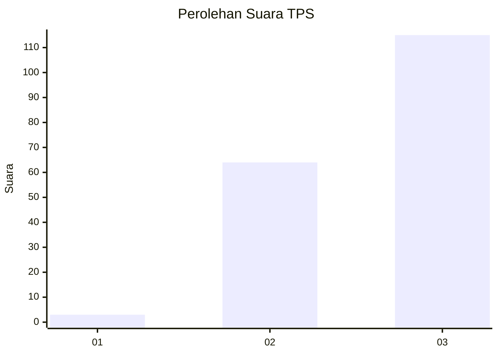
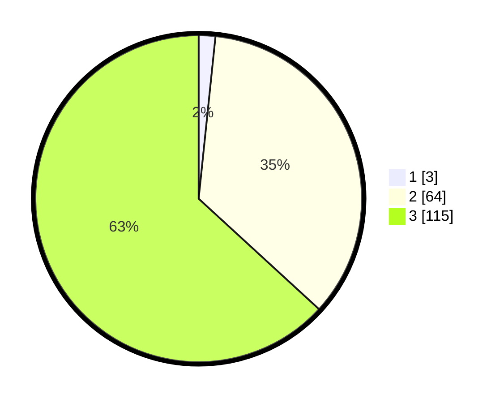

# Hasil

## Grafik

## Tabel

| No. | Nama Paslon    | Suara | Suara (raw) | Persentase |
|:--- |:-------------- | -----:| -----------:| ----------:|
| 1   | ANIES MUHAIMIN | 3     | [3][p-1]    | 1,65       |
| 2   | PRABOWO GIBRAN | 64    | [64][p-2]   | 35,16      |
| 3   | GANJAR MAHFUD  | 115   | [115][p-3]  | 63,19      |

[p-1]: https://github.com/gigit-pemilu/pemilu-2024-51-bali/blob/main/pilpres/hitung-suara/sub/51-bali/sub/07-karangasem/sub/03-manggis/sub/2001-gegelang/sub/011-tps/sub/paslon-1.txt
[p-2]: https://github.com/gigit-pemilu/pemilu-2024-51-bali/blob/main/pilpres/hitung-suara/sub/51-bali/sub/07-karangasem/sub/03-manggis/sub/2001-gegelang/sub/011-tps/sub/paslon-2.txt
[p-3]: https://github.com/gigit-pemilu/pemilu-2024-51-bali/blob/main/pilpres/hitung-suara/sub/51-bali/sub/07-karangasem/sub/03-manggis/sub/2001-gegelang/sub/011-tps/sub/paslon-3.txt

## Foto C Plano

https://sirekap-obj-formc.kpu.go.id/42f5/pemilu/ppwp/51/07/03/20/01/5107032001011-20240214-141321--d5951a64-af3f-4b67-9bfc-34ad87e88749.jpg

https://sirekap-obj-formc.kpu.go.id/42f5/pemilu/ppwp/51/07/03/20/01/5107032001011-20240214-141423--04431e80-e038-4d45-acc5-ff9d9c7b0ddb.jpg

https://sirekap-obj-formc.kpu.go.id/42f5/pemilu/ppwp/51/07/03/20/01/5107032001011-20240215-215133--5e5f505e-4f97-4c10-8e72-d122b6777baa.jpg

## Metadata

| Key        | Value               |
| ---------- | ------------------- |
| Time Stamp | 2024-02-16 10:00:28 |

## DATA PEMILIH TETAP

Jumlah pemilih dalam DPT: **280**.
 * L: **143**.
 * P: **137**.

## DATA PENGGUNA HAK PILIH

Jumlah pengguna hak pilih dalam DPT: **198**.
 * L: **107**.
 * P: **91**.

Jumlah pengguna hak pilih dalam DPTb: **0**.
 * L: **0**.
 * P: **0**.

Jumlah pengguna hak pilih dalam DPK: **1**.
 * L: **1**.
 * P: **0**.

Jumlah pengguna hak pilih: **199**.
 * L: **108**.
 * P: **91**.

## JUMLAH SUARA SAH DAN TIDAK SAH

JUMLAH SELURUH SUARA SAH: **182**.

JUMLAH SUARA TIDAK SAH: **17**.

JUMLAH SELURUH SUARA SAH DAN SUARA TIDAK SAH: **199**.

