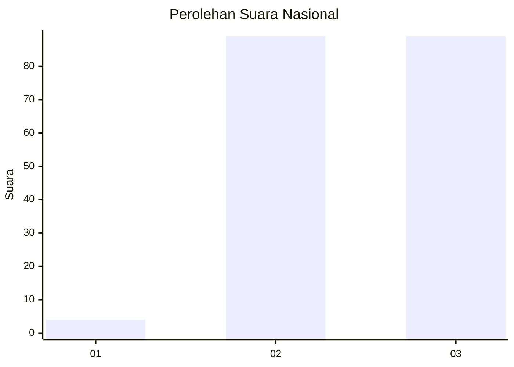
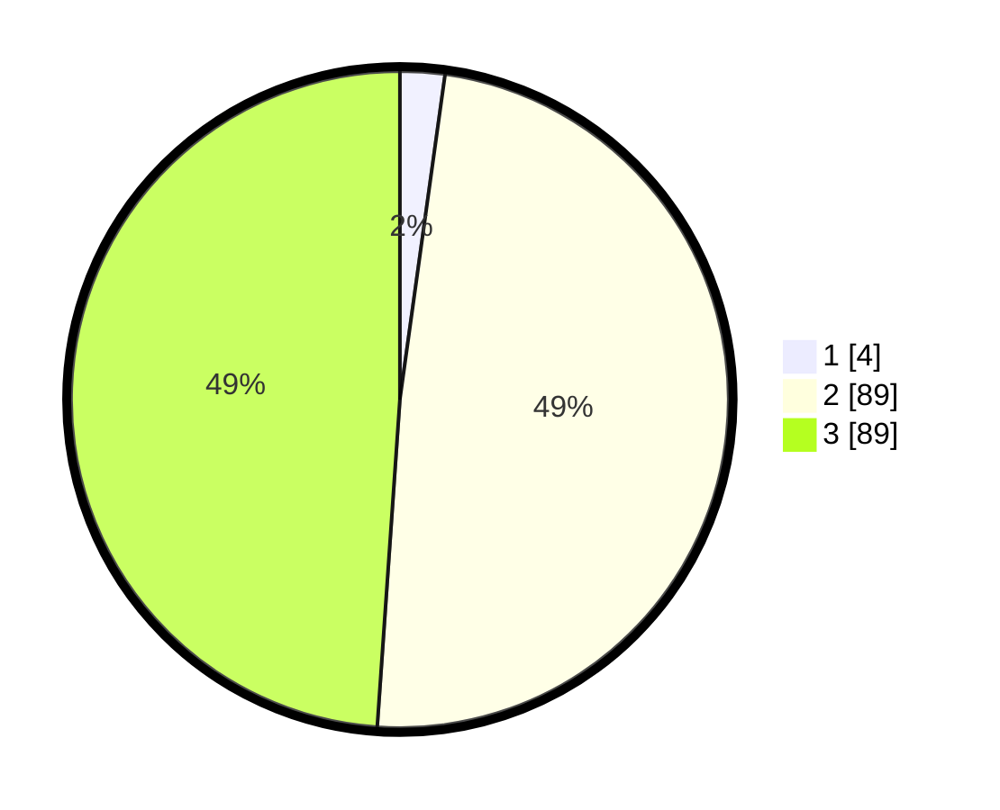

# Hasil

## Grafik

## Tabel

| No. | Nama Paslon    | Suara | Suara (raw) | Persentase |
|:--- |:-------------- | -----:| -----------:| ----------:|
| 1   | ANIES MUHAIMIN | 4     | [4][p-1]    | 2,20       |
| 2   | PRABOWO GIBRAN | 89    | [89][p-2]   | 48,90      |
| 3   | GANJAR MAHFUD  | 89    | [89][p-3]   | 48,90      |

[p-1]: https://github.com/gigit-pemilu/pemilu-2024/blob/main/pilpres/hitung-suara/sub/51-bali/sub/07-karangasem/sub/03-manggis/sub/2001-gegelang/sub/025-tps/sub/paslon-1.txt
[p-2]: https://github.com/gigit-pemilu/pemilu-2024/blob/main/pilpres/hitung-suara/sub/51-bali/sub/07-karangasem/sub/03-manggis/sub/2001-gegelang/sub/025-tps/sub/paslon-2.txt
[p-3]: https://github.com/gigit-pemilu/pemilu-2024/blob/main/pilpres/hitung-suara/sub/51-bali/sub/07-karangasem/sub/03-manggis/sub/2001-gegelang/sub/025-tps/sub/paslon-3.txt

## Foto C Plano

https://sirekap-obj-formc.kpu.go.id/769c/pemilu/ppwp/51/07/03/20/01/5107032001025-20240214-203809--9b3bb927-26b9-45cc-a757-51bac940f95f.jpg

https://sirekap-obj-formc.kpu.go.id/769c/pemilu/ppwp/51/07/03/20/01/5107032001025-20240214-203948--5a05e04d-16a3-4570-8b3e-67bedaafdc7f.jpg

https://sirekap-obj-formc.kpu.go.id/769c/pemilu/ppwp/51/07/03/20/01/5107032001025-20240214-204110--ccb075a4-e574-49fe-8c48-733754c24685.jpg

## Metadata

| Key        | Value               |
| ---------- | ------------------- |
| Time Stamp | 2024-02-19 06:16:00 |

