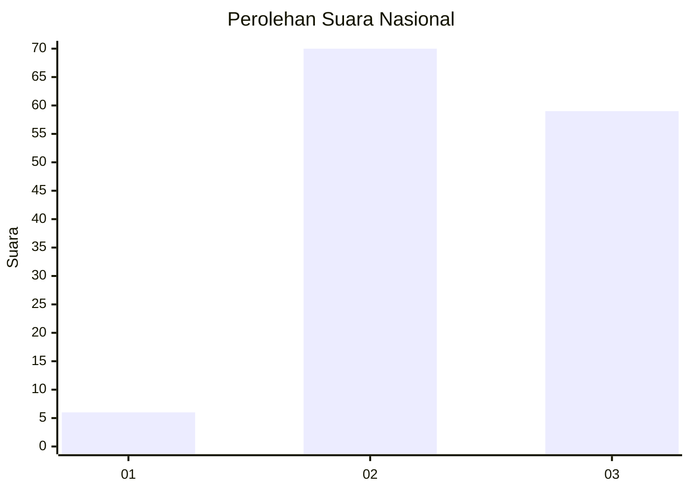
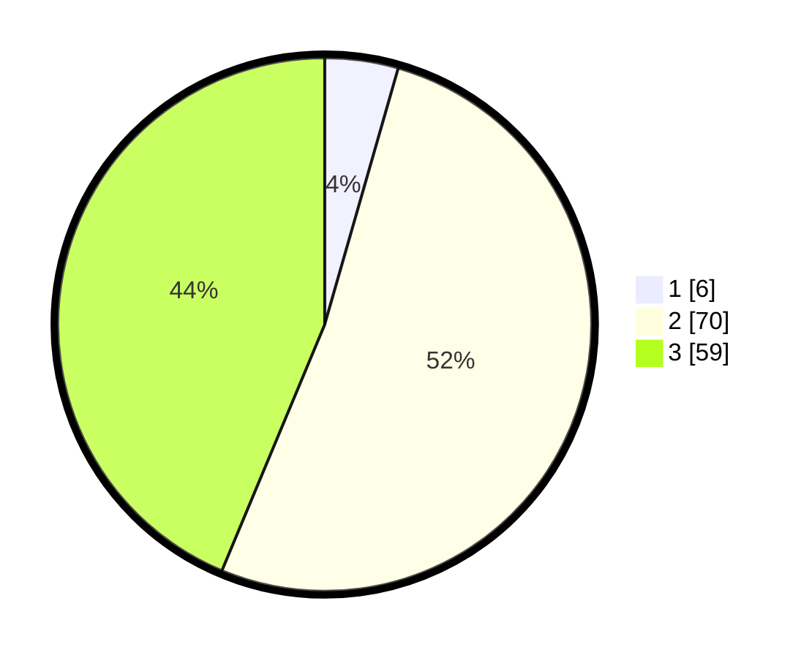

# Hasil

## Grafik

## Tabel

| No. | Nama Paslon    | Suara | Suara (raw) | Persentase |
|:--- |:-------------- | -----:| -----------:| ----------:|
| 1   | ANIES MUHAIMIN | 6     | [6][p-1]    | 4,44       |
| 2   | PRABOWO GIBRAN | 70    | [70][p-2]   | 51,85      |
| 3   | GANJAR MAHFUD  | 59    | [59][p-3]   | 43,70      |

[p-1]: https://github.com/gigit-pemilu/pemilu-2024/blob/main/pilpres/hitung-suara/sub/51-bali/sub/07-karangasem/sub/03-manggis/sub/2002-antiga/sub/003-tps/sub/paslon-1.txt
[p-2]: https://github.com/gigit-pemilu/pemilu-2024/blob/main/pilpres/hitung-suara/sub/51-bali/sub/07-karangasem/sub/03-manggis/sub/2002-antiga/sub/003-tps/sub/paslon-2.txt
[p-3]: https://github.com/gigit-pemilu/pemilu-2024/blob/main/pilpres/hitung-suara/sub/51-bali/sub/07-karangasem/sub/03-manggis/sub/2002-antiga/sub/003-tps/sub/paslon-3.txt

## Foto C Plano

https://sirekap-obj-formc.kpu.go.id/b228/pemilu/ppwp/51/07/03/20/02/5107032002003-20240214-130457--46b307f0-4b06-4946-9b35-20d5026b8b3f.jpg

https://sirekap-obj-formc.kpu.go.id/b228/pemilu/ppwp/51/07/03/20/02/5107032002003-20240214-130731--58cf09ae-bbed-4fb4-bfad-ea234fa87f0c.jpg

## Metadata

| Key        | Value               |
| ---------- | ------------------- |
| Time Stamp | 2024-02-24 22:31:28 |

