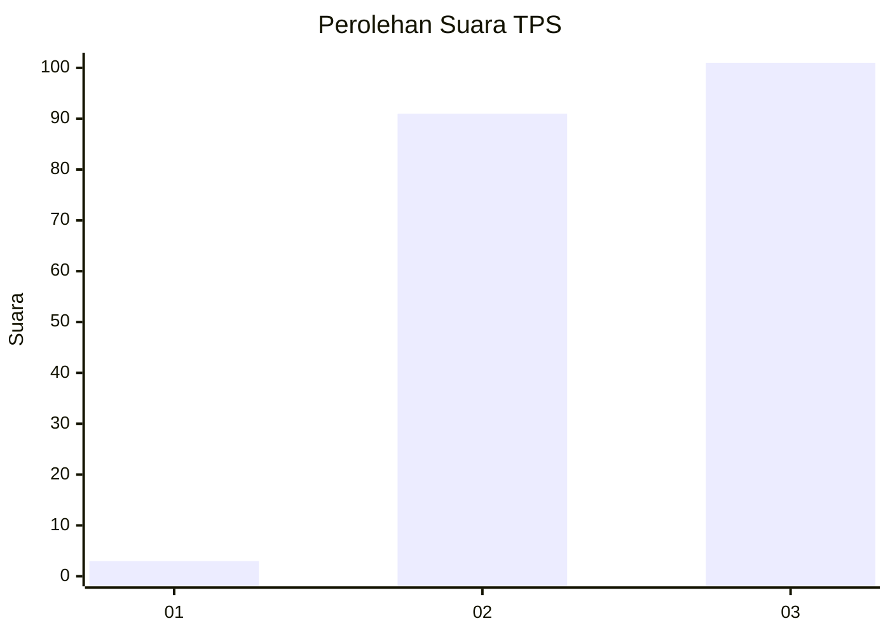
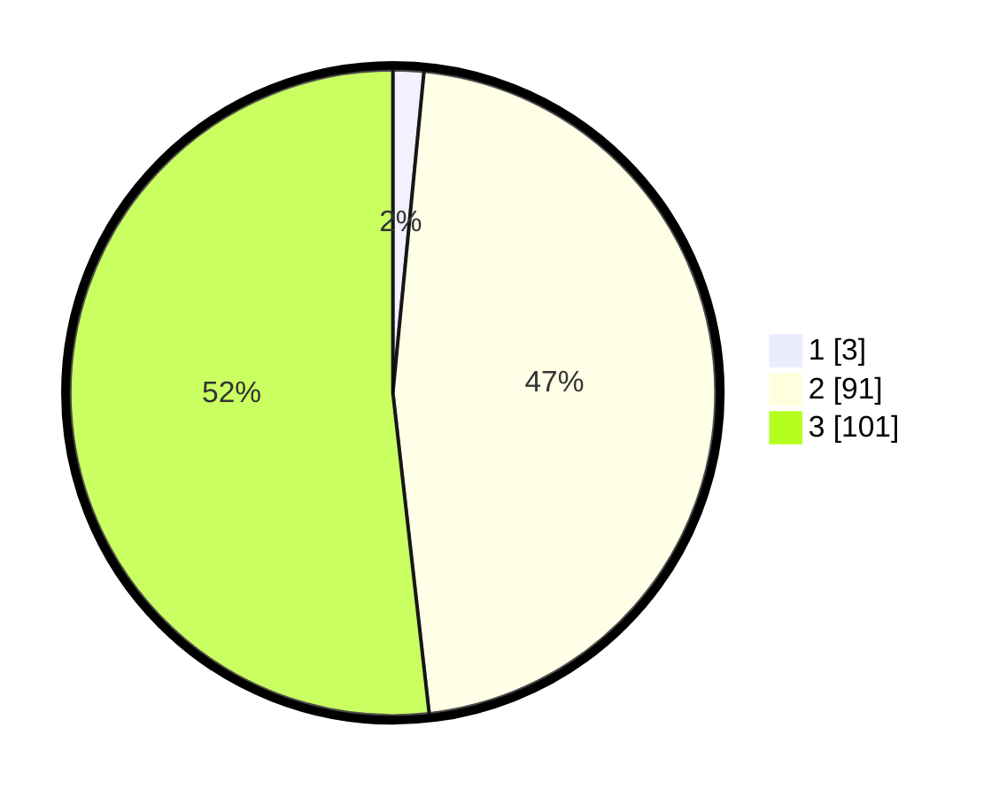

# Hasil

## Grafik

## Tabel

| No. | Nama Paslon    | Suara | Suara (raw) | Persentase |
|:--- |:-------------- | -----:| -----------:| ----------:|
| 1   | ANIES MUHAIMIN | 3     | [3][p-1]    | 1,54       |
| 2   | PRABOWO GIBRAN | 91    | [91][p-2]   | 46,67      |
| 3   | GANJAR MAHFUD  | 101   | [101][p-3]  | 51,79      |

[p-1]: https://github.com/gigit-pemilu/pemilu-2024-51-bali/blob/main/pilpres/hitung-suara/sub/51-bali/sub/07-karangasem/sub/03-manggis/sub/2002-antiga/sub/010-tps/sub/paslon-1.txt
[p-2]: https://github.com/gigit-pemilu/pemilu-2024-51-bali/blob/main/pilpres/hitung-suara/sub/51-bali/sub/07-karangasem/sub/03-manggis/sub/2002-antiga/sub/010-tps/sub/paslon-2.txt
[p-3]: https://github.com/gigit-pemilu/pemilu-2024-51-bali/blob/main/pilpres/hitung-suara/sub/51-bali/sub/07-karangasem/sub/03-manggis/sub/2002-antiga/sub/010-tps/sub/paslon-3.txt

## Foto C Plano

https://sirekap-obj-formc.kpu.go.id/eff7/pemilu/ppwp/51/07/03/20/02/5107032002010-20240214-204630--90ceeb87-3da6-483c-8d62-920829c3d368.jpg

https://sirekap-obj-formc.kpu.go.id/eff7/pemilu/ppwp/51/07/03/20/02/5107032002010-20240214-204721--8a20a315-b5ff-4832-87b1-2ebfe4bd96ec.jpg

https://sirekap-obj-formc.kpu.go.id/eff7/pemilu/ppwp/51/07/03/20/02/5107032002010-20240214-204906--fdf3b20b-8b23-435b-9112-4d8d5476dc8d.jpg

## Metadata

| Key        | Value               |
| ---------- | ------------------- |
| Time Stamp | 2024-02-19 06:16:00 |

