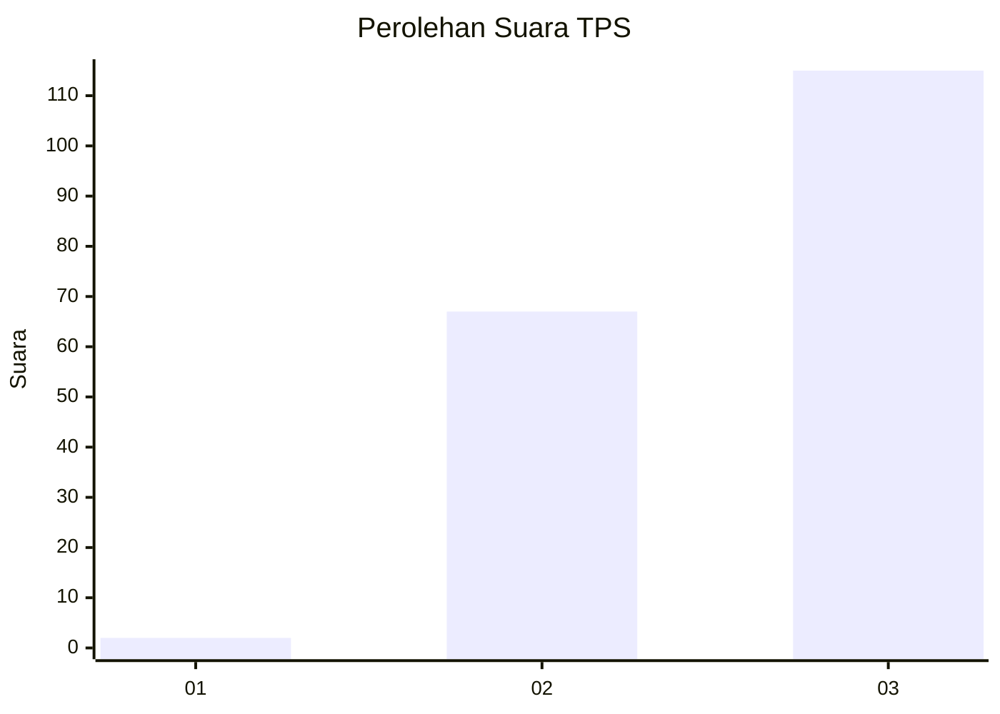
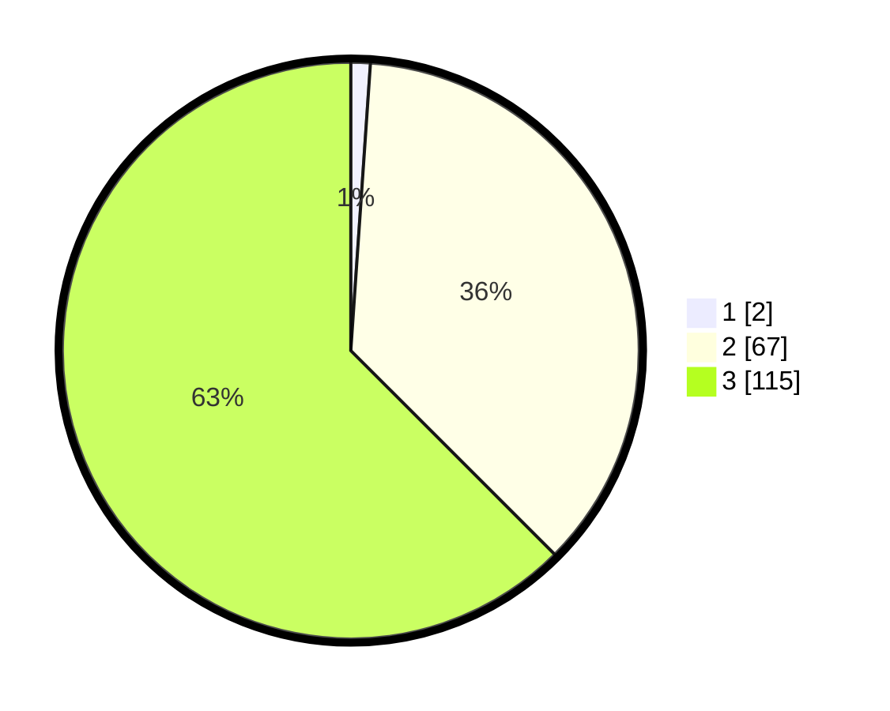

# Hasil

## Grafik

## Tabel

| No. | Nama Paslon    | Suara | Suara (raw) | Persentase |
|:--- |:-------------- | -----:| -----------:| ----------:|
| 1   | ANIES MUHAIMIN | 2     | [2][p-1]    | 1,09       |
| 2   | PRABOWO GIBRAN | 67    | [67][p-2]   | 36,41      |
| 3   | GANJAR MAHFUD  | 115   | [115][p-3]  | 62,50      |

[p-1]: https://github.com/gigit-pemilu/pemilu-2024-51-bali/blob/main/pilpres/hitung-suara/sub/51-bali/sub/07-karangasem/sub/03-manggis/sub/2002-antiga/sub/020-tps/sub/paslon-1.txt
[p-2]: https://github.com/gigit-pemilu/pemilu-2024-51-bali/blob/main/pilpres/hitung-suara/sub/51-bali/sub/07-karangasem/sub/03-manggis/sub/2002-antiga/sub/020-tps/sub/paslon-2.txt
[p-3]: https://github.com/gigit-pemilu/pemilu-2024-51-bali/blob/main/pilpres/hitung-suara/sub/51-bali/sub/07-karangasem/sub/03-manggis/sub/2002-antiga/sub/020-tps/sub/paslon-3.txt

## Foto C Plano

https://sirekap-obj-formc.kpu.go.id/1a1f/pemilu/ppwp/51/07/03/20/02/5107032002020-20240214-132918--a173a349-7d00-4533-820a-47480b1dbe90.jpg

https://sirekap-obj-formc.kpu.go.id/1a1f/pemilu/ppwp/51/07/03/20/02/5107032002020-20240214-132408--8c3956fa-ad7e-4858-9207-64d9bc4ef764.jpg

https://sirekap-obj-formc.kpu.go.id/1a1f/pemilu/ppwp/51/07/03/20/02/5107032002020-20240214-132702--39fa19c2-5337-44f3-a9af-92437f5c8f93.jpg

## Metadata

| Key        | Value               |
| ---------- | ------------------- |
| Time Stamp | 2024-02-17 14:56:33 |

