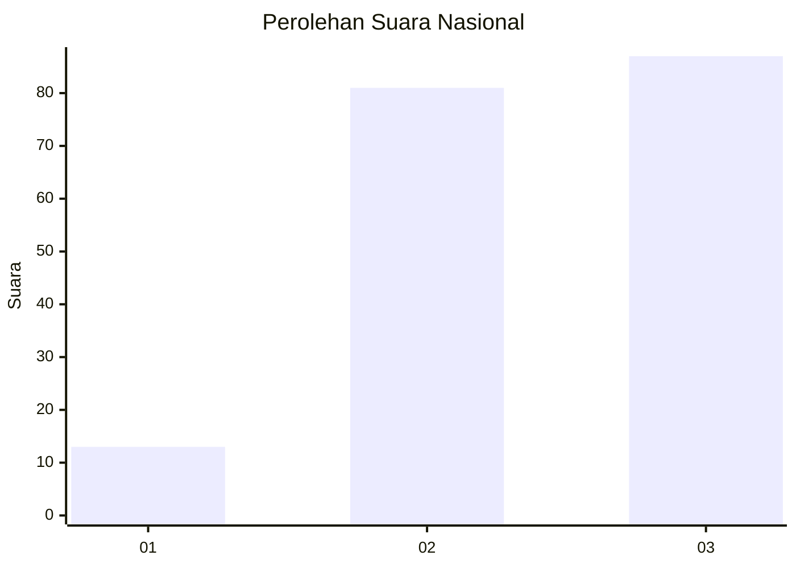
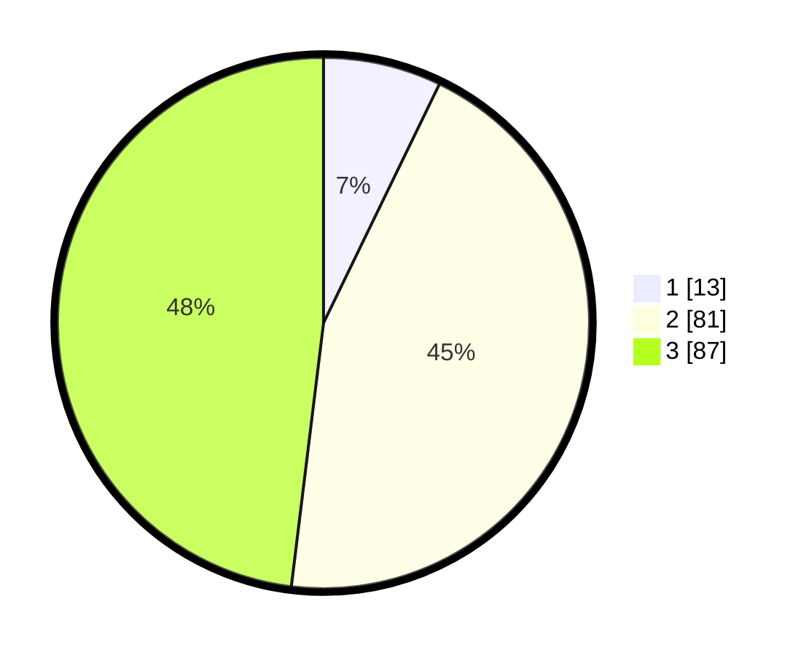

# Hasil

## Grafik

## Tabel

| No. | Nama Paslon    | Suara | Suara (raw) | Persentase |
|:--- |:-------------- | -----:| -----------:| ----------:|
| 1   | ANIES MUHAIMIN | 13    | [13][p-1]   | 7,18       |
| 2   | PRABOWO GIBRAN | 81    | [81][p-2]   | 44,75      |
| 3   | GANJAR MAHFUD  | 87    | [87][p-3]   | 48,07      |

[p-1]: https://github.com/gigit-pemilu/pemilu-2024/blob/main/pilpres/hitung-suara/sub/51-bali/sub/07-karangasem/sub/03-manggis/sub/2003-ulakan/sub/001-tps/sub/paslon-1.txt
[p-2]: https://github.com/gigit-pemilu/pemilu-2024/blob/main/pilpres/hitung-suara/sub/51-bali/sub/07-karangasem/sub/03-manggis/sub/2003-ulakan/sub/001-tps/sub/paslon-2.txt
[p-3]: https://github.com/gigit-pemilu/pemilu-2024/blob/main/pilpres/hitung-suara/sub/51-bali/sub/07-karangasem/sub/03-manggis/sub/2003-ulakan/sub/001-tps/sub/paslon-3.txt

## Foto C Plano

https://sirekap-obj-formc.kpu.go.id/d5d8/pemilu/ppwp/51/07/03/20/03/5107032003001-20240214-132402--9fa5de63-ca6a-4846-a0b4-4e87690d2d36.jpg

https://sirekap-obj-formc.kpu.go.id/d5d8/pemilu/ppwp/51/07/03/20/03/5107032003001-20240214-132509--5f8c2b67-c38d-4c79-a3d2-8a047f31d541.jpg

https://sirekap-obj-formc.kpu.go.id/d5d8/pemilu/ppwp/51/07/03/20/03/5107032003001-20240214-131741--86545906-b970-4d16-bd53-7e6d8f4ecc36.jpg

## Metadata

| Key        | Value               |
| ---------- | ------------------- |
| Time Stamp | 2024-02-14 21:46:01 |

