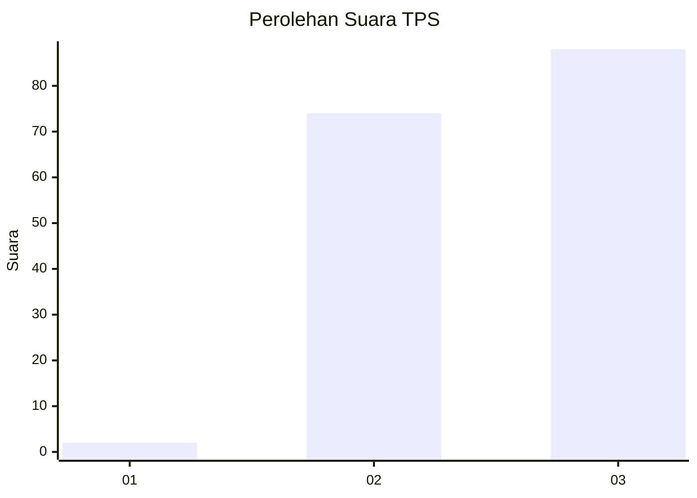
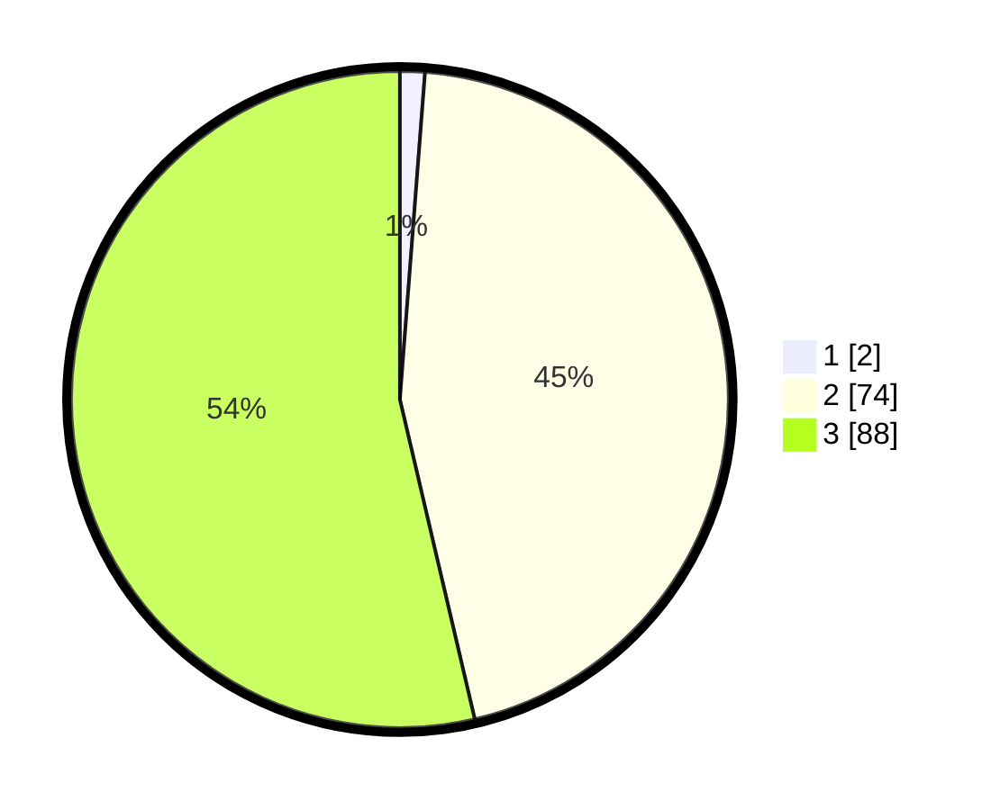

# Hasil

## Grafik

## Tabel

| No. | Nama Paslon    | Suara | Suara (raw) | Persentase |
|:--- |:-------------- | -----:| -----------:| ----------:|
| 1   | ANIES MUHAIMIN | 2     | [2][p-1]    | 1,22       |
| 2   | PRABOWO GIBRAN | 74    | [74][p-2]   | 45,12      |
| 3   | GANJAR MAHFUD  | 88    | [88][p-3]   | 53,66      |

[p-1]: https://github.com/gigit-pemilu/pemilu-2024-51-bali/blob/main/pilpres/hitung-suara/sub/51-bali/sub/07-karangasem/sub/03-manggis/sub/2003-ulakan/sub/013-tps/sub/paslon-1.txt
[p-2]: https://github.com/gigit-pemilu/pemilu-2024-51-bali/blob/main/pilpres/hitung-suara/sub/51-bali/sub/07-karangasem/sub/03-manggis/sub/2003-ulakan/sub/013-tps/sub/paslon-2.txt
[p-3]: https://github.com/gigit-pemilu/pemilu-2024-51-bali/blob/main/pilpres/hitung-suara/sub/51-bali/sub/07-karangasem/sub/03-manggis/sub/2003-ulakan/sub/013-tps/sub/paslon-3.txt

## Foto C Plano

https://sirekap-obj-formc.kpu.go.id/ca1d/pemilu/ppwp/51/07/03/20/03/5107032003013-20240214-232644--551cd323-5274-48a4-875f-1e3d477c2e88.jpg

https://sirekap-obj-formc.kpu.go.id/ca1d/pemilu/ppwp/51/07/03/20/03/5107032003013-20240214-232653--9abfebbe-f933-4485-adba-84df51869d5f.jpg

https://sirekap-obj-formc.kpu.go.id/ca1d/pemilu/ppwp/51/07/03/20/03/5107032003013-20240214-232701--f3d84856-3657-40ed-91f0-e8051dbd99e2.jpg

## Metadata

| Key        | Value               |
| ---------- | ------------------- |
| Time Stamp | 2024-02-17 14:56:33 |

