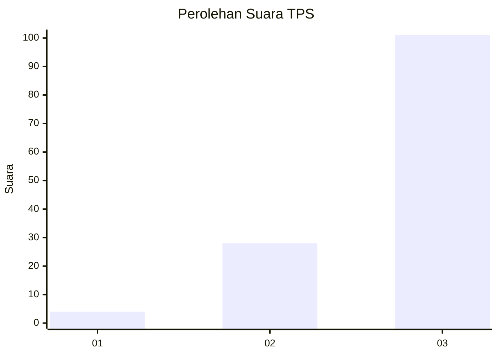
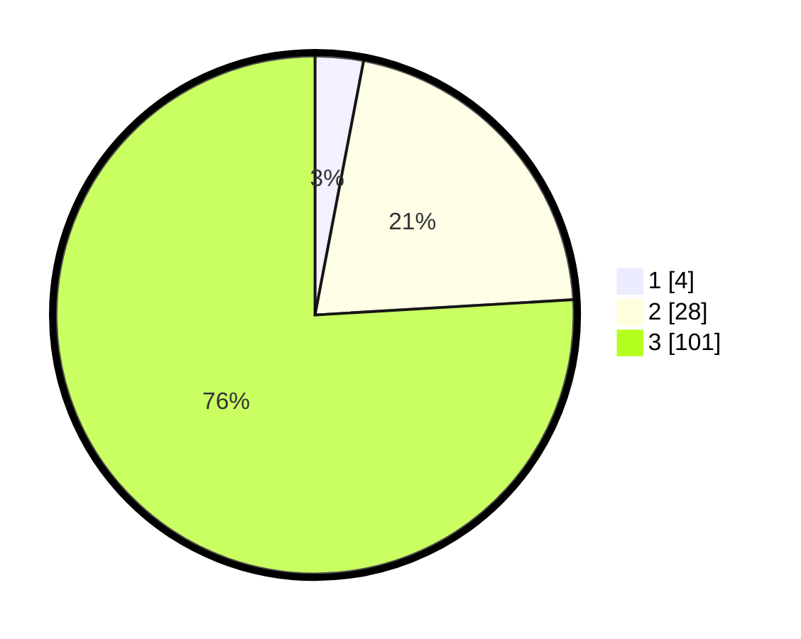

# Hasil

## Grafik

## Tabel

| No. | Nama Paslon    | Suara | Suara (raw) | Persentase |
|:--- |:-------------- | -----:| -----------:| ----------:|
| 1   | ANIES MUHAIMIN | 4     | [4][p-1]    | 3,01       |
| 2   | PRABOWO GIBRAN | 28    | [28][p-2]   | 21,05      |
| 3   | GANJAR MAHFUD  | 101   | [101][p-3]  | 75,94      |

[p-1]: https://github.com/gigit-pemilu/pemilu-2024-51-bali/blob/main/pilpres/hitung-suara/sub/51-bali/sub/07-karangasem/sub/03-manggis/sub/2004-manggis/sub/003-tps/sub/paslon-1.txt
[p-2]: https://github.com/gigit-pemilu/pemilu-2024-51-bali/blob/main/pilpres/hitung-suara/sub/51-bali/sub/07-karangasem/sub/03-manggis/sub/2004-manggis/sub/003-tps/sub/paslon-2.txt
[p-3]: https://github.com/gigit-pemilu/pemilu-2024-51-bali/blob/main/pilpres/hitung-suara/sub/51-bali/sub/07-karangasem/sub/03-manggis/sub/2004-manggis/sub/003-tps/sub/paslon-3.txt

## Foto C Plano

https://sirekap-obj-formc.kpu.go.id/c166/pemilu/ppwp/51/07/03/20/04/5107032004003-20240214-214013--588d8205-565f-4836-bb1e-1d68dde9862f.jpg

https://sirekap-obj-formc.kpu.go.id/c166/pemilu/ppwp/51/07/03/20/04/5107032004003-20240214-141749--0b586e2c-ca2d-45e5-9175-052bfc15463e.jpg

https://sirekap-obj-formc.kpu.go.id/c166/pemilu/ppwp/51/07/03/20/04/5107032004003-20240216-024152--601ae623-900a-4f77-a7d1-fb6050913dbc.jpg

## Metadata

| Key        | Value               |
| ---------- | ------------------- |
| Time Stamp | 2024-02-16 10:30:29 |

## DATA PEMILIH TETAP

Jumlah pemilih dalam DPT: **161**.
 * L: **74**.
 * P: **87**.

## DATA PENGGUNA HAK PILIH

Jumlah pengguna hak pilih dalam DPT: **133**.
 * L: **63**.
 * P: **70**.

Jumlah pengguna hak pilih dalam DPTb: **1**.
 * L: **1**.
 * P: **0**.

Jumlah pengguna hak pilih dalam DPK: **0**.
 * L: **0**.
 * P: **0**.

Jumlah pengguna hak pilih: **134**.
 * L: **64**.
 * P: **70**.

## JUMLAH SUARA SAH DAN TIDAK SAH

JUMLAH SELURUH SUARA SAH: **133**.

JUMLAH SUARA TIDAK SAH: **1**.

JUMLAH SELURUH SUARA SAH DAN SUARA TIDAK SAH: **134**.

