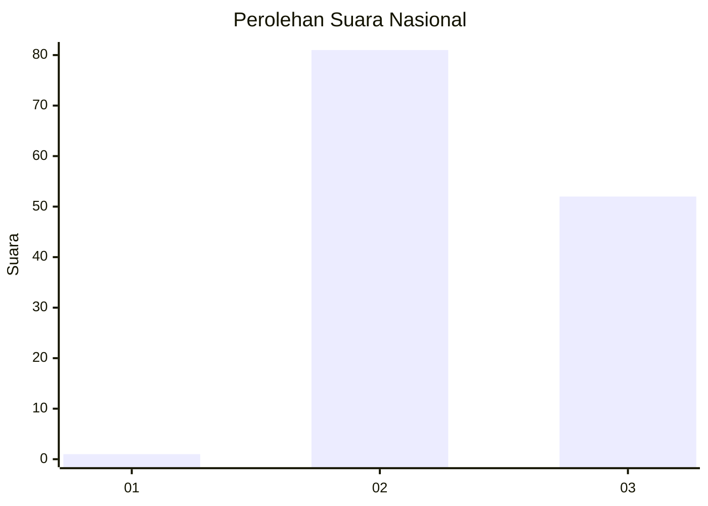
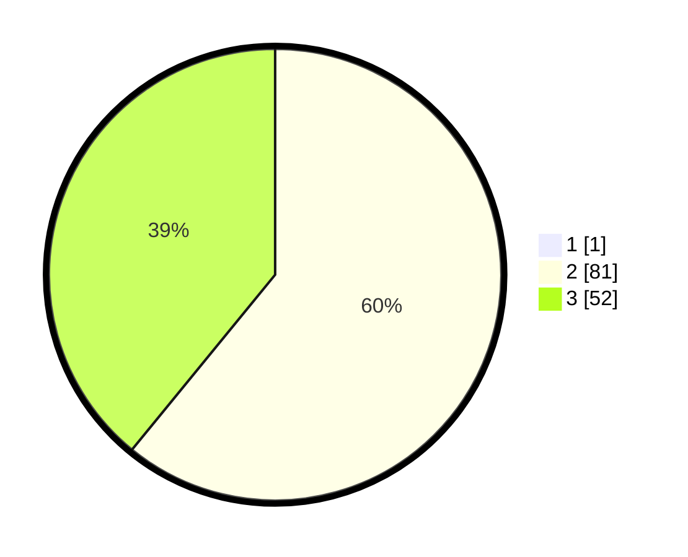

# Hasil

## Grafik

## Tabel

| No. | Nama Paslon    | Suara | Suara (raw) | Persentase |
|:--- |:-------------- | -----:| -----------:| ----------:|
| 1   | ANIES MUHAIMIN | 1     | [1][p-1]    | 0,75       |
| 2   | PRABOWO GIBRAN | 81    | [81][p-2]   | 60,45      |
| 3   | GANJAR MAHFUD  | 52    | [52][p-3]   | 38,81      |

[p-1]: https://github.com/gigit-pemilu/pemilu-2024/blob/main/pilpres/hitung-suara/sub/51-bali/sub/07-karangasem/sub/03-manggis/sub/2004-manggis/sub/007-tps/sub/paslon-1.txt
[p-2]: https://github.com/gigit-pemilu/pemilu-2024/blob/main/pilpres/hitung-suara/sub/51-bali/sub/07-karangasem/sub/03-manggis/sub/2004-manggis/sub/007-tps/sub/paslon-2.txt
[p-3]: https://github.com/gigit-pemilu/pemilu-2024/blob/main/pilpres/hitung-suara/sub/51-bali/sub/07-karangasem/sub/03-manggis/sub/2004-manggis/sub/007-tps/sub/paslon-3.txt

## Foto C Plano

https://sirekap-obj-formc.kpu.go.id/f8a3/pemilu/ppwp/51/07/03/20/04/5107032004007-20240214-133116--cb3a2b3c-4d67-47c7-8cc4-1411c5a1dc9e.jpg

https://sirekap-obj-formc.kpu.go.id/f8a3/pemilu/ppwp/51/07/03/20/04/5107032004007-20240214-133025--46b0c258-55b4-407d-a76f-7ae69863aca6.jpg

https://sirekap-obj-formc.kpu.go.id/f8a3/pemilu/ppwp/51/07/03/20/04/5107032004007-20240214-222046--f533cc3d-517f-4fa9-b42e-d576db4c1283.jpg

## Metadata

| Key        | Value               |
| ---------- | ------------------- |
| Time Stamp | 2024-02-16 10:30:29 |

## DATA PEMILIH TETAP

Jumlah pemilih dalam DPT: **159**.
 * L: **82**.
 * P: **77**.

## DATA PENGGUNA HAK PILIH

Jumlah pengguna hak pilih dalam DPT: **137**.
 * L: **75**.
 * P: **62**.

Jumlah pengguna hak pilih dalam DPTb: **4**.
 * L: **2**.
 * P: **2**.

Jumlah pengguna hak pilih dalam DPK: **0**.
 * L: **0**.
 * P: **0**.

Jumlah pengguna hak pilih: **141**.
 * L: **77**.
 * P: **64**.

## JUMLAH SUARA SAH DAN TIDAK SAH

JUMLAH SELURUH SUARA SAH: **134**.

JUMLAH SUARA TIDAK SAH: **7**.

JUMLAH SELURUH SUARA SAH DAN SUARA TIDAK SAH: **141**.

