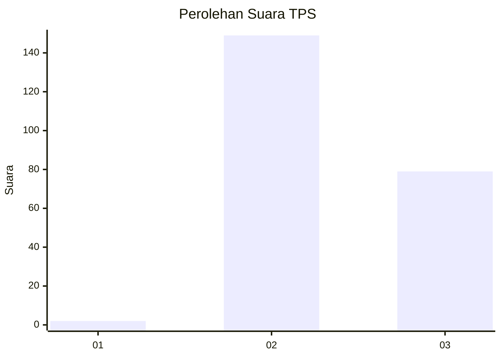
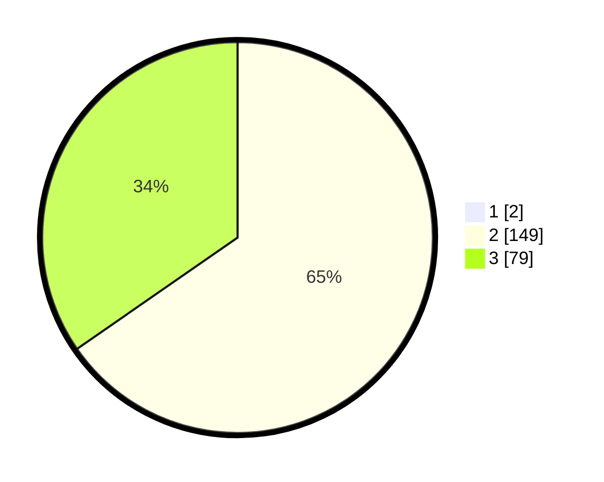

# Hasil

## Grafik

## Tabel

| No. | Nama Paslon    | Suara | Suara (raw) | Persentase |
|:--- |:-------------- | -----:| -----------:| ----------:|
| 1   | ANIES MUHAIMIN | 2     | [2][p-1]    | 0,87       |
| 2   | PRABOWO GIBRAN | 149   | [149][p-2]  | 64,78      |
| 3   | GANJAR MAHFUD  | 79    | [79][p-3]   | 34,35      |

[p-1]: https://github.com/gigit-pemilu/pemilu-2024-51-bali/blob/main/pilpres/hitung-suara/sub/51-bali/sub/07-karangasem/sub/03-manggis/sub/2004-manggis/sub/013-tps/sub/paslon-1.txt
[p-2]: https://github.com/gigit-pemilu/pemilu-2024-51-bali/blob/main/pilpres/hitung-suara/sub/51-bali/sub/07-karangasem/sub/03-manggis/sub/2004-manggis/sub/013-tps/sub/paslon-2.txt
[p-3]: https://github.com/gigit-pemilu/pemilu-2024-51-bali/blob/main/pilpres/hitung-suara/sub/51-bali/sub/07-karangasem/sub/03-manggis/sub/2004-manggis/sub/013-tps/sub/paslon-3.txt

## Foto C Plano

https://sirekap-obj-formc.kpu.go.id/f36c/pemilu/ppwp/51/07/03/20/04/5107032004013-20240214-215957--9bfdd922-b516-4a00-9976-e58830cd1662.jpg

https://sirekap-obj-formc.kpu.go.id/f36c/pemilu/ppwp/51/07/03/20/04/5107032004013-20240214-220218--a66cf0df-484e-4c35-aee8-a2f6b18b0484.jpg

https://sirekap-obj-formc.kpu.go.id/f36c/pemilu/ppwp/51/07/03/20/04/5107032004013-20240214-220301--4c6bdb04-317e-4e47-b910-f8e83e618b8c.jpg

## Metadata

| Key        | Value               |
| ---------- | ------------------- |
| Time Stamp | 2024-02-17 16:00:02 |

