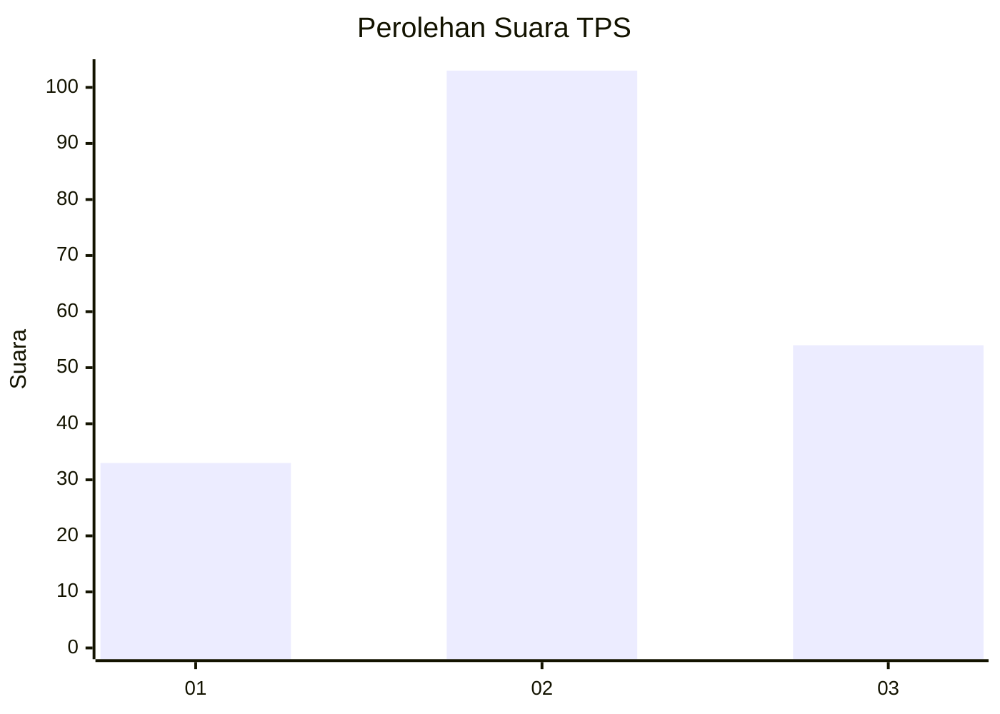
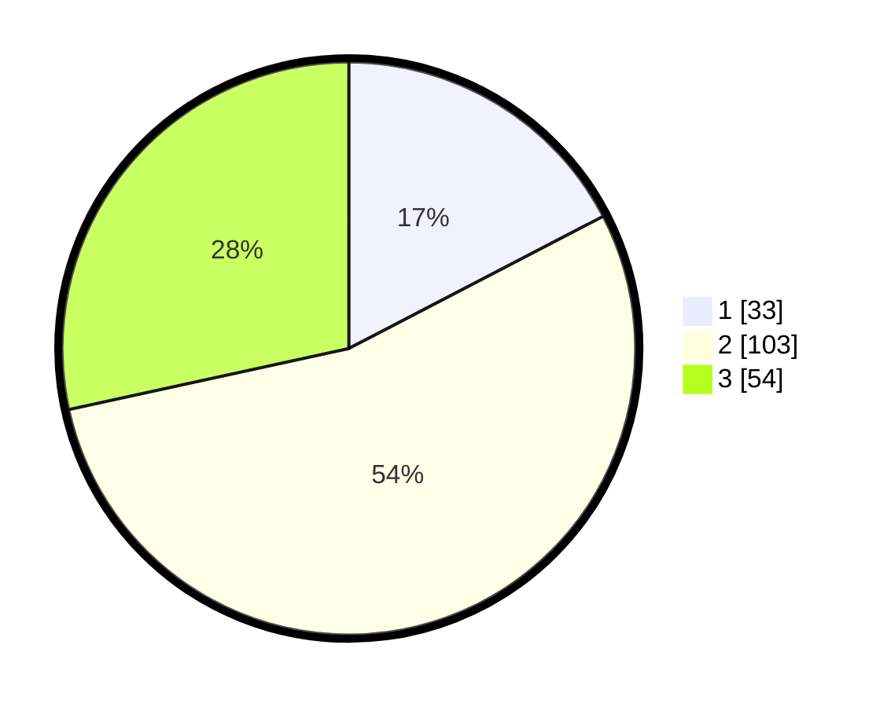

# Hasil

## Grafik

## Tabel

| No. | Nama Paslon    | Suara | Suara (raw) | Persentase |
|:--- |:-------------- | -----:| -----------:| ----------:|
| 1   | ANIES MUHAIMIN | 33    | [33][p-1]   | 17,37      |
| 2   | PRABOWO GIBRAN | 103   | [103][p-2]  | 54,21      |
| 3   | GANJAR MAHFUD  | 54    | [54][p-3]   | 28,42      |

[p-1]: https://github.com/gigit-pemilu/pemilu-2024-51-bali/blob/main/pilpres/hitung-suara/sub/51-bali/sub/07-karangasem/sub/03-manggis/sub/2004-manggis/sub/015-tps/sub/paslon-1.txt
[p-2]: https://github.com/gigit-pemilu/pemilu-2024-51-bali/blob/main/pilpres/hitung-suara/sub/51-bali/sub/07-karangasem/sub/03-manggis/sub/2004-manggis/sub/015-tps/sub/paslon-2.txt
[p-3]: https://github.com/gigit-pemilu/pemilu-2024-51-bali/blob/main/pilpres/hitung-suara/sub/51-bali/sub/07-karangasem/sub/03-manggis/sub/2004-manggis/sub/015-tps/sub/paslon-3.txt

## Foto C Plano

https://sirekap-obj-formc.kpu.go.id/80d4/pemilu/ppwp/51/07/03/20/04/5107032004015-20240214-223334--1c7da558-2323-4242-af07-1bc2603f2c3e.jpg

https://sirekap-obj-formc.kpu.go.id/80d4/pemilu/ppwp/51/07/03/20/04/5107032004015-20240214-223541--db94cf33-685f-447a-af80-ecb9278c3ec4.jpg

## Metadata

| Key        | Value               |
| ---------- | ------------------- |
| Time Stamp | 2024-02-17 16:00:02 |

