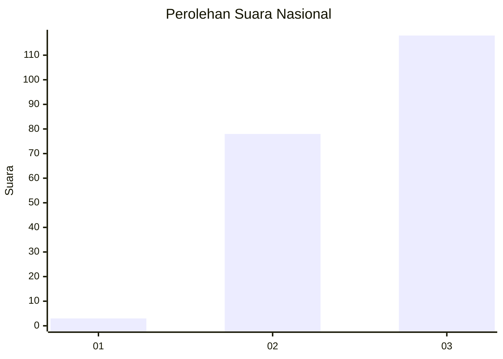
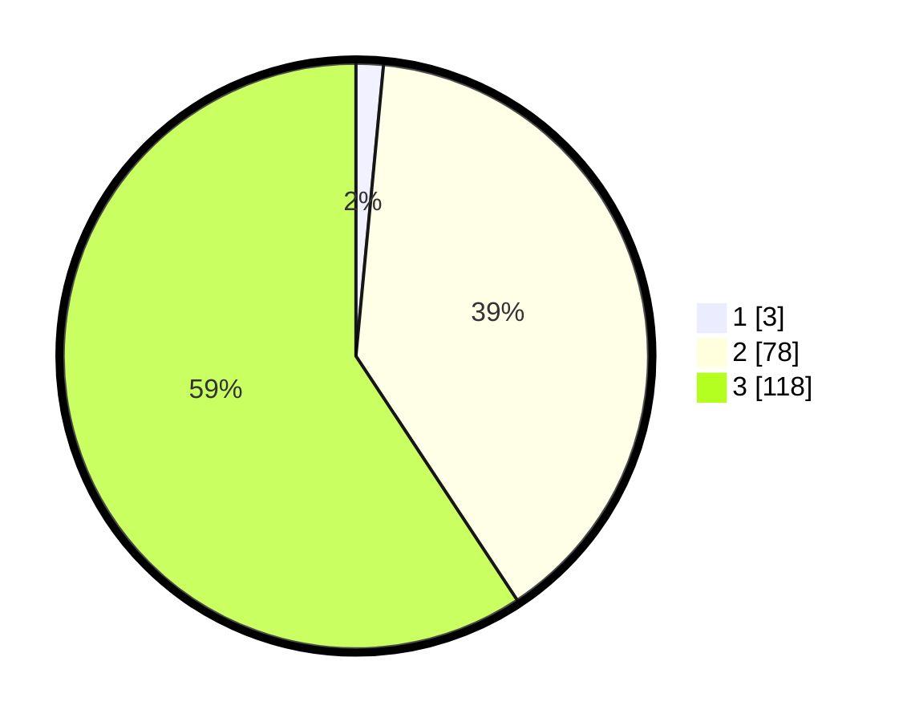

# Hasil

## Grafik

## Tabel

| No. | Nama Paslon    | Suara | Suara (raw) | Persentase |
|:--- |:-------------- | -----:| -----------:| ----------:|
| 1   | ANIES MUHAIMIN | 3     | [3][p-1]    | 1,51       |
| 2   | PRABOWO GIBRAN | 78    | [78][p-2]   | 39,20      |
| 3   | GANJAR MAHFUD  | 118   | [118][p-3]  | 59,30      |

[p-1]: https://github.com/gigit-pemilu/pemilu-2024/blob/main/pilpres/hitung-suara/sub/51-bali/sub/07-karangasem/sub/03-manggis/sub/2004-manggis/sub/017-tps/sub/paslon-1.txt
[p-2]: https://github.com/gigit-pemilu/pemilu-2024/blob/main/pilpres/hitung-suara/sub/51-bali/sub/07-karangasem/sub/03-manggis/sub/2004-manggis/sub/017-tps/sub/paslon-2.txt
[p-3]: https://github.com/gigit-pemilu/pemilu-2024/blob/main/pilpres/hitung-suara/sub/51-bali/sub/07-karangasem/sub/03-manggis/sub/2004-manggis/sub/017-tps/sub/paslon-3.txt

## Foto C Plano

https://sirekap-obj-formc.kpu.go.id/8bdc/pemilu/ppwp/51/07/03/20/04/5107032004017-20240215-014819--29f9764f-2e9f-4191-9a37-c9591c83c49f.jpg

https://sirekap-obj-formc.kpu.go.id/8bdc/pemilu/ppwp/51/07/03/20/04/5107032004017-20240215-014844--199877fb-3dcb-4ace-a1d1-6b9e25ada92f.jpg

https://sirekap-obj-formc.kpu.go.id/8bdc/pemilu/ppwp/51/07/03/20/04/5107032004017-20240215-014925--02f45c36-1838-4060-937c-177e242040e4.jpg

## Metadata

| Key        | Value               |
| ---------- | ------------------- |
| Time Stamp | 2024-02-16 11:00:29 |

