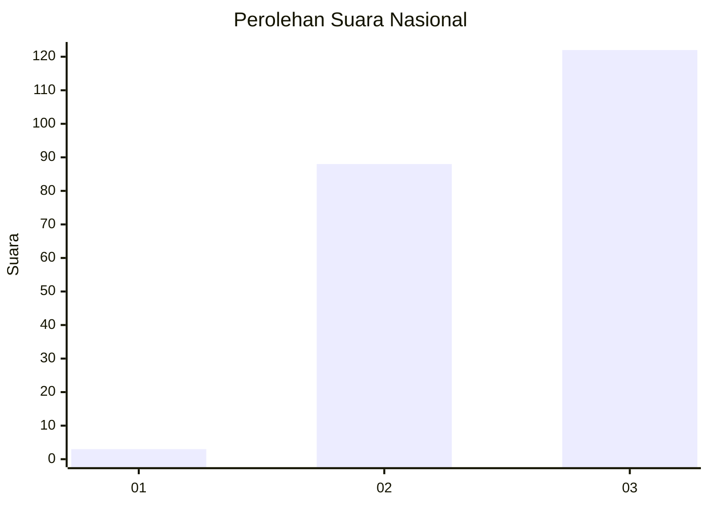
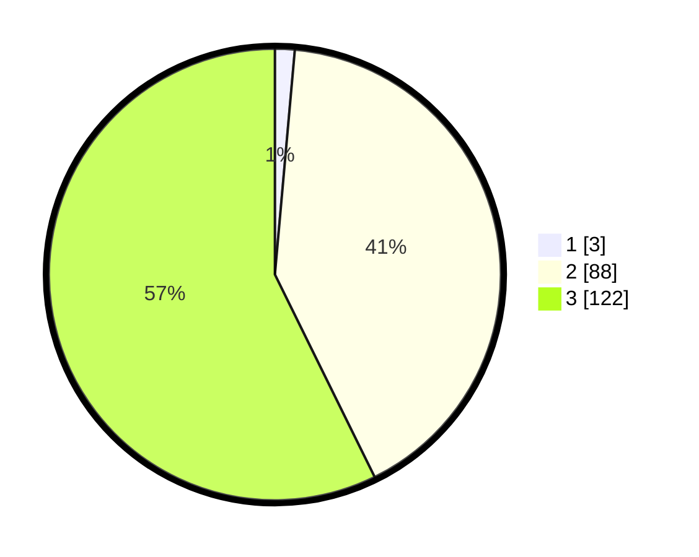

# Hasil

## Grafik

## Tabel

| No. | Nama Paslon    | Suara | Suara (raw) | Persentase |
|:--- |:-------------- | -----:| -----------:| ----------:|
| 1   | ANIES MUHAIMIN | 3     | [3][p-1]    | 1,41       |
| 2   | PRABOWO GIBRAN | 88    | [88][p-2]   | 41,31      |
| 3   | GANJAR MAHFUD  | 122   | [122][p-3]  | 57,28      |

[p-1]: https://github.com/gigit-pemilu/pemilu-2024/blob/main/pilpres/hitung-suara/sub/51-bali/sub/07-karangasem/sub/03-manggis/sub/2004-manggis/sub/018-tps/sub/paslon-1.txt
[p-2]: https://github.com/gigit-pemilu/pemilu-2024/blob/main/pilpres/hitung-suara/sub/51-bali/sub/07-karangasem/sub/03-manggis/sub/2004-manggis/sub/018-tps/sub/paslon-2.txt
[p-3]: https://github.com/gigit-pemilu/pemilu-2024/blob/main/pilpres/hitung-suara/sub/51-bali/sub/07-karangasem/sub/03-manggis/sub/2004-manggis/sub/018-tps/sub/paslon-3.txt

## Foto C Plano

https://sirekap-obj-formc.kpu.go.id/b3c9/pemilu/ppwp/51/07/03/20/04/5107032004018-20240215-012715--698a5028-2bf5-44d1-a569-6df44a11ac01.jpg

https://sirekap-obj-formc.kpu.go.id/b3c9/pemilu/ppwp/51/07/03/20/04/5107032004018-20240215-021656--5305059a-9dce-4ba9-9b8f-2d669991cf09.jpg

https://sirekap-obj-formc.kpu.go.id/b3c9/pemilu/ppwp/51/07/03/20/04/5107032004018-20240215-021745--4814d070-b2e3-458f-93d4-8f046efb4523.jpg

## Metadata

| Key        | Value               |
| ---------- | ------------------- |
| Time Stamp | 2024-02-17 16:00:02 |

