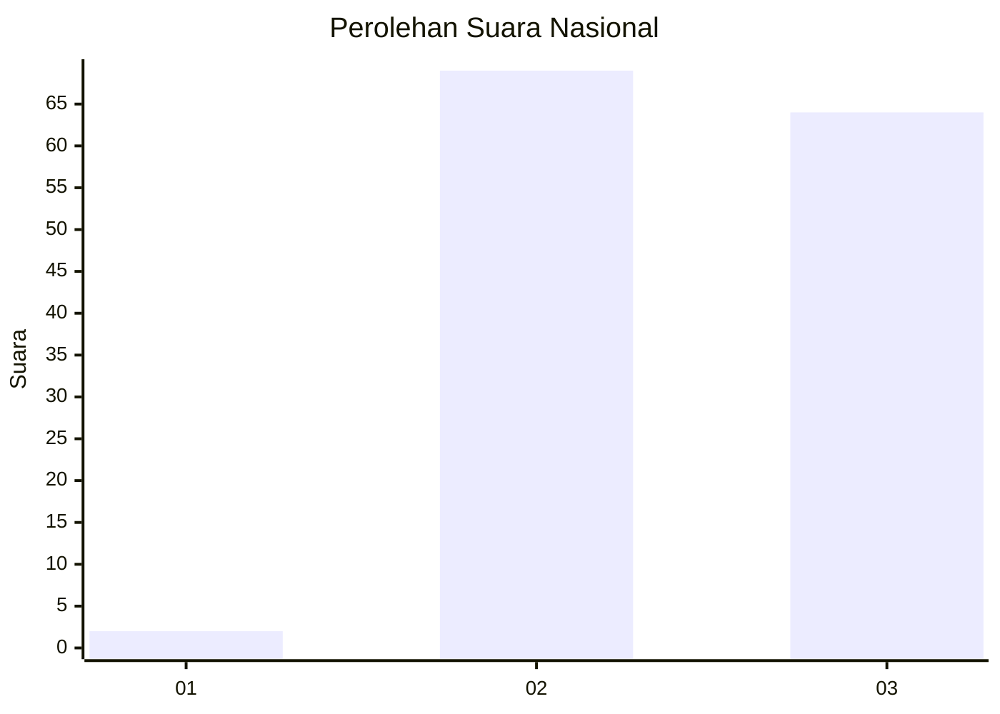
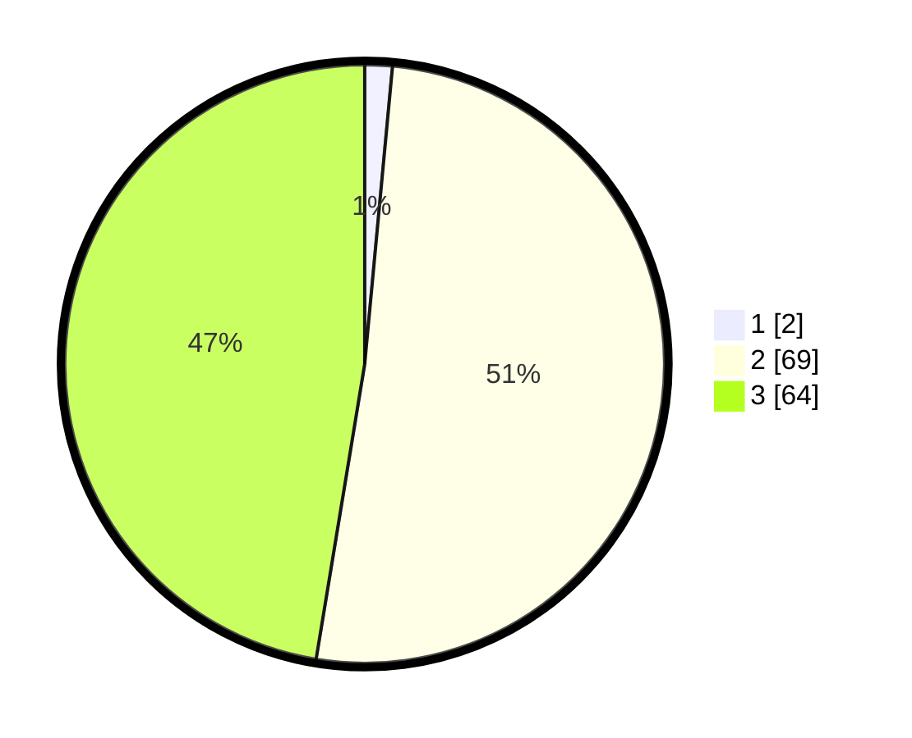

# Hasil

## Grafik

## Tabel

| No. | Nama Paslon    | Suara | Suara (raw) | Persentase |
|:--- |:-------------- | -----:| -----------:| ----------:|
| 1   | ANIES MUHAIMIN | 2     | [2][p-1]    | 1,48       |
| 2   | PRABOWO GIBRAN | 69    | [69][p-2]   | 51,11      |
| 3   | GANJAR MAHFUD  | 64    | [64][p-3]   | 47,41      |

[p-1]: https://github.com/gigit-pemilu/pemilu-2024/blob/main/pilpres/hitung-suara/sub/51-bali/sub/07-karangasem/sub/03-manggis/sub/2004-manggis/sub/022-tps/sub/paslon-1.txt
[p-2]: https://github.com/gigit-pemilu/pemilu-2024/blob/main/pilpres/hitung-suara/sub/51-bali/sub/07-karangasem/sub/03-manggis/sub/2004-manggis/sub/022-tps/sub/paslon-2.txt
[p-3]: https://github.com/gigit-pemilu/pemilu-2024/blob/main/pilpres/hitung-suara/sub/51-bali/sub/07-karangasem/sub/03-manggis/sub/2004-manggis/sub/022-tps/sub/paslon-3.txt

## Foto C Plano

https://sirekap-obj-formc.kpu.go.id/fbf6/pemilu/ppwp/51/07/03/20/04/5107032004022-20240214-141019--ce93c8c3-821c-4cbe-8870-12bfa4bdba47.jpg

https://sirekap-obj-formc.kpu.go.id/fbf6/pemilu/ppwp/51/07/03/20/04/5107032004022-20240214-190818--4a484621-9aab-4fd1-97da-d3c9ce81df69.jpg

https://sirekap-obj-formc.kpu.go.id/fbf6/pemilu/ppwp/51/07/03/20/04/5107032004022-20240214-141039--1d4d3e81-37a7-43d4-9af8-15972bea4953.jpg

## Metadata

| Key        | Value               |
| ---------- | ------------------- |
| Time Stamp | 2024-02-16 11:00:29 |

## DATA PEMILIH TETAP

Jumlah pemilih dalam DPT: **159**.
 * L: **91**.
 * P: **68**.

## DATA PENGGUNA HAK PILIH

Jumlah pengguna hak pilih dalam DPT: **142**.
 * L: **83**.
 * P: **59**.

Jumlah pengguna hak pilih dalam DPTb: **0**.
 * L: **0**.
 * P: **0**.

Jumlah pengguna hak pilih dalam DPK: **0**.
 * L: **0**.
 * P: **0**.

Jumlah pengguna hak pilih: **142**.
 * L: **83**.
 * P: **59**.

## JUMLAH SUARA SAH DAN TIDAK SAH

JUMLAH SELURUH SUARA SAH: **135**.

JUMLAH SUARA TIDAK SAH: **7**.

JUMLAH SELURUH SUARA SAH DAN SUARA TIDAK SAH: **142**.

