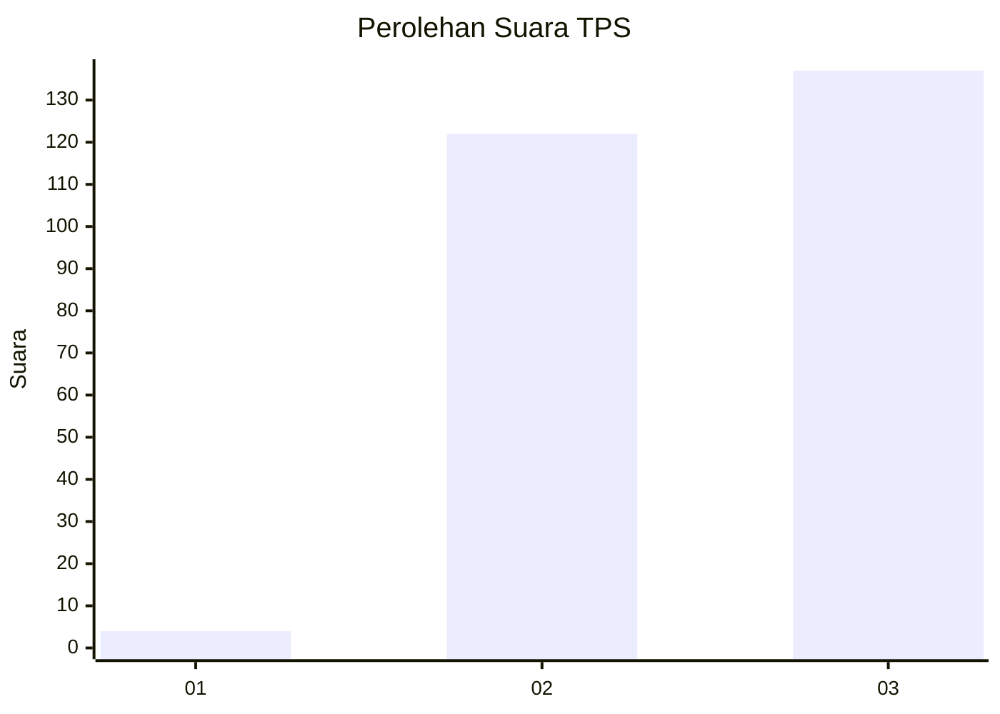
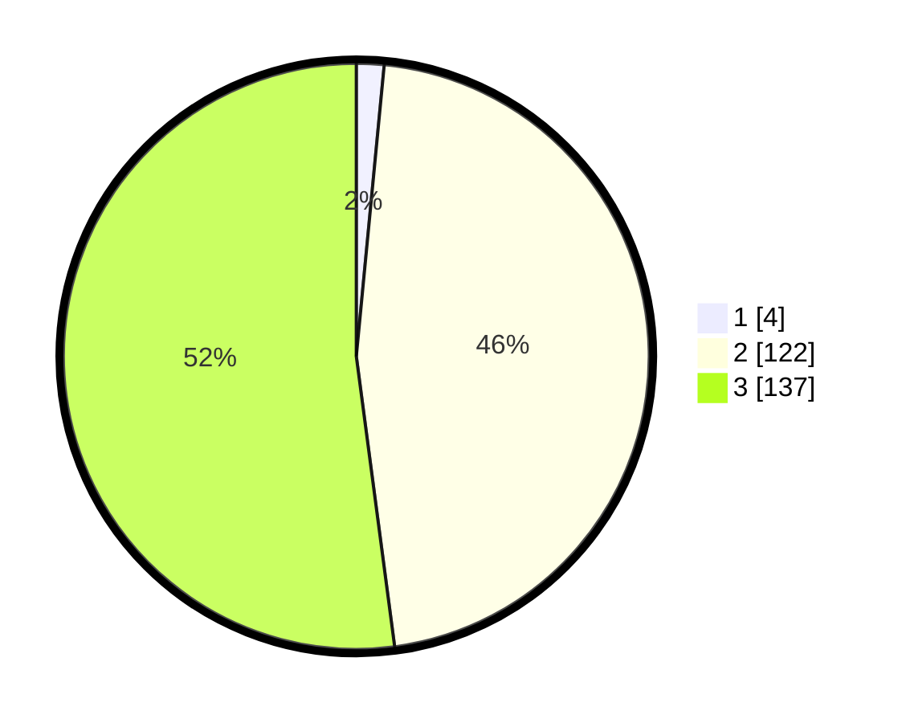

# Hasil

## Grafik

## Tabel

| No. | Nama Paslon    | Suara | Suara (raw) | Persentase |
|:--- |:-------------- | -----:| -----------:| ----------:|
| 1   | ANIES MUHAIMIN | 4     | [4][p-1]    | 1,52       |
| 2   | PRABOWO GIBRAN | 122   | [122][p-2]  | 46,39      |
| 3   | GANJAR MAHFUD  | 137   | [137][p-3]  | 52,09      |

[p-1]: https://github.com/gigit-pemilu/pemilu-2024-51-bali/blob/main/pilpres/hitung-suara/sub/51-bali/sub/07-karangasem/sub/03-manggis/sub/2005-nyuh-tebel/sub/001-tps/sub/paslon-1.txt
[p-2]: https://github.com/gigit-pemilu/pemilu-2024-51-bali/blob/main/pilpres/hitung-suara/sub/51-bali/sub/07-karangasem/sub/03-manggis/sub/2005-nyuh-tebel/sub/001-tps/sub/paslon-2.txt
[p-3]: https://github.com/gigit-pemilu/pemilu-2024-51-bali/blob/main/pilpres/hitung-suara/sub/51-bali/sub/07-karangasem/sub/03-manggis/sub/2005-nyuh-tebel/sub/001-tps/sub/paslon-3.txt

## Foto C Plano

https://sirekap-obj-formc.kpu.go.id/d367/pemilu/ppwp/51/07/03/20/05/5107032005001-20240214-225658--2a1745ed-d2eb-432d-9741-d603f1ae1290.jpg

https://sirekap-obj-formc.kpu.go.id/d367/pemilu/ppwp/51/07/03/20/05/5107032005001-20240214-225849--0a279b49-028f-4f3f-aa59-1746fd44de4a.jpg

https://sirekap-obj-formc.kpu.go.id/d367/pemilu/ppwp/51/07/03/20/05/5107032005001-20240214-231020--1d6f3c33-ca0a-4885-8a23-e0004831e7c4.jpg

## Metadata

| Key        | Value               |
| ---------- | ------------------- |
| Time Stamp | 2024-02-19 06:16:00 |

