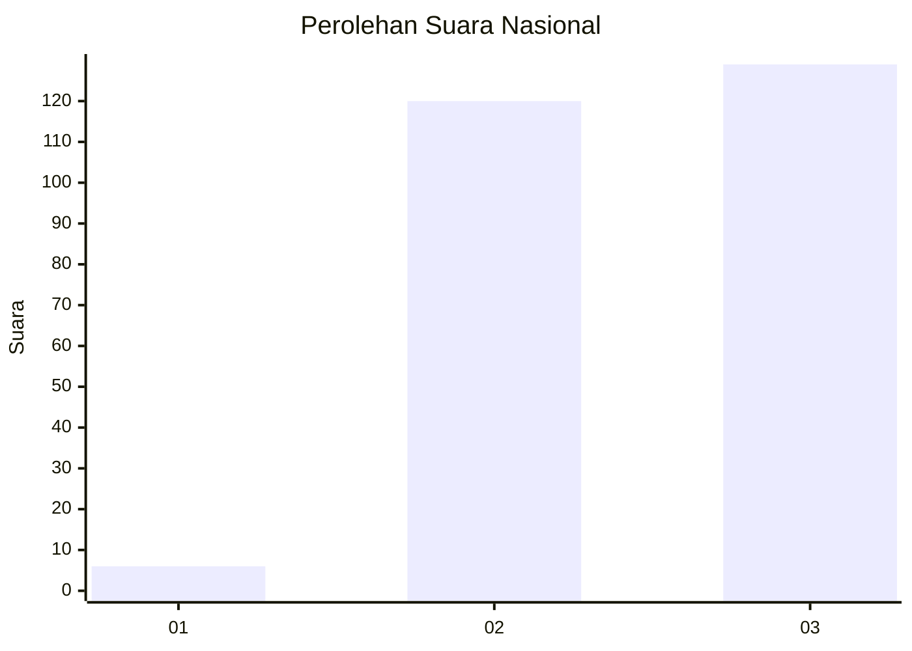
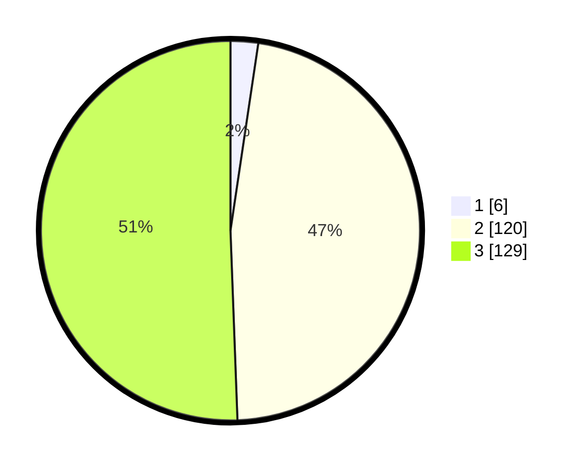

# Hasil

## Grafik

## Tabel

| No. | Nama Paslon    | Suara | Suara (raw) | Persentase |
|:--- |:-------------- | -----:| -----------:| ----------:|
| 1   | ANIES MUHAIMIN | 6     | [6][p-1]    | 2,35       |
| 2   | PRABOWO GIBRAN | 120   | [120][p-2]  | 47,06      |
| 3   | GANJAR MAHFUD  | 129   | [129][p-3]  | 50,59      |

[p-1]: https://github.com/gigit-pemilu/pemilu-2024/blob/main/pilpres/hitung-suara/sub/51-bali/sub/07-karangasem/sub/03-manggis/sub/2005-nyuh-tebel/sub/002-tps/sub/paslon-1.txt
[p-2]: https://github.com/gigit-pemilu/pemilu-2024/blob/main/pilpres/hitung-suara/sub/51-bali/sub/07-karangasem/sub/03-manggis/sub/2005-nyuh-tebel/sub/002-tps/sub/paslon-2.txt
[p-3]: https://github.com/gigit-pemilu/pemilu-2024/blob/main/pilpres/hitung-suara/sub/51-bali/sub/07-karangasem/sub/03-manggis/sub/2005-nyuh-tebel/sub/002-tps/sub/paslon-3.txt

## Foto C Plano

https://sirekap-obj-formc.kpu.go.id/c37a/pemilu/ppwp/51/07/03/20/05/5107032005002-20240216-133305--cb15b6d2-d6d3-4b4d-9d6e-27293cacfc6c.jpg

https://sirekap-obj-formc.kpu.go.id/c37a/pemilu/ppwp/51/07/03/20/05/5107032005002-20240216-133306--43968dc8-ddac-48b2-85df-cca541fa2cf4.jpg

https://sirekap-obj-formc.kpu.go.id/c37a/pemilu/ppwp/51/07/03/20/05/5107032005002-20240216-133306--86795a31-1539-4315-b383-1f0f98922aad.jpg

## Metadata

| Key        | Value               |
| ---------- | ------------------- |
| Time Stamp | 2024-02-16 14:00:34 |

## DATA PEMILIH TETAP

Jumlah pemilih dalam DPT: **289**.
 * L: **155**.
 * P: **134**.

## DATA PENGGUNA HAK PILIH

Jumlah pengguna hak pilih dalam DPT: **258**.
 * L: **140**.
 * P: **118**.

Jumlah pengguna hak pilih dalam DPTb: **0**.
 * L: **0**.
 * P: **0**.

Jumlah pengguna hak pilih dalam DPK: **0**.
 * L: **0**.
 * P: **0**.

Jumlah pengguna hak pilih: **258**.
 * L: **140**.
 * P: **118**.

## JUMLAH SUARA SAH DAN TIDAK SAH

JUMLAH SELURUH SUARA SAH: **255**.

JUMLAH SUARA TIDAK SAH: **3**.

JUMLAH SELURUH SUARA SAH DAN SUARA TIDAK SAH: **258**.

