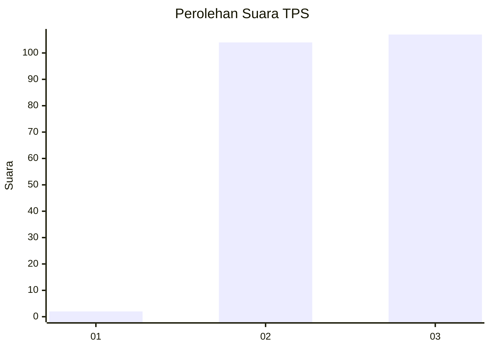
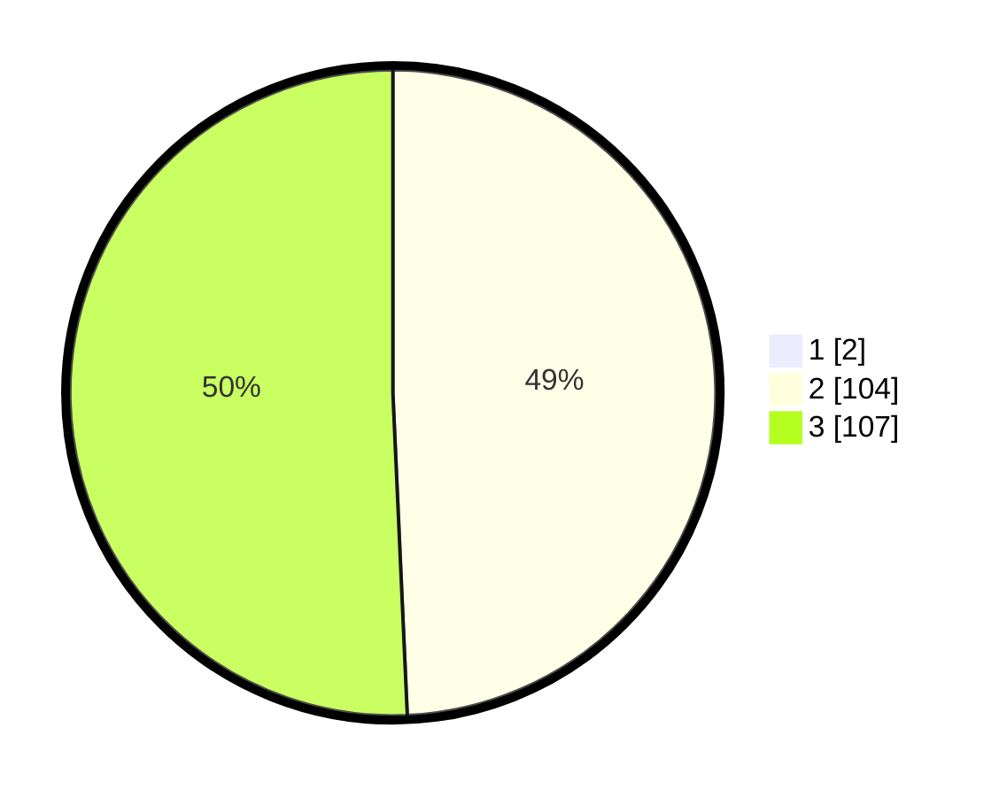

# Hasil

## Grafik

## Tabel

| No. | Nama Paslon    | Suara | Suara (raw) | Persentase |
|:--- |:-------------- | -----:| -----------:| ----------:|
| 1   | ANIES MUHAIMIN | 2     | [2][p-1]    | 0,94       |
| 2   | PRABOWO GIBRAN | 104   | [104][p-2]  | 48,83      |
| 3   | GANJAR MAHFUD  | 107   | [107][p-3]  | 50,23      |

[p-1]: https://github.com/gigit-pemilu/pemilu-2024-51-bali/blob/main/pilpres/hitung-suara/sub/51-bali/sub/07-karangasem/sub/03-manggis/sub/2005-nyuh-tebel/sub/006-tps/sub/paslon-1.txt
[p-2]: https://github.com/gigit-pemilu/pemilu-2024-51-bali/blob/main/pilpres/hitung-suara/sub/51-bali/sub/07-karangasem/sub/03-manggis/sub/2005-nyuh-tebel/sub/006-tps/sub/paslon-2.txt
[p-3]: https://github.com/gigit-pemilu/pemilu-2024-51-bali/blob/main/pilpres/hitung-suara/sub/51-bali/sub/07-karangasem/sub/03-manggis/sub/2005-nyuh-tebel/sub/006-tps/sub/paslon-3.txt

## Foto C Plano

https://sirekap-obj-formc.kpu.go.id/47ed/pemilu/ppwp/51/07/03/20/05/5107032005006-20240214-132057--5698670c-8bdf-4fc8-bd0f-63d8b3e7b84f.jpg

https://sirekap-obj-formc.kpu.go.id/47ed/pemilu/ppwp/51/07/03/20/05/5107032005006-20240214-132155--0696f513-5fd4-423d-9c65-ffd2fbbc38a5.jpg

https://sirekap-obj-formc.kpu.go.id/47ed/pemilu/ppwp/51/07/03/20/05/5107032005006-20240214-132233--7fb4c0d0-22e3-40f2-9775-4479068bbdf9.jpg

## Metadata

| Key        | Value               |
| ---------- | ------------------- |
| Time Stamp | 2024-02-17 16:00:02 |

## DATA PEMILIH TETAP

Jumlah pemilih dalam DPT: **238**.
 * L: **125**.
 * P: **113**.

## DATA PENGGUNA HAK PILIH

Jumlah pengguna hak pilih dalam DPT: **216**.
 * L: **112**.
 * P: **104**.

Jumlah pengguna hak pilih dalam DPTb: **3**.
 * L: **1**.
 * P: **2**.

Jumlah pengguna hak pilih dalam DPK: **0**.
 * L: **0**.
 * P: **0**.

Jumlah pengguna hak pilih: **219**.
 * L: **113**.
 * P: **106**.

## JUMLAH SUARA SAH DAN TIDAK SAH

JUMLAH SELURUH SUARA SAH: **213**.

JUMLAH SUARA TIDAK SAH: **6**.

JUMLAH SELURUH SUARA SAH DAN SUARA TIDAK SAH: **219**.

