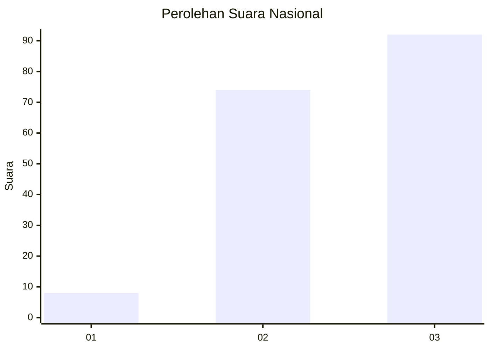
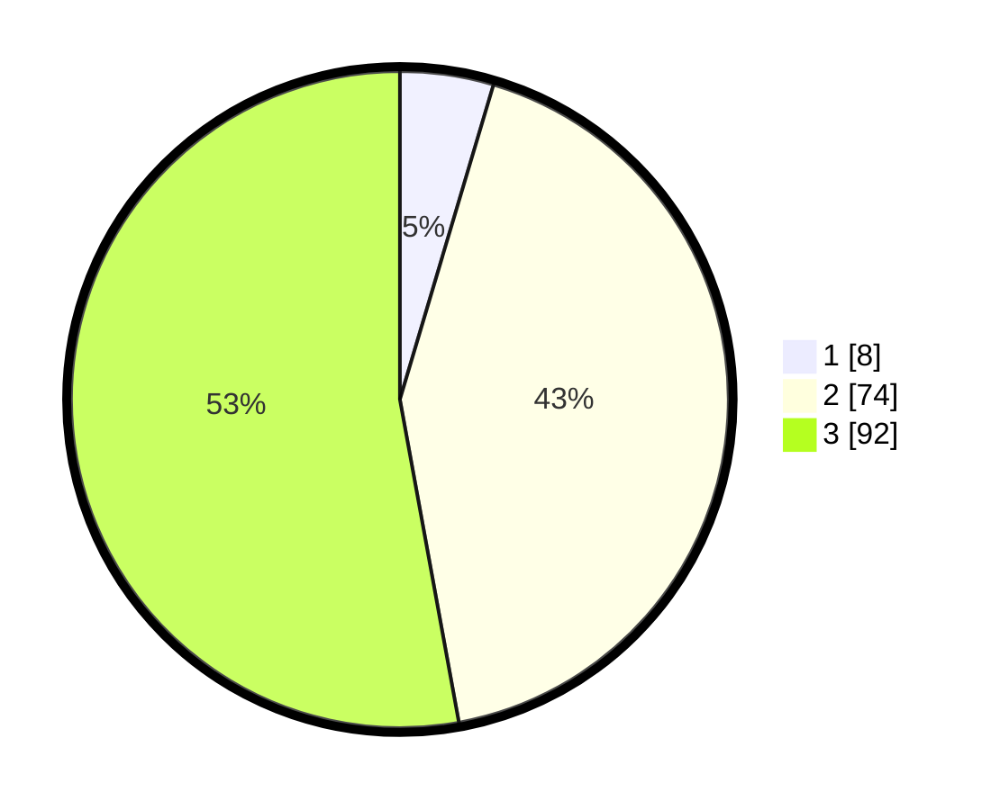

# Hasil

## Grafik

## Tabel

| No. | Nama Paslon    | Suara | Suara (raw) | Persentase |
|:--- |:-------------- | -----:| -----------:| ----------:|
| 1   | ANIES MUHAIMIN | 8     | [8][p-1]    | 4,60       |
| 2   | PRABOWO GIBRAN | 74    | [74][p-2]   | 42,53      |
| 3   | GANJAR MAHFUD  | 92    | [92][p-3]   | 52,87      |

[p-1]: https://github.com/gigit-pemilu/pemilu-2024/blob/main/pilpres/hitung-suara/sub/51-bali/sub/07-karangasem/sub/03-manggis/sub/2006-tenganan/sub/007-tps/sub/paslon-1.txt
[p-2]: https://github.com/gigit-pemilu/pemilu-2024/blob/main/pilpres/hitung-suara/sub/51-bali/sub/07-karangasem/sub/03-manggis/sub/2006-tenganan/sub/007-tps/sub/paslon-2.txt
[p-3]: https://github.com/gigit-pemilu/pemilu-2024/blob/main/pilpres/hitung-suara/sub/51-bali/sub/07-karangasem/sub/03-manggis/sub/2006-tenganan/sub/007-tps/sub/paslon-3.txt

## Foto C Plano

https://sirekap-obj-formc.kpu.go.id/58b9/pemilu/ppwp/51/07/03/20/06/5107032006007-20240214-224512--2334f2bc-8ab9-4851-a550-3698d85d3dee.jpg

https://sirekap-obj-formc.kpu.go.id/58b9/pemilu/ppwp/51/07/03/20/06/5107032006007-20240214-224518--52dbacec-f35a-4ffe-8486-16ab1a0f8044.jpg

https://sirekap-obj-formc.kpu.go.id/58b9/pemilu/ppwp/51/07/03/20/06/5107032006007-20240214-224526--41e9dc20-b02c-408a-83d4-3c3a106b12f0.jpg

## Metadata

| Key        | Value               |
| ---------- | ------------------- |
| Time Stamp | 2024-02-17 16:00:02 |

