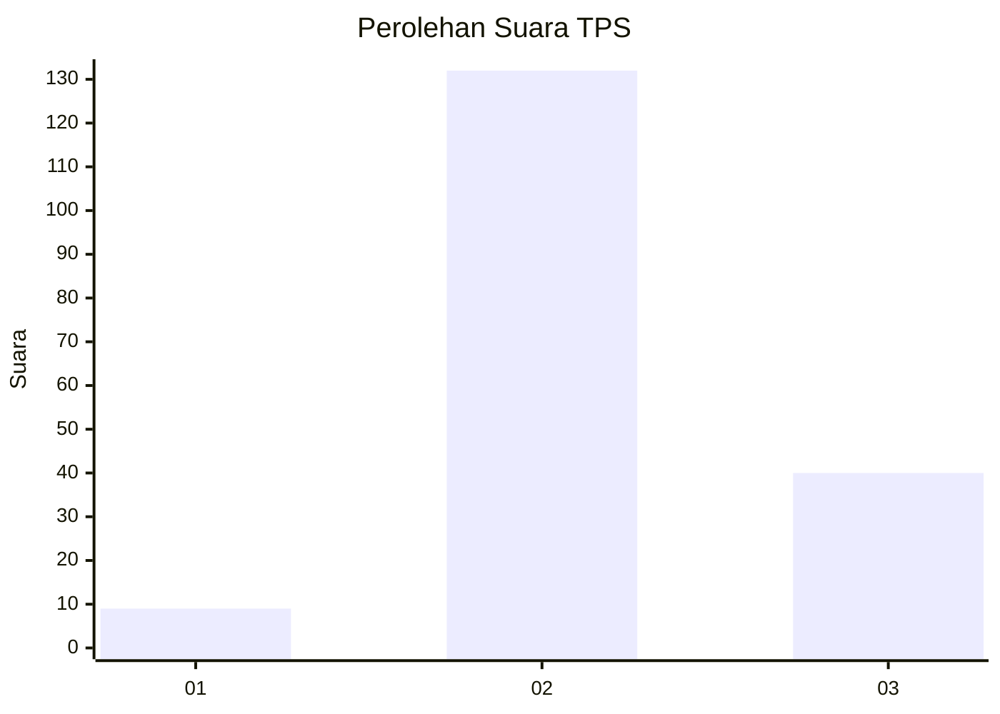
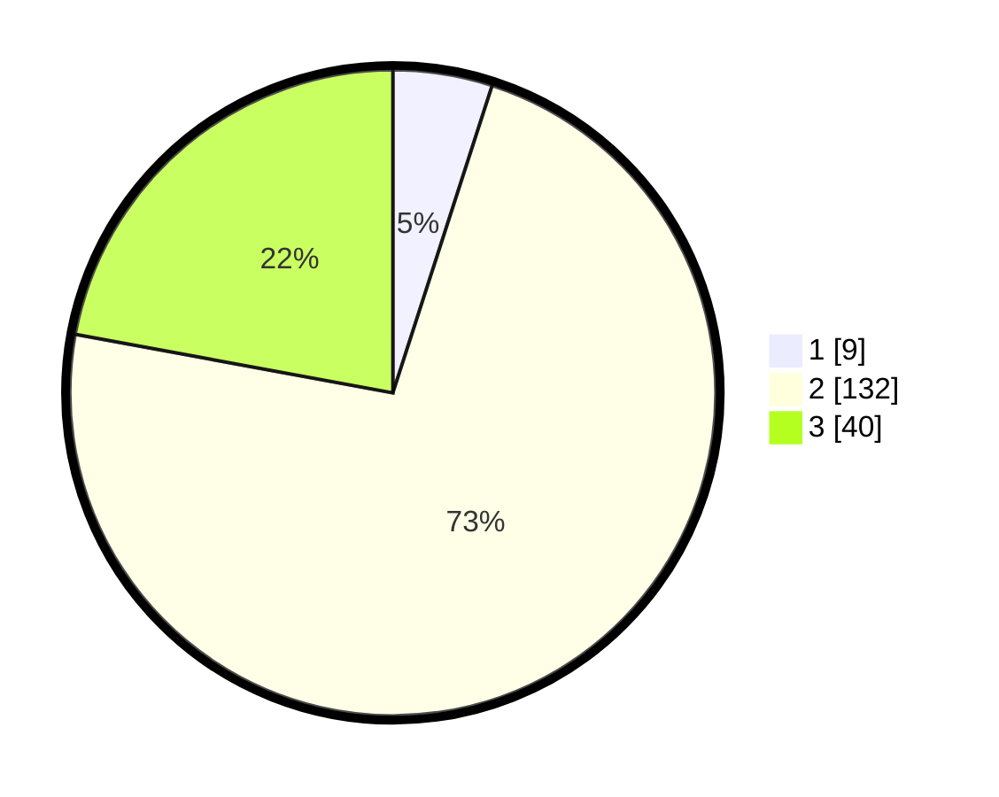

# Hasil

## Grafik

## Tabel

| No. | Nama Paslon    | Suara | Suara (raw) | Persentase |
|:--- |:-------------- | -----:| -----------:| ----------:|
| 1   | ANIES MUHAIMIN | 9     | [9][p-1]    | 4,97       |
| 2   | PRABOWO GIBRAN | 132   | [132][p-2]  | 72,93      |
| 3   | GANJAR MAHFUD  | 40    | [40][p-3]   | 22,10      |

[p-1]: https://github.com/gigit-pemilu/pemilu-2024-51-bali/blob/main/pilpres/hitung-suara/sub/51-bali/sub/07-karangasem/sub/03-manggis/sub/2006-tenganan/sub/010-tps/sub/paslon-1.txt
[p-2]: https://github.com/gigit-pemilu/pemilu-2024-51-bali/blob/main/pilpres/hitung-suara/sub/51-bali/sub/07-karangasem/sub/03-manggis/sub/2006-tenganan/sub/010-tps/sub/paslon-2.txt
[p-3]: https://github.com/gigit-pemilu/pemilu-2024-51-bali/blob/main/pilpres/hitung-suara/sub/51-bali/sub/07-karangasem/sub/03-manggis/sub/2006-tenganan/sub/010-tps/sub/paslon-3.txt

## Foto C Plano

https://sirekap-obj-formc.kpu.go.id/e5b5/pemilu/ppwp/51/07/03/20/06/5107032006010-20240215-064724--4b504f22-7b6e-4255-9758-593b6c0e1a4d.jpg

https://sirekap-obj-formc.kpu.go.id/e5b5/pemilu/ppwp/51/07/03/20/06/5107032006010-20240215-064738--202db103-e6d7-457a-909d-451387d3002e.jpg

https://sirekap-obj-formc.kpu.go.id/e5b5/pemilu/ppwp/51/07/03/20/06/5107032006010-20240215-064746--6abab1b3-df5c-4647-a8a7-7c4e3aafceb3.jpg

## Metadata

| Key        | Value               |
| ---------- | ------------------- |
| Time Stamp | 2024-02-17 16:00:02 |

