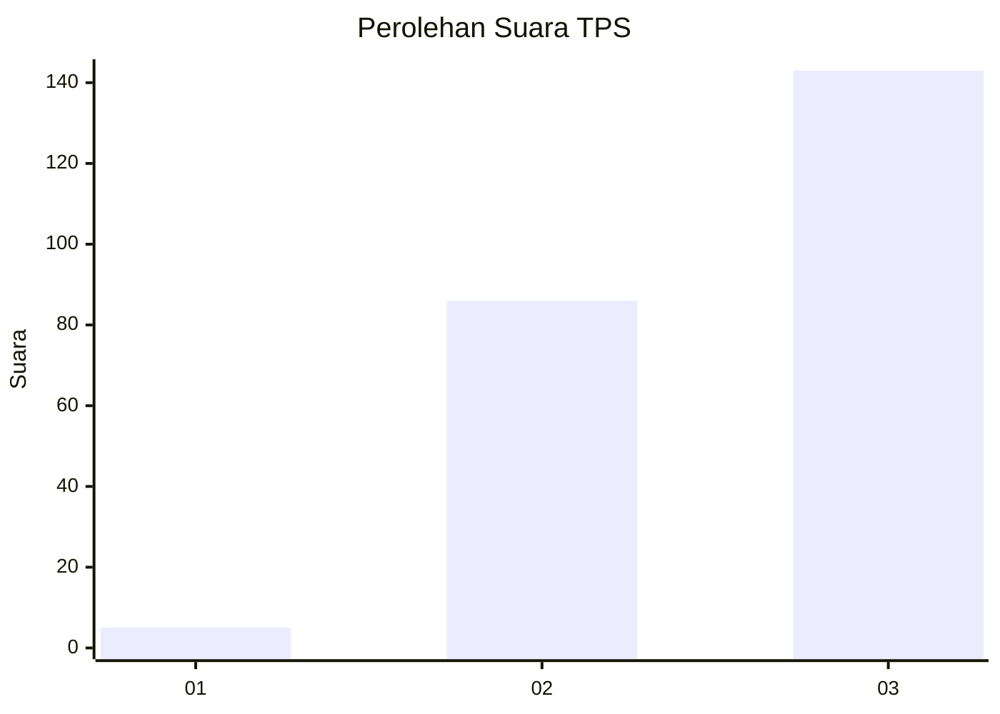
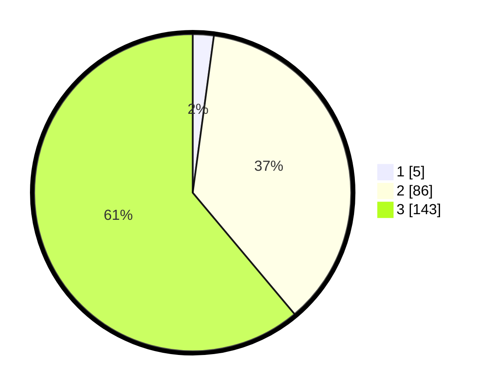

# Hasil

## Grafik

## Tabel

| No. | Nama Paslon    | Suara | Suara (raw) | Persentase |
|:--- |:-------------- | -----:| -----------:| ----------:|
| 1   | ANIES MUHAIMIN | 5     | [5][p-1]    | 2,14       |
| 2   | PRABOWO GIBRAN | 86    | [86][p-2]   | 36,75      |
| 3   | GANJAR MAHFUD  | 143   | [143][p-3]  | 61,11      |

[p-1]: https://github.com/gigit-pemilu/pemilu-2024-51-bali/blob/main/pilpres/hitung-suara/sub/51-bali/sub/07-karangasem/sub/03-manggis/sub/2007-ngis/sub/001-tps/sub/paslon-1.txt
[p-2]: https://github.com/gigit-pemilu/pemilu-2024-51-bali/blob/main/pilpres/hitung-suara/sub/51-bali/sub/07-karangasem/sub/03-manggis/sub/2007-ngis/sub/001-tps/sub/paslon-2.txt
[p-3]: https://github.com/gigit-pemilu/pemilu-2024-51-bali/blob/main/pilpres/hitung-suara/sub/51-bali/sub/07-karangasem/sub/03-manggis/sub/2007-ngis/sub/001-tps/sub/paslon-3.txt

## Foto C Plano

https://sirekap-obj-formc.kpu.go.id/22dc/pemilu/ppwp/51/07/03/20/07/5107032007001-20240214-215403--05c91466-4dbb-4b43-82e7-f0c68340fc3e.jpg

https://sirekap-obj-formc.kpu.go.id/22dc/pemilu/ppwp/51/07/03/20/07/5107032007001-20240214-215408--e2353fb2-b0d4-444b-9b79-80fd5065f87e.jpg

https://sirekap-obj-formc.kpu.go.id/22dc/pemilu/ppwp/51/07/03/20/07/5107032007001-20240214-215548--c09e899c-76b8-4237-a157-0e0abb0dfcb1.jpg

## Metadata

| Key        | Value               |
| ---------- | ------------------- |
| Time Stamp | 2024-02-17 16:00:02 |

