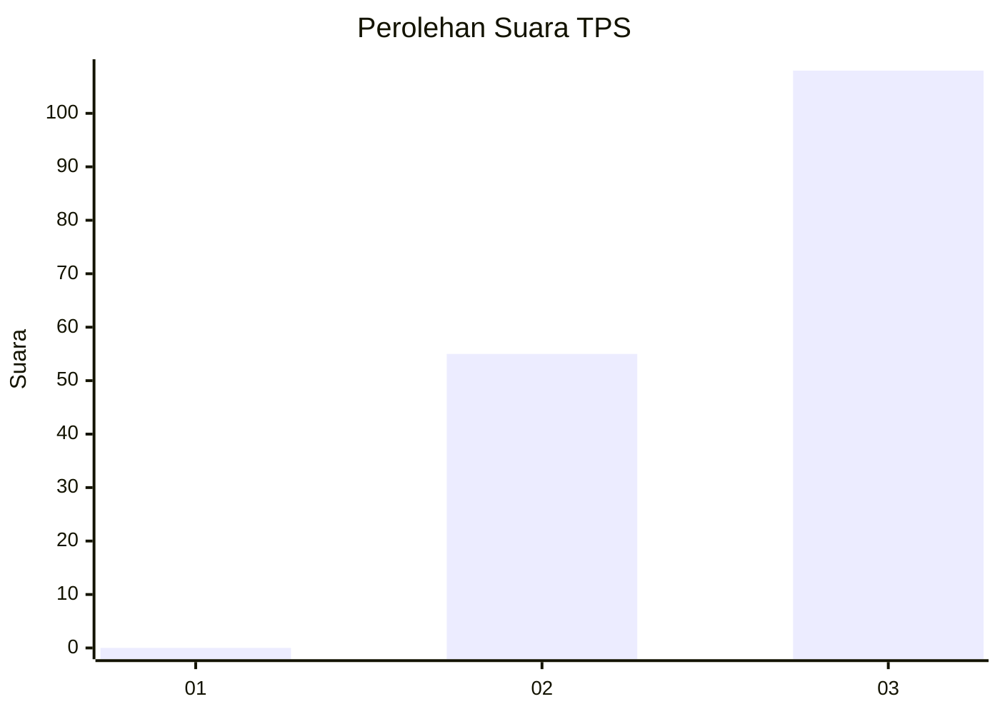
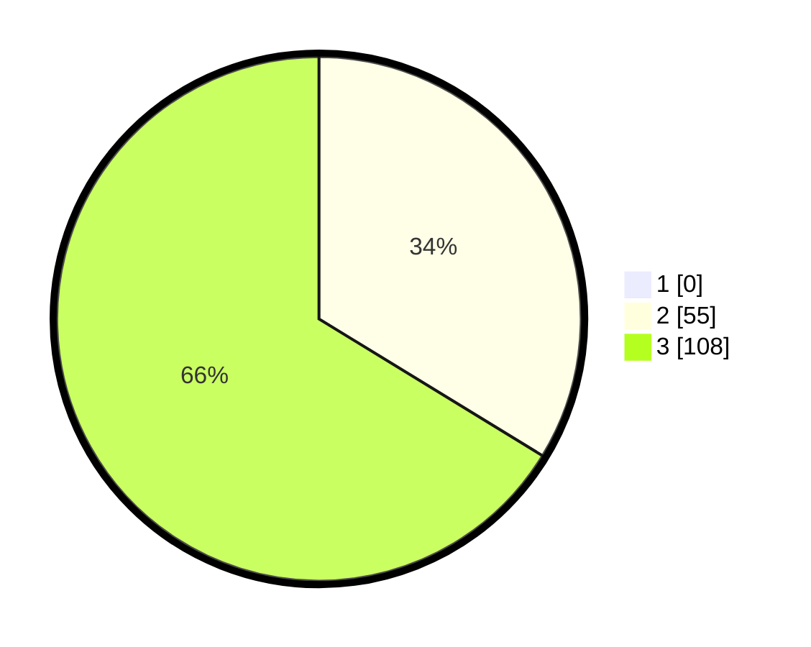

# Hasil

## Grafik

## Tabel

| No. | Nama Paslon    | Suara | Suara (raw) | Persentase |
|:--- |:-------------- | -----:| -----------:| ----------:|
| 1   | ANIES MUHAIMIN | 0     | [0][p-1]    | 0,00       |
| 2   | PRABOWO GIBRAN | 55    | [55][p-2]   | 33,74      |
| 3   | GANJAR MAHFUD  | 108   | [108][p-3]  | 66,26      |

[p-1]: https://github.com/gigit-pemilu/pemilu-2024-51-bali/blob/main/pilpres/hitung-suara/sub/51-bali/sub/07-karangasem/sub/03-manggis/sub/2007-ngis/sub/003-tps/sub/paslon-1.txt
[p-2]: https://github.com/gigit-pemilu/pemilu-2024-51-bali/blob/main/pilpres/hitung-suara/sub/51-bali/sub/07-karangasem/sub/03-manggis/sub/2007-ngis/sub/003-tps/sub/paslon-2.txt
[p-3]: https://github.com/gigit-pemilu/pemilu-2024-51-bali/blob/main/pilpres/hitung-suara/sub/51-bali/sub/07-karangasem/sub/03-manggis/sub/2007-ngis/sub/003-tps/sub/paslon-3.txt

## Foto C Plano

https://sirekap-obj-formc.kpu.go.id/577b/pemilu/ppwp/51/07/03/20/07/5107032007003-20240215-014241--9a307508-803b-48c0-b484-e5a10990de3c.jpg

https://sirekap-obj-formc.kpu.go.id/577b/pemilu/ppwp/51/07/03/20/07/5107032007003-20240215-014245--b662fca2-7809-434a-874f-17933507bbb2.jpg

https://sirekap-obj-formc.kpu.go.id/577b/pemilu/ppwp/51/07/03/20/07/5107032007003-20240215-014251--c7453115-da3a-4dfe-a920-64505eca4d4b.jpg

## Metadata

| Key        | Value               |
| ---------- | ------------------- |
| Time Stamp | 2024-02-17 16:00:02 |

