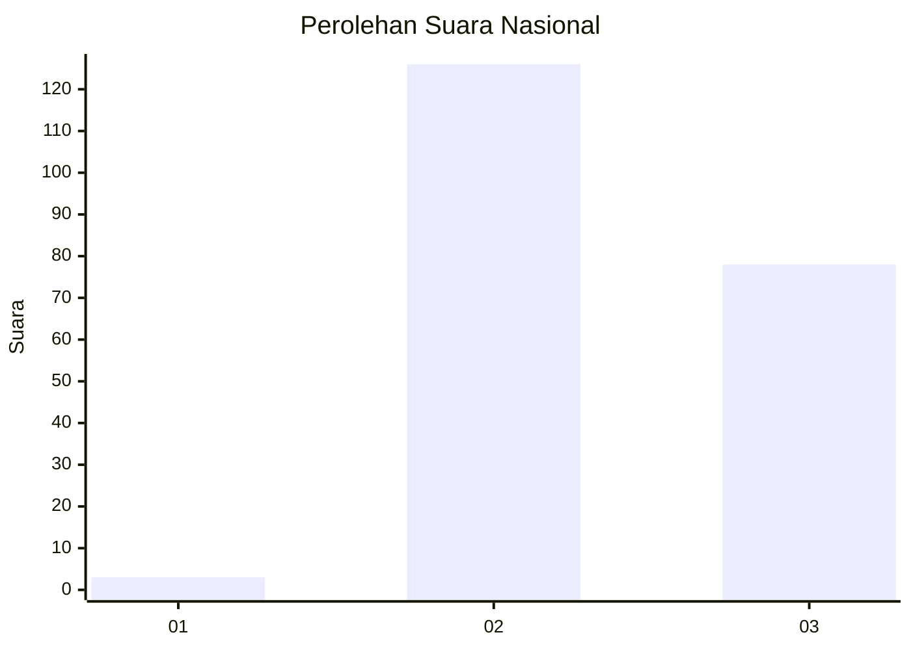
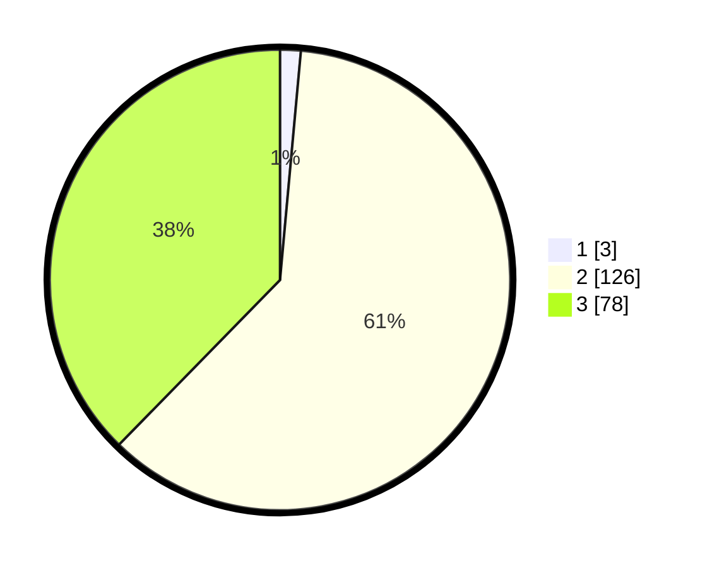

# Hasil

## Grafik

## Tabel

| No. | Nama Paslon    | Suara | Suara (raw) | Persentase |
|:--- |:-------------- | -----:| -----------:| ----------:|
| 1   | ANIES MUHAIMIN | 3     | [3][p-1]    | 1,45       |
| 2   | PRABOWO GIBRAN | 126   | [126][p-2]  | 60,87      |
| 3   | GANJAR MAHFUD  | 78    | [78][p-3]   | 37,68      |

[p-1]: https://github.com/gigit-pemilu/pemilu-2024/blob/main/pilpres/hitung-suara/sub/51-bali/sub/07-karangasem/sub/03-manggis/sub/2007-ngis/sub/007-tps/sub/paslon-1.txt
[p-2]: https://github.com/gigit-pemilu/pemilu-2024/blob/main/pilpres/hitung-suara/sub/51-bali/sub/07-karangasem/sub/03-manggis/sub/2007-ngis/sub/007-tps/sub/paslon-2.txt
[p-3]: https://github.com/gigit-pemilu/pemilu-2024/blob/main/pilpres/hitung-suara/sub/51-bali/sub/07-karangasem/sub/03-manggis/sub/2007-ngis/sub/007-tps/sub/paslon-3.txt

## Foto C Plano

https://sirekap-obj-formc.kpu.go.id/292c/pemilu/ppwp/51/07/03/20/07/5107032007007-20240215-072453--83925dda-3060-49b3-a3f7-9c5c30279ed3.jpg

https://sirekap-obj-formc.kpu.go.id/292c/pemilu/ppwp/51/07/03/20/07/5107032007007-20240215-072458--ef54e18c-5088-4a30-bf4d-95523ec99261.jpg

https://sirekap-obj-formc.kpu.go.id/292c/pemilu/ppwp/51/07/03/20/07/5107032007007-20240215-072505--a1fd28cd-01b3-49e3-8adb-65ee75420174.jpg

## Metadata

| Key        | Value               |
| ---------- | ------------------- |
| Time Stamp | 2024-02-17 16:00:02 |

