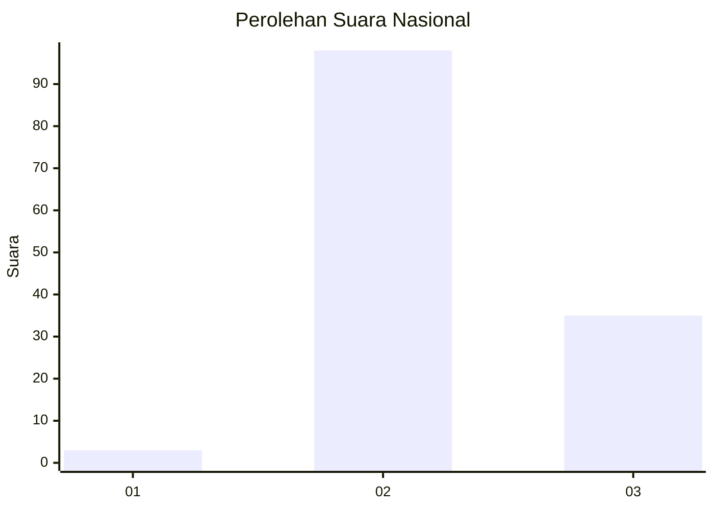
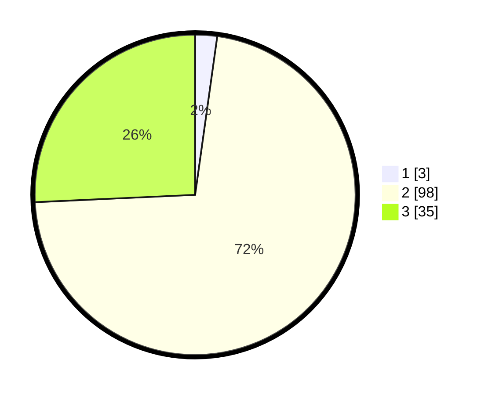

# Hasil

## Grafik

## Tabel

| No. | Nama Paslon    | Suara | Suara (raw) | Persentase |
|:--- |:-------------- | -----:| -----------:| ----------:|
| 1   | ANIES MUHAIMIN | 3     | [3][p-1]    | 2,21       |
| 2   | PRABOWO GIBRAN | 98    | [98][p-2]   | 72,06      |
| 3   | GANJAR MAHFUD  | 35    | [35][p-3]   | 25,74      |

[p-1]: https://github.com/gigit-pemilu/pemilu-2024/blob/main/pilpres/hitung-suara/sub/51-bali/sub/07-karangasem/sub/03-manggis/sub/2008-selumbung/sub/001-tps/sub/paslon-1.txt
[p-2]: https://github.com/gigit-pemilu/pemilu-2024/blob/main/pilpres/hitung-suara/sub/51-bali/sub/07-karangasem/sub/03-manggis/sub/2008-selumbung/sub/001-tps/sub/paslon-2.txt
[p-3]: https://github.com/gigit-pemilu/pemilu-2024/blob/main/pilpres/hitung-suara/sub/51-bali/sub/07-karangasem/sub/03-manggis/sub/2008-selumbung/sub/001-tps/sub/paslon-3.txt

## Foto C Plano

https://sirekap-obj-formc.kpu.go.id/4c30/pemilu/ppwp/51/07/03/20/08/5107032008001-20240215-233110--cc33c0e2-b114-42d9-855d-f7990c7ce12e.jpg

https://sirekap-obj-formc.kpu.go.id/4c30/pemilu/ppwp/51/07/03/20/08/5107032008001-20240214-203627--abaf9c0d-076b-4d4c-8d7c-cbc83348ef7b.jpg

https://sirekap-obj-formc.kpu.go.id/4c30/pemilu/ppwp/51/07/03/20/08/5107032008001-20240214-203631--85bdfd99-f976-49f1-a968-18455eeb9fc9.jpg

## Metadata

| Key        | Value               |
| ---------- | ------------------- |
| Time Stamp | 2024-02-16 00:00:26 |

## DATA PEMILIH TETAP

Jumlah pemilih dalam DPT: **154**.
 * L: **74**.
 * P: **80**.

## DATA PENGGUNA HAK PILIH

Jumlah pengguna hak pilih dalam DPT: **134**.
 * L: **68**.
 * P: **66**.

Jumlah pengguna hak pilih dalam DPTb: **0**.
 * L: **0**.
 * P: **0**.

Jumlah pengguna hak pilih dalam DPK: **4**.
 * L: **1**.
 * P: **3**.

Jumlah pengguna hak pilih: **138**.
 * L: **69**.
 * P: **69**.

## JUMLAH SUARA SAH DAN TIDAK SAH

JUMLAH SELURUH SUARA SAH: **136**.

JUMLAH SUARA TIDAK SAH: **2**.

JUMLAH SELURUH SUARA SAH DAN SUARA TIDAK SAH: **138**.

