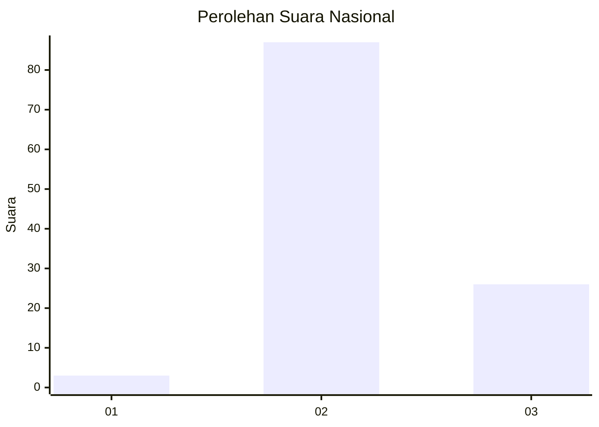
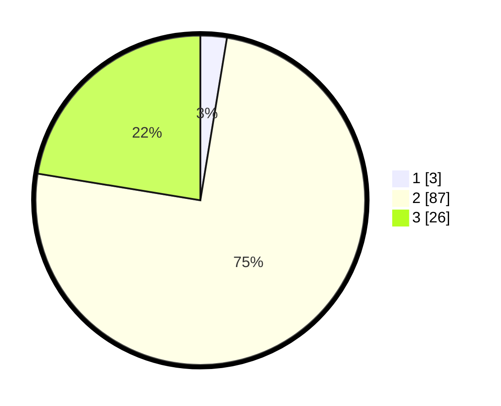

# Hasil

## Grafik

## Tabel

| No. | Nama Paslon    | Suara | Suara (raw) | Persentase |
|:--- |:-------------- | -----:| -----------:| ----------:|
| 1   | ANIES MUHAIMIN | 3     | [3][p-1]    | 2,59       |
| 2   | PRABOWO GIBRAN | 87    | [87][p-2]   | 75,00      |
| 3   | GANJAR MAHFUD  | 26    | [26][p-3]   | 22,41      |

[p-1]: https://github.com/gigit-pemilu/pemilu-2024/blob/main/pilpres/hitung-suara/sub/51-bali/sub/07-karangasem/sub/03-manggis/sub/2008-selumbung/sub/002-tps/sub/paslon-1.txt
[p-2]: https://github.com/gigit-pemilu/pemilu-2024/blob/main/pilpres/hitung-suara/sub/51-bali/sub/07-karangasem/sub/03-manggis/sub/2008-selumbung/sub/002-tps/sub/paslon-2.txt
[p-3]: https://github.com/gigit-pemilu/pemilu-2024/blob/main/pilpres/hitung-suara/sub/51-bali/sub/07-karangasem/sub/03-manggis/sub/2008-selumbung/sub/002-tps/sub/paslon-3.txt

## Foto C Plano

https://sirekap-obj-formc.kpu.go.id/5ad2/pemilu/ppwp/51/07/03/20/08/5107032008002-20240214-214344--a36cc5b2-3a9d-43f8-8c04-45401986b295.jpg

https://sirekap-obj-formc.kpu.go.id/5ad2/pemilu/ppwp/51/07/03/20/08/5107032008002-20240214-224503--1354c46c-469e-4c06-b507-b9b93cf1af15.jpg

https://sirekap-obj-formc.kpu.go.id/5ad2/pemilu/ppwp/51/07/03/20/08/5107032008002-20240214-224621--26a13545-c635-4d38-8d62-2aed7cb06408.jpg

## Metadata

| Key        | Value               |
| ---------- | ------------------- |
| Time Stamp | 2024-02-19 06:16:00 |

