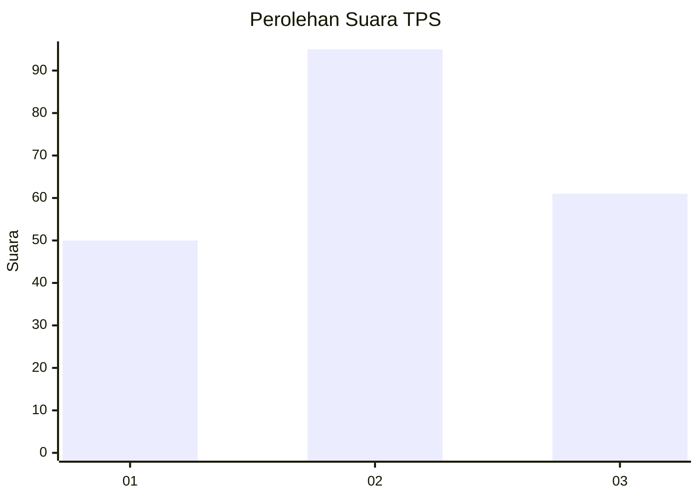
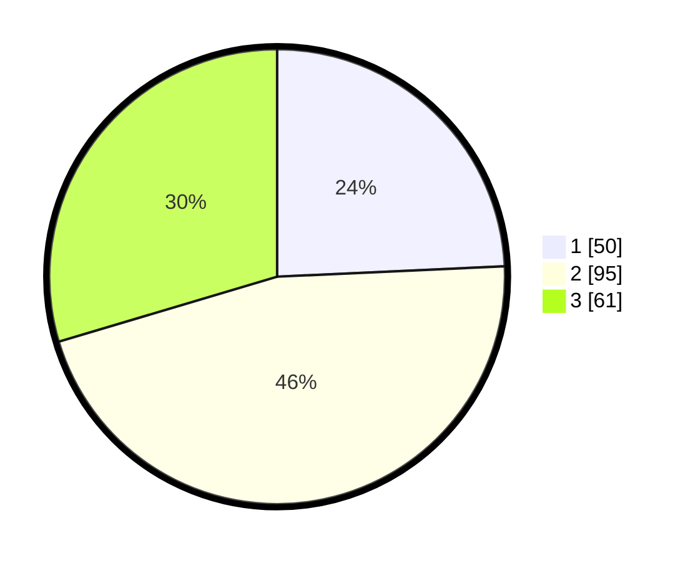

# Hasil

## Grafik

## Tabel

| No. | Nama Paslon    | Suara | Suara (raw) | Persentase |
|:--- |:-------------- | -----:| -----------:| ----------:|
| 1   | ANIES MUHAIMIN | 50    | [50][p-1]   | 24,27      |
| 2   | PRABOWO GIBRAN | 95    | [95][p-2]   | 46,12      |
| 3   | GANJAR MAHFUD  | 61    | [61][p-3]   | 29,61      |

[p-1]: https://github.com/gigit-pemilu/pemilu-2024-51-bali/blob/main/pilpres/hitung-suara/sub/51-bali/sub/07-karangasem/sub/03-manggis/sub/2008-selumbung/sub/006-tps/sub/paslon-1.txt
[p-2]: https://github.com/gigit-pemilu/pemilu-2024-51-bali/blob/main/pilpres/hitung-suara/sub/51-bali/sub/07-karangasem/sub/03-manggis/sub/2008-selumbung/sub/006-tps/sub/paslon-2.txt
[p-3]: https://github.com/gigit-pemilu/pemilu-2024-51-bali/blob/main/pilpres/hitung-suara/sub/51-bali/sub/07-karangasem/sub/03-manggis/sub/2008-selumbung/sub/006-tps/sub/paslon-3.txt

## Foto C Plano

https://sirekap-obj-formc.kpu.go.id/4f7e/pemilu/ppwp/51/07/03/20/08/5107032008006-20240221-101329--b7e46a02-2d5f-49d8-b86f-f47544af726f.jpg

https://sirekap-obj-formc.kpu.go.id/4f7e/pemilu/ppwp/51/07/03/20/08/5107032008006-20240221-101331--e18f57d3-6b1e-48f4-9470-4a50efe1fe9e.jpg

https://sirekap-obj-formc.kpu.go.id/4f7e/pemilu/ppwp/51/07/03/20/08/5107032008006-20240221-101330--00c482d8-cdf9-4f16-8650-c9f40fded9ef.jpg

## Metadata

| Key        | Value               |
| ---------- | ------------------- |
| Time Stamp | 2024-02-24 22:31:28 |

## DATA PEMILIH TETAP

Jumlah pemilih dalam DPT: **223**.
 * L: **98**.
 * P: **125**.

## DATA PENGGUNA HAK PILIH

Jumlah pengguna hak pilih dalam DPT: **162**.
 * L: **78**.
 * P: **84**.

Jumlah pengguna hak pilih dalam DPTb: **0**.
 * L: **0**.
 * P: **0**.

Jumlah pengguna hak pilih dalam DPK: **2**.
 * L: **0**.
 * P: **2**.

Jumlah pengguna hak pilih: **164**.
 * L: **78**.
 * P: **86**.

## JUMLAH SUARA SAH DAN TIDAK SAH

JUMLAH SELURUH SUARA SAH: **159**.

JUMLAH SUARA TIDAK SAH: **5**.

JUMLAH SELURUH SUARA SAH DAN SUARA TIDAK SAH: **164**.

