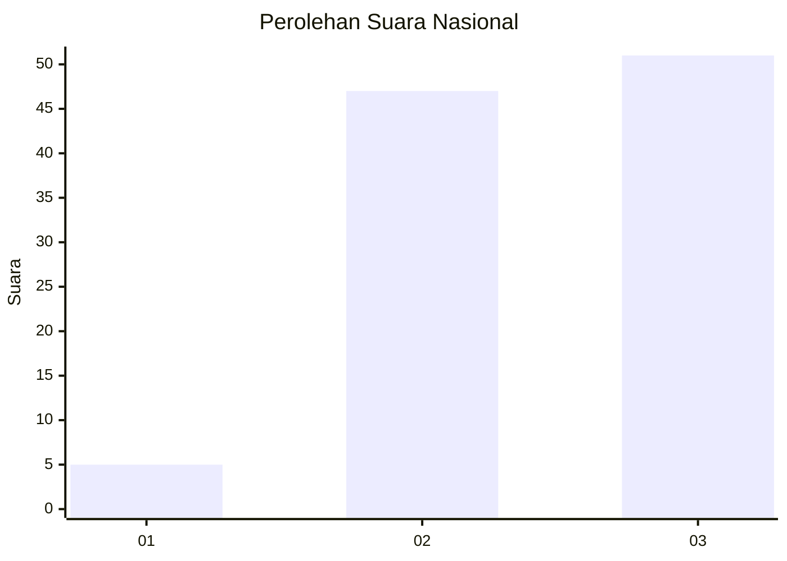
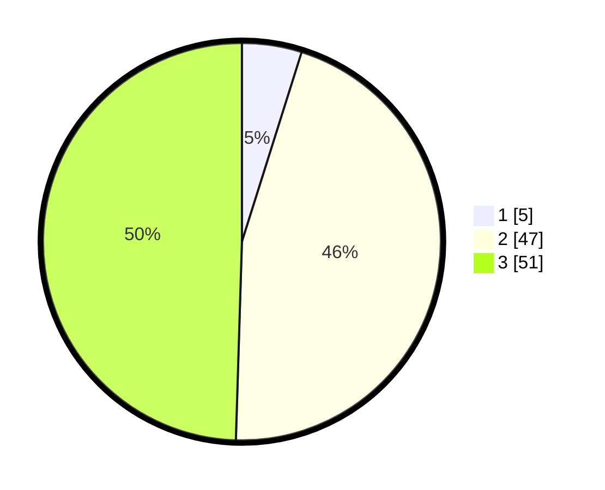

# Hasil

## Grafik

## Tabel

| No. | Nama Paslon    | Suara | Suara (raw) | Persentase |
|:--- |:-------------- | -----:| -----------:| ----------:|
| 1   | ANIES MUHAIMIN | 5     | [5][p-1]    | 4,85       |
| 2   | PRABOWO GIBRAN | 47    | [47][p-2]   | 45,63      |
| 3   | GANJAR MAHFUD  | 51    | [51][p-3]   | 49,51      |

[p-1]: https://github.com/gigit-pemilu/pemilu-2024/blob/main/pilpres/hitung-suara/sub/51-bali/sub/07-karangasem/sub/03-manggis/sub/2008-selumbung/sub/007-tps/sub/paslon-1.txt
[p-2]: https://github.com/gigit-pemilu/pemilu-2024/blob/main/pilpres/hitung-suara/sub/51-bali/sub/07-karangasem/sub/03-manggis/sub/2008-selumbung/sub/007-tps/sub/paslon-2.txt
[p-3]: https://github.com/gigit-pemilu/pemilu-2024/blob/main/pilpres/hitung-suara/sub/51-bali/sub/07-karangasem/sub/03-manggis/sub/2008-selumbung/sub/007-tps/sub/paslon-3.txt

## Foto C Plano

https://sirekap-obj-formc.kpu.go.id/d136/pemilu/ppwp/51/07/03/20/08/5107032008007-20240221-114242--39fbaa16-008c-49d9-9072-493b26f7c67d.jpg

https://sirekap-obj-formc.kpu.go.id/d136/pemilu/ppwp/51/07/03/20/08/5107032008007-20240221-114522--26b390db-c452-4695-b9e5-4b19f4374840.jpg

https://sirekap-obj-formc.kpu.go.id/d136/pemilu/ppwp/51/07/03/20/08/5107032008007-20240221-114633--f866cf6e-45c5-4d94-b853-0abca174b041.jpg

## Metadata

| Key        | Value               |
| ---------- | ------------------- |
| Time Stamp | 2024-02-21 12:00:00 |

## DATA PEMILIH TETAP

Jumlah pemilih dalam DPT: **227**.
 * L: **117**.
 * P: **110**.

## DATA PENGGUNA HAK PILIH

Jumlah pengguna hak pilih dalam DPT: **670**.
 * L: **88**.
 * P: **92**.

Jumlah pengguna hak pilih dalam DPTb: **777**.
 * L: **522**.
 * P: **277**.

Jumlah pengguna hak pilih dalam DPK: **844**.
 * L: **808**.
 * P: **582**.

Jumlah pengguna hak pilih: **444**.
 * L: **89**.
 * P: **832**.

## JUMLAH SUARA SAH DAN TIDAK SAH

JUMLAH SELURUH SUARA SAH: **169**.

JUMLAH SUARA TIDAK SAH: **5**.

JUMLAH SELURUH SUARA SAH DAN SUARA TIDAK SAH: **174**.

