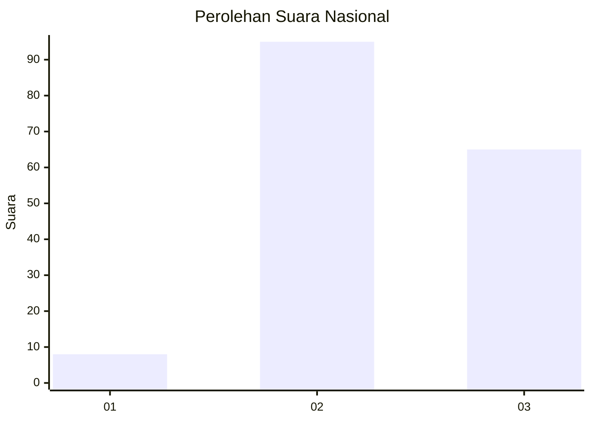
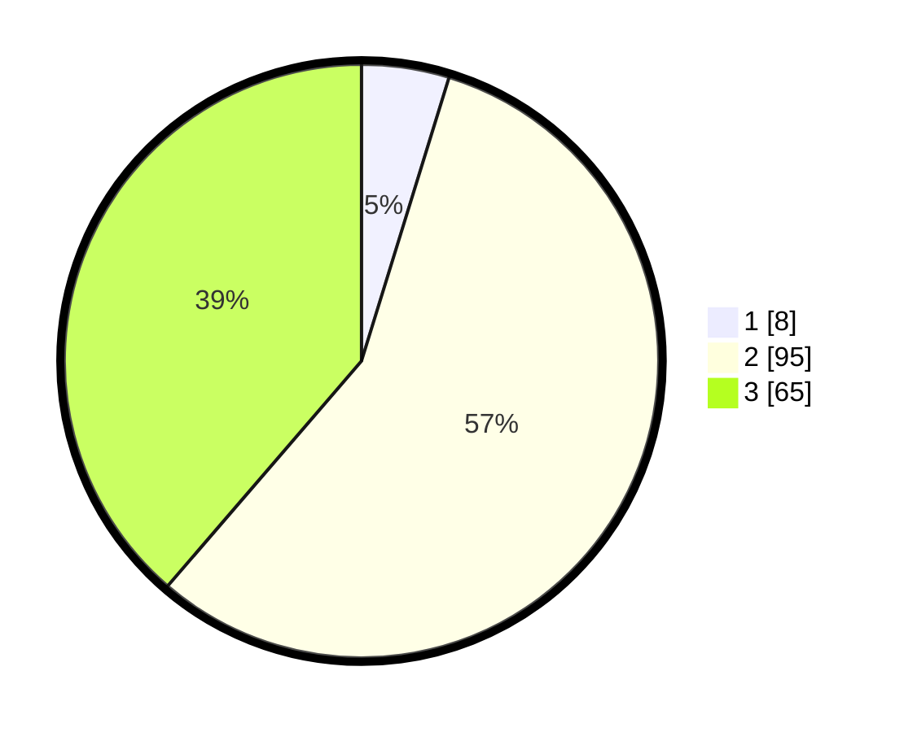

# Hasil

## Grafik

## Tabel

| No. | Nama Paslon    | Suara | Suara (raw) | Persentase |
|:--- |:-------------- | -----:| -----------:| ----------:|
| 1   | ANIES MUHAIMIN | 8     | [8][p-1]    | 4,76       |
| 2   | PRABOWO GIBRAN | 95    | [95][p-2]   | 56,55      |
| 3   | GANJAR MAHFUD  | 65    | [65][p-3]   | 38,69      |

[p-1]: https://github.com/gigit-pemilu/pemilu-2024/blob/main/pilpres/hitung-suara/sub/51-bali/sub/07-karangasem/sub/03-manggis/sub/2008-selumbung/sub/010-tps/sub/paslon-1.txt
[p-2]: https://github.com/gigit-pemilu/pemilu-2024/blob/main/pilpres/hitung-suara/sub/51-bali/sub/07-karangasem/sub/03-manggis/sub/2008-selumbung/sub/010-tps/sub/paslon-2.txt
[p-3]: https://github.com/gigit-pemilu/pemilu-2024/blob/main/pilpres/hitung-suara/sub/51-bali/sub/07-karangasem/sub/03-manggis/sub/2008-selumbung/sub/010-tps/sub/paslon-3.txt

## Foto C Plano

https://sirekap-obj-formc.kpu.go.id/254a/pemilu/ppwp/51/07/03/20/08/5107032008010-20240214-233618--793ead84-d68c-494c-8759-036b9c7801e4.jpg

https://sirekap-obj-formc.kpu.go.id/254a/pemilu/ppwp/51/07/03/20/08/5107032008010-20240214-233754--977f545c-d532-4ea4-b004-c47c9c81965a.jpg

https://sirekap-obj-formc.kpu.go.id/254a/pemilu/ppwp/51/07/03/20/08/5107032008010-20240214-233706--cce8424a-d0e1-43fa-b8b3-2604360297e9.jpg

## Metadata

| Key        | Value               |
| ---------- | ------------------- |
| Time Stamp | 2024-02-17 16:00:02 |

