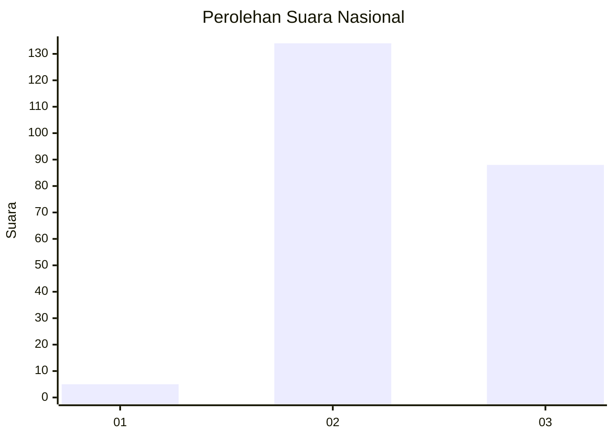
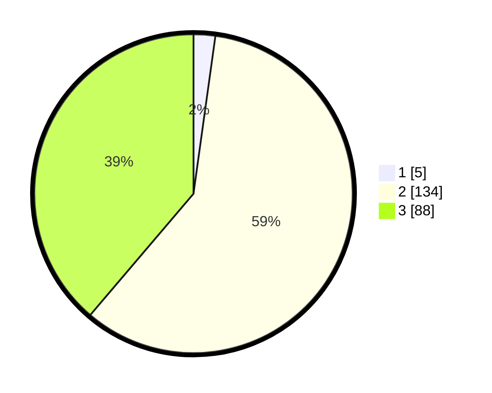

# Hasil

## Grafik

## Tabel

| No. | Nama Paslon    | Suara | Suara (raw) | Persentase |
|:--- |:-------------- | -----:| -----------:| ----------:|
| 1   | ANIES MUHAIMIN | 5     | [5][p-1]    | 2,20       |
| 2   | PRABOWO GIBRAN | 134   | [134][p-2]  | 59,03      |
| 3   | GANJAR MAHFUD  | 88    | [88][p-3]   | 38,77      |

[p-1]: https://github.com/gigit-pemilu/pemilu-2024/blob/main/pilpres/hitung-suara/sub/51-bali/sub/07-karangasem/sub/03-manggis/sub/2008-selumbung/sub/012-tps/sub/paslon-1.txt
[p-2]: https://github.com/gigit-pemilu/pemilu-2024/blob/main/pilpres/hitung-suara/sub/51-bali/sub/07-karangasem/sub/03-manggis/sub/2008-selumbung/sub/012-tps/sub/paslon-2.txt
[p-3]: https://github.com/gigit-pemilu/pemilu-2024/blob/main/pilpres/hitung-suara/sub/51-bali/sub/07-karangasem/sub/03-manggis/sub/2008-selumbung/sub/012-tps/sub/paslon-3.txt

## Foto C Plano

https://sirekap-obj-formc.kpu.go.id/90f1/pemilu/ppwp/51/07/03/20/08/5107032008012-20240214-200257--697419e5-9547-4abc-a97d-2867ff08547b.jpg

https://sirekap-obj-formc.kpu.go.id/90f1/pemilu/ppwp/51/07/03/20/08/5107032008012-20240214-200307--ea83baa4-f20c-4878-8716-5bb6073f243f.jpg

https://sirekap-obj-formc.kpu.go.id/90f1/pemilu/ppwp/51/07/03/20/08/5107032008012-20240214-133415--ccb24187-74d9-4591-8a38-ff70db400516.jpg

## Metadata

| Key        | Value               |
| ---------- | ------------------- |
| Time Stamp | 2024-02-19 06:16:00 |

