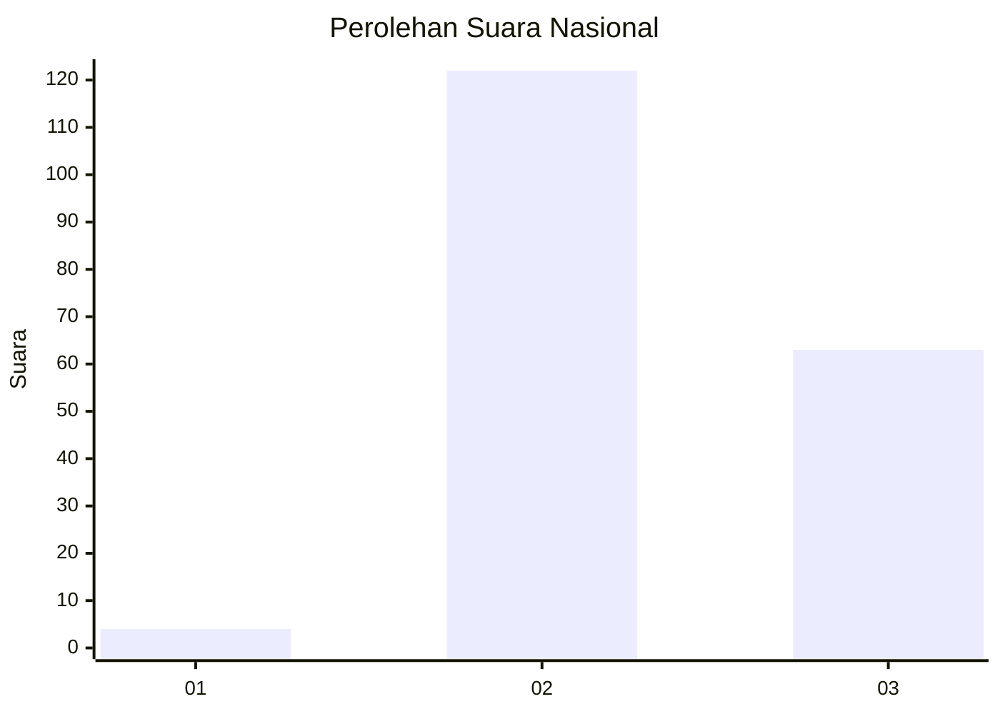
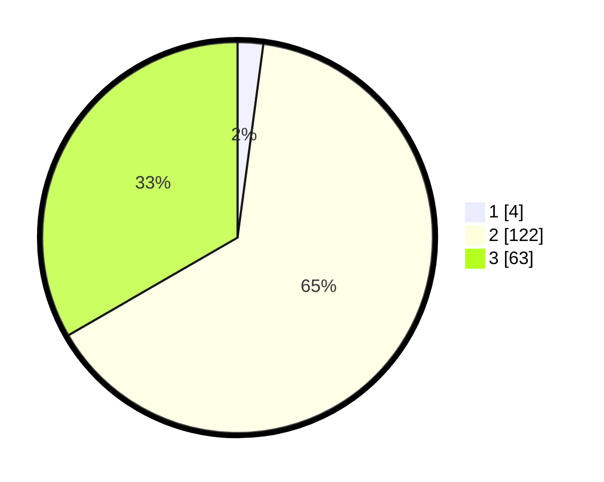

# Hasil

## Grafik

## Tabel

| No. | Nama Paslon    | Suara | Suara (raw) | Persentase |
|:--- |:-------------- | -----:| -----------:| ----------:|
| 1   | ANIES MUHAIMIN | 4     | [4][p-1]    | 2,12       |
| 2   | PRABOWO GIBRAN | 122   | [122][p-2]  | 64,55      |
| 3   | GANJAR MAHFUD  | 63    | [63][p-3]   | 33,33      |

[p-1]: https://github.com/gigit-pemilu/pemilu-2024/blob/main/pilpres/hitung-suara/sub/51-bali/sub/07-karangasem/sub/03-manggis/sub/2009-padangbai/sub/001-tps/sub/paslon-1.txt
[p-2]: https://github.com/gigit-pemilu/pemilu-2024/blob/main/pilpres/hitung-suara/sub/51-bali/sub/07-karangasem/sub/03-manggis/sub/2009-padangbai/sub/001-tps/sub/paslon-2.txt
[p-3]: https://github.com/gigit-pemilu/pemilu-2024/blob/main/pilpres/hitung-suara/sub/51-bali/sub/07-karangasem/sub/03-manggis/sub/2009-padangbai/sub/001-tps/sub/paslon-3.txt

## Foto C Plano

https://sirekap-obj-formc.kpu.go.id/cfae/pemilu/ppwp/51/07/03/20/09/5107032009001-20240214-205144--0cbb20ad-e1ac-4b73-a067-af69753348bc.jpg

https://sirekap-obj-formc.kpu.go.id/cfae/pemilu/ppwp/51/07/03/20/09/5107032009001-20240214-210644--377bc57b-e1ab-40f2-b60c-12ddc900410c.jpg

## Metadata

| Key        | Value               |
| ---------- | ------------------- |
| Time Stamp | 2024-02-24 22:31:28 |

