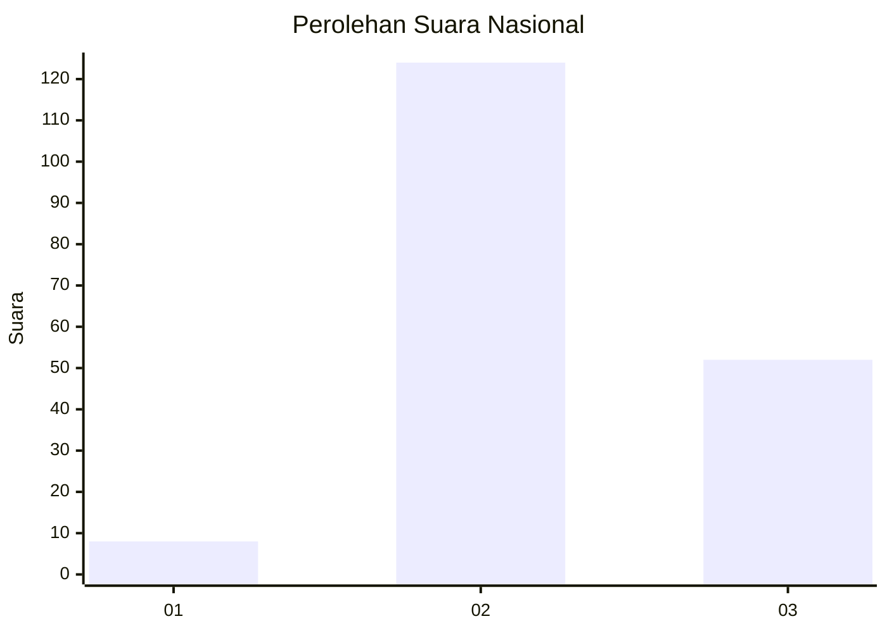
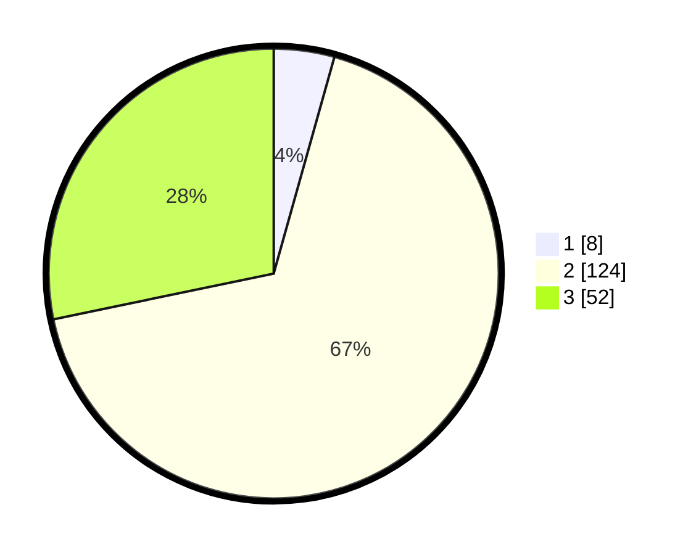

# Hasil

## Grafik

## Tabel

| No. | Nama Paslon    | Suara | Suara (raw) | Persentase |
|:--- |:-------------- | -----:| -----------:| ----------:|
| 1   | ANIES MUHAIMIN | 8     | [8][p-1]    | 4,35       |
| 2   | PRABOWO GIBRAN | 124   | [124][p-2]  | 67,39      |
| 3   | GANJAR MAHFUD  | 52    | [52][p-3]   | 28,26      |

[p-1]: https://github.com/gigit-pemilu/pemilu-2024/blob/main/pilpres/hitung-suara/sub/51-bali/sub/07-karangasem/sub/03-manggis/sub/2009-padangbai/sub/002-tps/sub/paslon-1.txt
[p-2]: https://github.com/gigit-pemilu/pemilu-2024/blob/main/pilpres/hitung-suara/sub/51-bali/sub/07-karangasem/sub/03-manggis/sub/2009-padangbai/sub/002-tps/sub/paslon-2.txt
[p-3]: https://github.com/gigit-pemilu/pemilu-2024/blob/main/pilpres/hitung-suara/sub/51-bali/sub/07-karangasem/sub/03-manggis/sub/2009-padangbai/sub/002-tps/sub/paslon-3.txt

## Foto C Plano

https://sirekap-obj-formc.kpu.go.id/f06c/pemilu/ppwp/51/07/03/20/09/5107032009002-20240214-140959--53743d8c-9fa1-4f03-b432-dbb6271b3b57.jpg

https://sirekap-obj-formc.kpu.go.id/f06c/pemilu/ppwp/51/07/03/20/09/5107032009002-20240214-141014--277b8c93-ede2-4fc7-8b72-b38806968fee.jpg

https://sirekap-obj-formc.kpu.go.id/f06c/pemilu/ppwp/51/07/03/20/09/5107032009002-20240214-141022--193c60c1-410b-4975-8ff2-0a206f301347.jpg

## Metadata

| Key        | Value               |
| ---------- | ------------------- |
| Time Stamp | 2024-02-17 16:00:02 |

