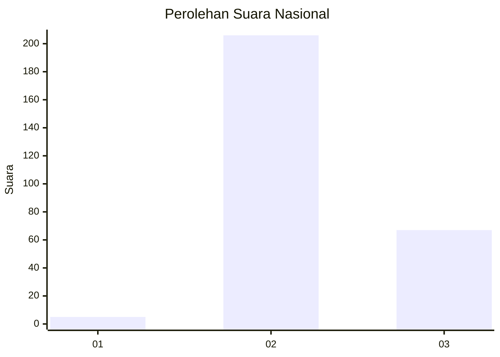
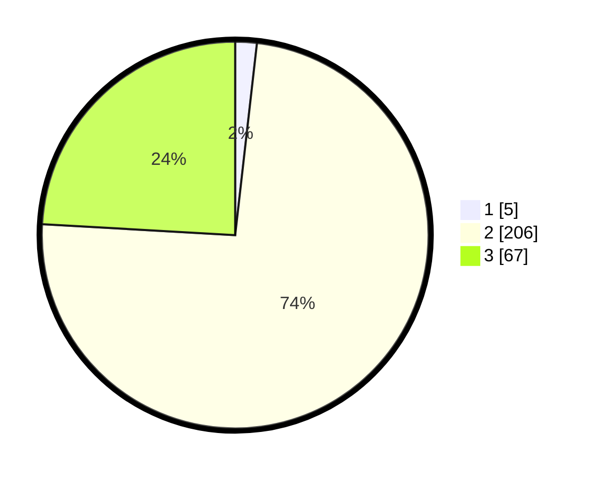

# Hasil

## Grafik

## Tabel

| No. | Nama Paslon    | Suara | Suara (raw) | Persentase |
|:--- |:-------------- | -----:| -----------:| ----------:|
| 1   | ANIES MUHAIMIN | 5     | [5][p-1]    | 1,80       |
| 2   | PRABOWO GIBRAN | 206   | [206][p-2]  | 74,10      |
| 3   | GANJAR MAHFUD  | 67    | [67][p-3]   | 24,10      |

[p-1]: https://github.com/gigit-pemilu/pemilu-2024/blob/main/pilpres/hitung-suara/sub/51-bali/sub/07-karangasem/sub/03-manggis/sub/2009-padangbai/sub/005-tps/sub/paslon-1.txt
[p-2]: https://github.com/gigit-pemilu/pemilu-2024/blob/main/pilpres/hitung-suara/sub/51-bali/sub/07-karangasem/sub/03-manggis/sub/2009-padangbai/sub/005-tps/sub/paslon-2.txt
[p-3]: https://github.com/gigit-pemilu/pemilu-2024/blob/main/pilpres/hitung-suara/sub/51-bali/sub/07-karangasem/sub/03-manggis/sub/2009-padangbai/sub/005-tps/sub/paslon-3.txt

## Foto C Plano

https://sirekap-obj-formc.kpu.go.id/9a17/pemilu/ppwp/51/07/03/20/09/5107032009005-20240221-090240--8f8810da-ed2c-442e-bb7f-a350f097cc68.jpg

https://sirekap-obj-formc.kpu.go.id/9a17/pemilu/ppwp/51/07/03/20/09/5107032009005-20240221-090418--30a6c553-2ff4-4d19-91f5-cbcf95beec16.jpg

https://sirekap-obj-formc.kpu.go.id/9a17/pemilu/ppwp/51/07/03/20/09/5107032009005-20240221-090527--daa33409-3072-4b66-ac0e-af79507fc86a.jpg

## Metadata

| Key        | Value               |
| ---------- | ------------------- |
| Time Stamp | 2024-02-21 10:00:00 |

## DATA PEMILIH TETAP

Jumlah pemilih dalam DPT: **237**.
 * L: **116**.
 * P: **121**.

## DATA PENGGUNA HAK PILIH

Jumlah pengguna hak pilih dalam DPT: **189**.
 * L: **92**.
 * P: **97**.

Jumlah pengguna hak pilih dalam DPTb: **270**.
 * L: **782**.
 * P: **2**.

Jumlah pengguna hak pilih dalam DPK: **0**.
 * L: **0**.
 * P: **0**.

Jumlah pengguna hak pilih: **189**.
 * L: **92**.
 * P: **97**.

## JUMLAH SUARA SAH DAN TIDAK SAH

JUMLAH SELURUH SUARA SAH: **178**.

JUMLAH SUARA TIDAK SAH: **11**.

JUMLAH SELURUH SUARA SAH DAN SUARA TIDAK SAH: **189**.

