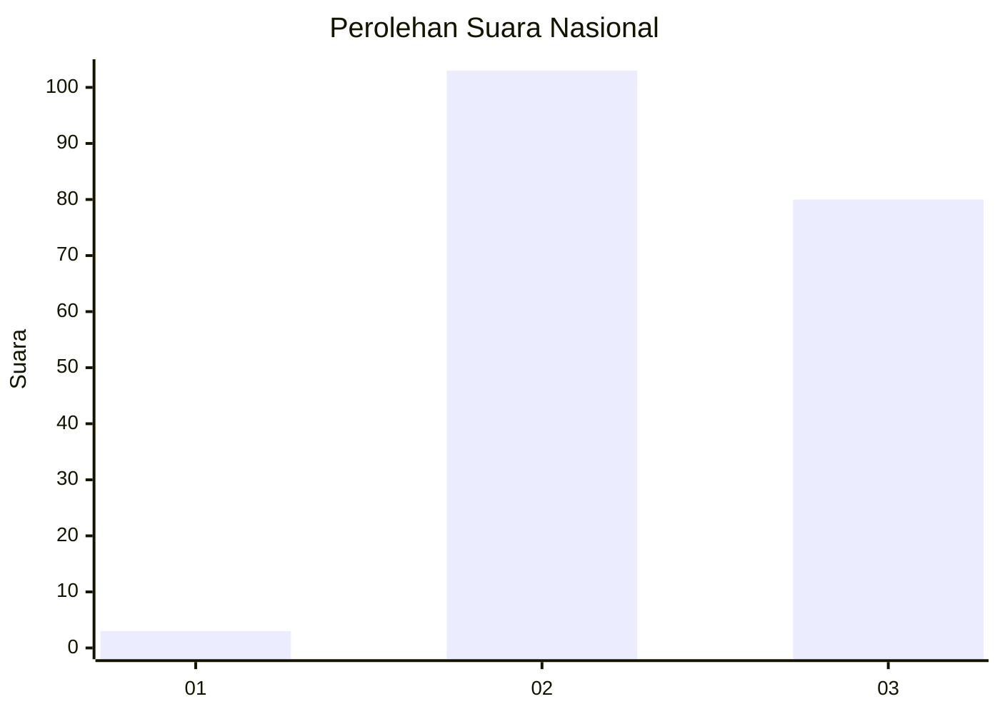
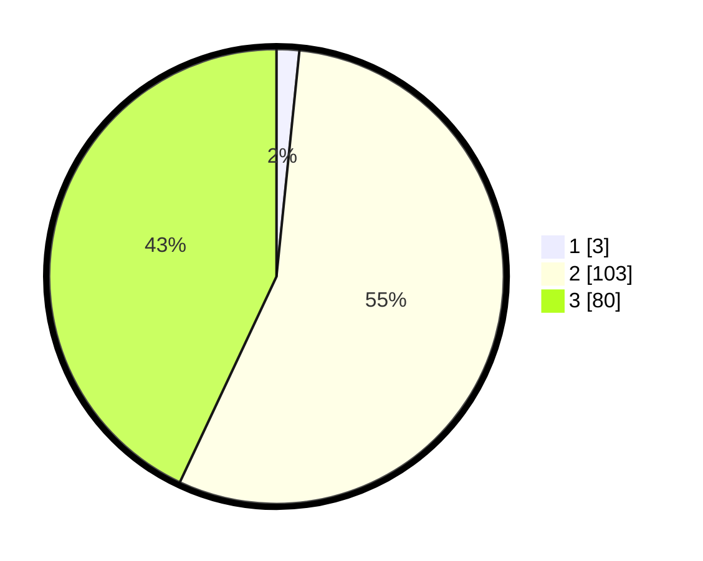

# Hasil

## Grafik

## Tabel

| No. | Nama Paslon    | Suara | Suara (raw) | Persentase |
|:--- |:-------------- | -----:| -----------:| ----------:|
| 1   | ANIES MUHAIMIN | 3     | [3][p-1]    | 1,61       |
| 2   | PRABOWO GIBRAN | 103   | [103][p-2]  | 55,38      |
| 3   | GANJAR MAHFUD  | 80    | [80][p-3]   | 43,01      |

[p-1]: https://github.com/gigit-pemilu/pemilu-2024/blob/main/pilpres/hitung-suara/sub/51-bali/sub/07-karangasem/sub/03-manggis/sub/2009-padangbai/sub/007-tps/sub/paslon-1.txt
[p-2]: https://github.com/gigit-pemilu/pemilu-2024/blob/main/pilpres/hitung-suara/sub/51-bali/sub/07-karangasem/sub/03-manggis/sub/2009-padangbai/sub/007-tps/sub/paslon-2.txt
[p-3]: https://github.com/gigit-pemilu/pemilu-2024/blob/main/pilpres/hitung-suara/sub/51-bali/sub/07-karangasem/sub/03-manggis/sub/2009-padangbai/sub/007-tps/sub/paslon-3.txt

## Foto C Plano

https://sirekap-obj-formc.kpu.go.id/0ca0/pemilu/ppwp/51/07/03/20/09/5107032009007-20240221-094330--0edb120e-56d9-45ec-815d-da49bd3a814b.jpg

https://sirekap-obj-formc.kpu.go.id/0ca0/pemilu/ppwp/51/07/03/20/09/5107032009007-20240221-094455--676cfec7-2469-4325-b6ba-b19f22712c23.jpg

https://sirekap-obj-formc.kpu.go.id/0ca0/pemilu/ppwp/51/07/03/20/09/5107032009007-20240221-094600--75974a0c-0c19-4dc1-9cb3-d7633ce3719e.jpg

## Metadata

| Key        | Value               |
| ---------- | ------------------- |
| Time Stamp | 2024-02-21 10:00:00 |

## DATA PEMILIH TETAP

Jumlah pemilih dalam DPT: **329**.
 * L: **123**.
 * P: **136**.

## DATA PENGGUNA HAK PILIH

Jumlah pengguna hak pilih dalam DPT: **188**.
 * L: **92**.
 * P: **96**.

Jumlah pengguna hak pilih dalam DPTb: **0**.
 * L: **880**.
 * P: **0**.

Jumlah pengguna hak pilih dalam DPK: **2**.
 * L: **0**.
 * P: **2**.

Jumlah pengguna hak pilih: **190**.
 * L: **92**.
 * P: **98**.

## JUMLAH SUARA SAH DAN TIDAK SAH

JUMLAH SELURUH SUARA SAH: **186**.

JUMLAH SUARA TIDAK SAH: **4**.

JUMLAH SELURUH SUARA SAH DAN SUARA TIDAK SAH: **190**.

