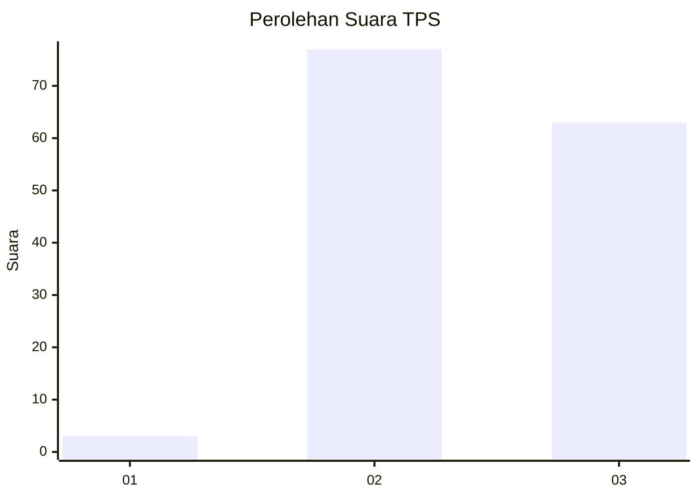
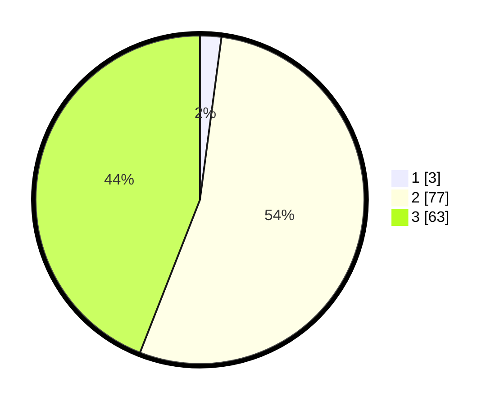

# Hasil

## Grafik

## Tabel

| No. | Nama Paslon    | Suara | Suara (raw) | Persentase |
|:--- |:-------------- | -----:| -----------:| ----------:|
| 1   | ANIES MUHAIMIN | 3     | [3][p-1]    | 2,10       |
| 2   | PRABOWO GIBRAN | 77    | [77][p-2]   | 53,85      |
| 3   | GANJAR MAHFUD  | 63    | [63][p-3]   | 44,06      |

[p-1]: https://github.com/gigit-pemilu/pemilu-2024-51-bali/blob/main/pilpres/hitung-suara/sub/51-bali/sub/07-karangasem/sub/03-manggis/sub/2009-padangbai/sub/010-tps/sub/paslon-1.txt
[p-2]: https://github.com/gigit-pemilu/pemilu-2024-51-bali/blob/main/pilpres/hitung-suara/sub/51-bali/sub/07-karangasem/sub/03-manggis/sub/2009-padangbai/sub/010-tps/sub/paslon-2.txt
[p-3]: https://github.com/gigit-pemilu/pemilu-2024-51-bali/blob/main/pilpres/hitung-suara/sub/51-bali/sub/07-karangasem/sub/03-manggis/sub/2009-padangbai/sub/010-tps/sub/paslon-3.txt

## Foto C Plano

https://sirekap-obj-formc.kpu.go.id/2e54/pemilu/ppwp/51/07/03/20/09/5107032009010-20240221-091307--1137ae08-5026-4df6-8a2a-9ba51317ba2c.jpg

https://sirekap-obj-formc.kpu.go.id/2e54/pemilu/ppwp/51/07/03/20/09/5107032009010-20240221-091356--58a17382-39e9-4b6f-a404-21e11825ef8b.jpg

https://sirekap-obj-formc.kpu.go.id/2e54/pemilu/ppwp/51/07/03/20/09/5107032009010-20240221-091515--2fa67197-97eb-4cec-af12-ded9fb5cb2c0.jpg

## Metadata

| Key        | Value               |
| ---------- | ------------------- |
| Time Stamp | 2024-02-21 10:00:00 |

## DATA PEMILIH TETAP

Jumlah pemilih dalam DPT: **266**.
 * L: **122**.
 * P: **130**.

## DATA PENGGUNA HAK PILIH

Jumlah pengguna hak pilih dalam DPT: **216**.
 * L: **498**.
 * P: **114**.

Jumlah pengguna hak pilih dalam DPTb: **255**.
 * L: **557**.
 * P: **507**.

Jumlah pengguna hak pilih dalam DPK: **0**.
 * L: **4**.
 * P: **0**.

Jumlah pengguna hak pilih: **512**.
 * L: **98**.
 * P: **114**.

## JUMLAH SUARA SAH DAN TIDAK SAH

JUMLAH SELURUH SUARA SAH: **202**.

JUMLAH SUARA TIDAK SAH: **9**.

JUMLAH SELURUH SUARA SAH DAN SUARA TIDAK SAH: **212**.

